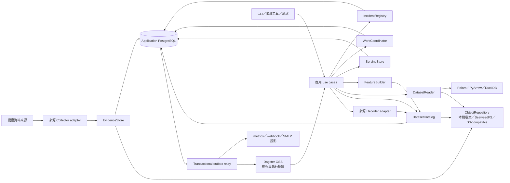

# 資料擷取、編排與儲存平台架構

> **2026-08-15 product boundary:** ADR 0017 與主 spec 的 `COST-0-01` 取代本文所有 P2＋外部契約／principal entitlement、付費 backfill 與固定七年必要來源假設；公開資料以 dataset-level `open_data_terms` 治理，缺漏以實得涵蓋 fail closed。本文其餘不可變版本、時間點、譜系與 provider-interface 契約仍有效。

本文件記錄「選擇資料擷取、編排與儲存架構」的決策。它建立可在 Docker Compose 完整運行、可部署到 Kubernetes、保存七年證據鏈，且不讓編排或儲存供應商滲入領域語意的平台骨架；身分、來源權利、加密及精確刪除遵守[安全與保存契約](security-identity-entitlement-and-retention.md)，程序、副本、容量與復原遵守[部署契約](deployment-topology-capacity-and-recovery.md)，分期實作深度與tracer bullets遵守[分階段架構交接契約](phased-architecture-and-spec-handoff.md)。

## 架構摘要

平台採模組化單體。API、日常 worker、維護 worker 與回補／訓練 worker 使用相同的應用套件與領域模組，但以不同程序、容器及資源限制啟動。首版不在模組間建立 HTTP 呼叫；模組透過 Python 介面、不可變版本 ID、物件 URI 與 PostgreSQL 交易協作。



Dagster、監控後端及通知出口都是可重建投影。資料集版本、譜系、來源政策、checkpoint、事故與模型核准的權威狀態只存在應用資料庫及其引用的不可變 artifact 中。

## 技術選擇

| 責任 | 生產導向 MVP 選擇 | 理由與限制 |
| --- | --- | --- |
| 編排 | Dagster OSS | asset、partition、materialization 與 lineage 投影貼近資料流程；應用 use case 不匯入 Dagster context |
| 關聯式儲存 | PostgreSQL | 承擔交易性 metadata、狀態、事件與 serving query；首版沒有跨區分散式 SQL 證據 |
| 不可變物件 | `ObjectRepository` adapter；Compose 預設 SeaweedFS S3 gateway | 本機檔案、SeaweedFS 及外部 S3-compatible endpoint 以契約測試互換；不依賴特定 object-lock 功能 |
| 結構化大量資料 | Parquet + canonical manifest | 開放格式、partition pruning、可被多種引擎讀取；版本真相留在 PostgreSQL catalog |
| 批次分析 | Polars、PyArrow、嵌入式 DuckDB | 適合單 worker 的資料轉換與時間點 join；不營運額外查詢叢集 |
| 事件投遞 | PostgreSQL transactional outbox | 與權威狀態原子提交；at-least-once 加冪等消費，首版不部署訊息代理 |
| 特徵儲存 | 不可變 Parquet 特徵快照 | 日終批次無需低延遲線上 feature store；訓練、回測及推論共用特徵建構模組 |

首版刻意不採用 Kafka／RabbitMQ／Redis queue、Iceberg／Delta、Spark／Trino、Feast、CockroachDB 或 MinIO Community 作預設。這些能力只有在量測證明既有 seam 無法滿足需求，且授權與營運成本被接受後，才能以新 adapter 引入。

## 執行角色與資源池

同一 application image 提供下列角色：

| 角色／資源池 | 主要責任 | 優先權 |
| --- | --- | --- |
| API | REST 與研究介面 read model 查詢 | 獨立配額，不受訓練占用 |
| `daily-critical` worker | 收盤資料擷取、解碼、特徵及每日推論 | 最高；可抑制其他 pool 併發 |
| `maintenance` worker | compaction、品質重算、解析重播及一般修復 | 中 |
| `backfill-training` worker | 歷史回填、完整重訓、調參及大量回測 | 最低；不得使日常推論逾時 |
| Dagster webserver／daemon | 排程、partition、sensor 及執行 UI | 不承擔應用權威資料 |
| Outbox relay | 投遞應用事件至編排、監控與通知 projection | 可獨立重啟及重送 |

Docker Compose 可共用 image，但每個角色以不同 command、資源限制及資料庫角色啟動。Kubernetes 使用相同 application image 與設定契約，將不同 pool 映射到獨立 Deployment／Job queue、resource quota 與 autoscaling policy。

## PostgreSQL 所有權

應用資料位於一個 application database，依深模組分 schema。只有擁有模組可以寫入其 schema；其他模組經介面或明確 read projection 讀取，不允許任意跨 schema 寫入。

| Schema | 權威內容 |
| --- | --- |
| `catalog` | 發行人、證券、掛牌、身分主張、交易日曆、股票池 |
| `ingestion` | 來源／資料集登錄、來源政策版本、執行、checkpoint、擷取收據 |
| `lineage` | object reference、資料集版本、manifest、綱要、涵蓋報告、引用關係 |
| `quality` | 品質檢查、漂移結果、隔離紀錄及處置歷程 |
| `ml` | 實驗索引、模型版本、評估、升版閘門及人工核准 |
| `serving` | 預測紀錄、研究查詢 projection 及儀表板摘要 |
| `ops` | work lease、fencing token、outbox、事件、事故及通知狀態 |

Dagster metadata 與未來 MLflow metadata 使用獨立 database、角色、migration 與備份政策；三者可以在 MVP 共用 PostgreSQL instance，但不得直接讀寫彼此內部表。跨產品只交換應用產生的 UUID、URI、trace ID 與事件。

## 大量資料與物件所有權

| 資料類別 | 權威位置 | PostgreSQL 保留內容 |
| --- | --- | --- |
| 來源回應、檔案、新聞／公告／申報原文 | 物件儲存的不可變原始資料物件 | object ID、URI、checksum、size、媒體型別、政策與版本引用 |
| 正規化大量資料 | Parquet 物件與資料集 manifest | 版本、綱要、分區、涵蓋、譜系及必要搜尋索引 |
| 特徵快照 | Parquet 物件與 manifest | 資訊截止點、股票池、輸入版本、特徵綱要及狀態 |
| 回測明細／大型評估輸出 | Parquet／報告 artifact | 摘要 metric、評估狀態及 artifact reference |
| 模型及校準器 | artifact | 模型版本、checksum、輸入譜系及核准狀態 |
| 預測紀錄 | `serving` schema；每日另封存 Parquet | 完整查詢資料、版本譜系與封存 reference |

大型 artifact 不進 PostgreSQL bytea；PostgreSQL 也不保存新聞全文、完整申報文件或特徵矩陣。物件以內容雜湊或不可變版本 ID 定址，重試不得覆寫既有 key。

### Parquet 分區

共同分區先採 `dataset / market / event_date-or-period / run_id`，不以 ticker 建頂層分區。掛牌 UUID、ticker、事件時間及觀察時間保留為欄位並使用 Parquet statistics pruning。每日批次在股票池範圍內合併成目標約 128–512 MiB 檔案；極小、低頻資料可按月或 release／vintage 分區。

不同資料語意使用不同 partition spec：

- 行情／市場事件：`market / session_date`
- 新聞／公告：`source / observed_date / shard`
- 財報：`market / reporting_period / observed_date`
- 總體：`dataset / release-or-vintage`
- 特徵／預測：`market / information_cutoff / stock_pool_version`

權威分區規格、預期分區與涵蓋規則存在資料集 catalog；Dagster partition key 只定位工作。

## 資料集版本生命週期

資料集版本狀態如下：

| 狀態 | 意義 |
| --- | --- |
| `staging` | 物件與草稿 metadata 正在建立，正式讀者不可見 |
| `validating` | checksum、綱要、涵蓋與政策規則正在驗證 |
| `published` | 驗證通過，可供正式下游解析 |
| `degraded` | 已發布版本的必要物件不可讀、損壞或失去完整性，禁止新正式產出 |
| `rejected` | 驗證或品質不通過，保留證據但不得供正式下游使用 |
| `superseded` | 已有後繼版本，仍可重現舊預測與回測 |
| `tombstoned` | 因政策或治理禁止新用途；實體內容依保留規則處置 |

### 發布協定

PostgreSQL 與物件儲存無法共享交易，因此採 staging → verify → publish：

1. WorkCoordinator 取得資料集／分區 lease 與 fencing token。
2. Producer 將不可變內容以 staging reference 寫入 ObjectRepository。
3. 平台驗證 read-after-write、checksum、size、媒體型別、Parquet footer／schema 及涵蓋報告。
4. 平台以單一 PostgreSQL 交易建立 canonical manifest、版本關係、引用圖及 outbox 事件，並將狀態設為 `published`；所有寫入攜帶最新 fencing token。
5. 下游只解析 `published` 且未降級／tombstone 的版本。
6. 無 metadata 引用且超過寬限期的 staging 物件由受控回收工作清理。

相同內容的 retry 會取得同一內容定址 object reference。若 PostgreSQL 交易失敗，物件留在 staging 等待回收或重用；若交易成功但 outbox 尚未投遞便重啟，relay 會重新投遞相同事件 ID。

### 綱要與 compaction

每種資料集具有 `schema_id` 與語意版本：新增可選欄位為 minor、刪除／改型別／改語意為 major、只改文件為 patch。Reader 宣告可接受的 major／minor 範圍；不相容資料拒絕合併。

Migration、decoder 重播與 compaction 都只讀既有 published 版本，寫出新物件和新資料集版本；manifest 保存輸入版本、規則／工具版本、筆數與內容統計驗證。舊版本在仍被預測、模型、回測、稽核或保留政策引用時不得刪除。

## 深模組與小型介面

平台以行為而非資料表建立模組；不提供逐表 CRUD repository。

### EvidenceStore

保存原始資料物件、擷取收據與來源執行證據，並在物件成功持久化後安全提交 checkpoint。它隱藏 dedup、內容定址、receipt 與 checkpoint 的交易順序。

### DatasetCatalog

建立、驗證、發布、解析、降級、supersede 及 tombstone 資料集版本，維護 manifest reference graph。正式呼叫端不得要求裸 `latest`；它必須提交資料選擇條件，至少包含資料集種類、市場、資訊截止點、股票池、可接受綱要、freshness、涵蓋要求、缺失模態政策及`production`／`historical_reconstruction`／`isolated_research`選擇模式。Catalog依時間點契約驗證歷史可得性主張與證據等級，一次解析成不可變版本 ID 集合，並把選擇模式、主張ID及結果寫入下游 manifest。

### DatasetReader

只從指定資料集版本 manifest 開啟掃描，驗證綱要相容與 object integrity，並將 projection／filter 交給 Polars、PyArrow 或 DuckDB adapter。它不掃描資料夾，也不在執行途中重新解析最新版本。

### WorkCoordinator

擁有資料集／分區 lease、fencing token、執行狀態及 retry 決策。Dagster 負責一般併發，但 CLI、重試、暫停後復活的 worker 與第二套部署仍受平台 lease 防護。

### FeatureBuilder

接受已解析的不可變輸入版本集合、資訊截止點、股票池、交易日曆、調整與特徵規則版本，建立特徵快照。訓練、回測與推論共用此模組，避免 training-serving skew。

### ServingStore

以單一交易發布不可變預測紀錄與查詢 projection；提供掛牌、期間、資訊截止點及模型版本導向的研究查詢。它不暴露底層 serving table 給其他模組寫入。

### IncidentRegistry

在 `ops` schema 保存事件、事故聚合、狀態轉換與通知投影。Dagster UI、Prometheus、webhook 及 SMTP 都不是事故真相。

### ObjectRepository

核心物件 seam 只暴露：

```text
put_verified(stream, expected_checksum, metadata) -> ObjectRef
open(ObjectRef) -> stream
stat(ObjectRef) -> ObjectStat
```

Bucket、multipart、list、versioning、presigned URL 及供應商 object lock 是 adapter implementation 或外圍 projection，不進入領域呼叫端。實體刪除只能由 retention 模組通過受控內部介面執行。

### 編排 adapter

Use case 接受普通命令物件，回傳平台自己的 `RunResult`、版本 ID、涵蓋報告及事件。Dagster wrapper 只把它們投影為 asset materialization、run metadata 與 sensor 訊號。相同 use case 必須能由測試、CLI、補救工具或未來編排 adapter 執行。

## Retry、checkpoint 與補跑

平台提供統一 RetryPolicy；來源 adapter 只回報結構化 outcome 與可選 `Retry-After`。

- 網路錯誤、429 與多數 5xx：指數退避、full jitter 並尊重 `Retry-After`
- `terminal_failure`：不自動重試
- `policy_blocked`：政策或 entitlement 更新前不重試
- `quarantined`：完成明確處置前不重試
- 游標失效：建立受控重新同步，不能靜默歸零

最大嘗試次數、總等待時間及資料集併發由資料集政策設定。原始資料物件與收據成功持久化後才提交 checkpoint；補跑從最後成功 published 版本及 committed checkpoint 開始，不整條管線重跑。

必要模態失敗時停止正式下游並產生 `data_unavailable`；非必要模態可以採 freshness 規則允許的版本，但特徵快照必須記錄缺失模態及實際使用版本。

## Outbox 語意

權威狀態變更與 outbox event 在同一 PostgreSQL 交易提交。投遞為 at-least-once，不宣稱跨系統 exactly-once。事件包含穩定 `event_id`、aggregate ID、aggregate version、payload schema version、trace ID 與發生時間。

消費者必須在同一交易記錄已處理事件與自己的狀態變更；重複事件為 no-op，亂序事件依 aggregate version 重試或隔離。只有量測證明 PostgreSQL outbox 無法負擔吞吐量或出現多個長期串流消費者時，才在既有事件 relay seam 後加入訊息代理。

## 隔離、保留與完整性

Schema 漂移、身分歧義、內容碰撞或品質失敗時，原始證據仍依來源政策進入不可變物件儲存；資料集版本標為 rejected 或紀錄進入隔離狀態。PostgreSQL 保存原因、證據 URI、擁有者、首次／最近發生時間與處置歷程。人工或規則修復只能建立新正規化版本，不能修改隔離內容。

所有 object reference 進入 manifest reference graph。一般垃圾回收只可刪除無 published／superseded 引用、不被預測／模型／回測／稽核引用、超過 staging 寬限期且來源政策允許刪除的物件。

政策要求刪除時，平台先 tombstone 相關版本、產生影響報告與刪除證據，再執行實體刪除；不得以資料夾日期直接批次刪除。

發布前執行 read-after-write 與 checksum 驗證；發布後持續執行完整或抽樣 scrub。必要物件不可讀或 checksum 不符時，資料集轉為 degraded、禁止新的正式下游產出、建立高嚴重度事故並嘗試從複本修復。平台不得靜默回退到另一個最新版本。

## 備份與復原

| 儲存 | 生產目標 | 方法 |
| --- | --- | --- |
| Application PostgreSQL | RPO ≤ 15 分鐘 | 持續 WAL 歸檔、每日基礎備份、定期 restore verification |
| Dagster metadata | RPO ≤ 24 小時 | 每日備份；待執行工作可由應用權威狀態重新建立 |
| MLflow metadata（啟用時） | RPO ≤ 24 小時 | 每日備份；以獨立 database／migration 管理，且可由 canonical ledger／outbox 重建 projection |
| 物件儲存 | RPO ≤ 24 小時 | checksum、不可覆寫／版本化、每日異地複寫 |
| 整體研究服務 | RTO ≤ 4 小時 | 經文件化且自動驗證的還原順序與 smoke test |

每季執行一次完整還原演練：從 prediction ID 還原並定位 PostgreSQL 預測紀錄、canonical manifest、來源／正規化資料、特徵、模型 artifact、Git SHA 及核准紀錄。本機 Compose 不承諾 HA，但提供相同語意的備份、還原及 smoke-test 命令。

上述 PostgreSQL 15 分鐘與物件 24 小時是區域災難目標；完整 artifact-dependent能力的有效RPO最差為24小時。部署契約以版本化復原集合保留較新ledger、標示缺件引用，不把database倒退來偽造完整證據。

## 必須通過的 provider contract tests

- 本機檔案與 SeaweedFS adapter 執行相同 ObjectRepository 測試：串流讀寫、checksum、重複 put、損壞偵測及故障注入。
- PostgreSQL container 與測試 adapter 執行相同 catalog、lease、fencing、transaction 及 outbox 行為測試。
- Dagster wrapper 與直接 CLI 對相同 use case 產生相同平台 RunResult 與資料集版本。
- DuckDB／Polars reader 對 manifest、綱要相容、projection、partition pruning 與時間點輸入產生一致結果。
- Outbox 測試重複、亂序、relay crash 及 consumer transaction crash。

只有 mock 通過不算 seam 已驗證。所有 provider contract tests 必須在 Windows 11 + Docker Desktop 與 Linux CI 的共同 container 路徑執行。

## 必須通過的端到端事故情境

- Worker 在物件上傳後、manifest 發布前終止；重跑重用內容物件且不發布不完整版本。
- PostgreSQL 交易成功但 outbox 尚未投遞便重啟；事件以同一 ID 補送。
- 分頁來源中途失敗；從最後 committed checkpoint 重跑且不產生重複來源版本。
- CLI 與 Dagster 同時執行同一分區；舊 fencing token 的寫入被拒絕。
- Schema 不相容、身分歧義與授權到期均不能進入 published 下游。
- Compaction 後仍能以舊 manifest 重現歷史預測。
- 已發布物件損壞時版本進入 degraded，並由異地複本修復且保留證據。
- PostgreSQL 與物件儲存完整還原後，能由 prediction ID 找到所有資料與模型譜系。
- 大量 backfill／training 執行時，API 及每日關鍵推論仍符合資源與時限要求。
