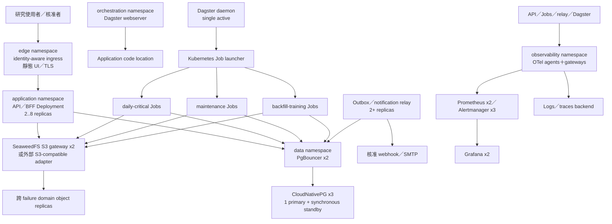

# 部署拓撲、容量與災難復原契約

本文件固定生產導向 MVP 在 Docker Compose 與 Kubernetes 的部署輪廓、程序與持久化形狀、資源隔離、備份復原、rolling deployment、容量驗收、首次上線及退役契約。它部署既有的八個 application module，而不把 module 名稱轉成微服務清單；module interface、權威帳本及資料語意分別沿用[服務模組契約](service-boundaries-and-api-contracts.md)、[資料平台架構](data-platform-architecture.md)、[可觀測性契約](observability-source-health-and-incidents.md)與[安全契約](security-identity-entitlement-and-retention.md)，部署輪廓的分期entry／exit由[分階段架構交接契約](phased-architecture-and-spec-handoff.md)固定。

## 決策摘要

- `compose-dev` 提供完整本機開發／測試路徑，`compose-pilot` 提供可受控停機的單機小型試營運，只有 `k8s-production` 承諾 HA。
- 三個部署輪廓使用相同 application image、typed configuration schema、workflow、module interface、artifact 與 provider contract。
- 正式 Kubernetes 採單一區域、三個 failure domains；另一區域維持暖資料、冷應用的災難復原能力，不做 active-active。
- API 與 relay 是可水平擴充的 Deployment；Dagster 建立短生命週期 Job；八個 application module 不形成彼此 HTTP 呼叫。
- Application PostgreSQL 與內容定址物件仍是權威資料；Dagster、MLflow、telemetry 與 UI 都是可重建 adapter／projection。
- `daily-critical` 有保留容量與保護視窗；maintenance、backfill、training 不能使正式日終批次錯過 T+120。
- 區域內已提交狀態目標 `RPO≈0`；區域災難時 application PostgreSQL `RPO≤15 分鐘`、物件／artifact `RPO≤24 小時`、整體 `RTO≤4 小時`。
- 部署更新以簽章、內容定址的部署成品運作；正式批次 pin 單一程式／設定版本，migration 採 expand／contract。
- 容量不是未驗證的 CPU／RAM 建議，而是綁定代表性負載、硬體、成品與量測的不可變容量報告。
- 正式上線前須完成授權回填、五次台美 EOD shadow、容量／復原／安全 gate 及多人核准。

## 部署輪廓

| 輪廓 | 用途 | 容量承諾 | 可用性 | 正式資料 |
| --- | --- | --- | --- | --- |
| `compose-dev` | Windows／macOS Docker Desktop 或 Linux 的開發、CI、契約與 E2E | 無 | 單機；可隨時重建 | 預設合成／fixture；不得帶入未核准正式資料 |
| `compose-pilot` | Linux 單機、小型內部試營運與營運演練 | `small` | 接受主機故障及文件化維護停機 | 可使用獲准資料，仍須正式身分、secret、備份、audit 與來源政策 |
| `k8s-production` | 正式研究介面、日終資料與模型工作 | `baseline` | 單區 HA、異地 DR | 獨立信任域、來源資格、加密根與備份 |

正式、staging、test 與 dev 不共用 cluster／Compose project、database、bucket、KMS、OIDC client、來源憑證、工作負載身分或備份。另一組織需要另一個隔離部署；本拓撲不是多租戶設計。

## 不變量

1. 部署角色只是 application image 的 entry adapter 與資源池，不是新的 application module。
2. 角色之間不新增 application HTTP／gRPC；工作只交換命令、不可變 ID／artifact reference、ledger 狀態與 outbox event。
3. 所有正式工作由 `WorkCoordinator` lease、fencing token、attempt 與 idempotency 管理；Dagster run state 不是工作真相。
4. API 只讀已發布 projection或提交既定小型治理決定，不臨時執行模型或長任務。
5. PostgreSQL 與物件儲存無分散式交易；仍使用 staging → verify → canonical publish。
6. 任一部署、故障切換或復原只能有一個現行部署世代具正式寫入權。
7. 外部來源、OIDC、通知或 telemetry 故障不得讓健康 pod crash-loop；是否可執行領域操作由 application policy fail closed。
8. 來源政策性刪除可精確處置所有副本；不得以備份、snapshot 或 object lock 延長被禁止內容。

## 整體 Kubernetes 拓撲

## 程序與資料矩陣

| 程序／角色 | Kubernetes workload | Compose | 可寫權威狀態 | 本地持久狀態 | 主要擴充單位 |
| --- | --- | --- | --- | --- | --- |
| Edge／靜態研究 UI | Deployment | 常駐容器 | 否 | 否 | replica |
| API／BFF | Deployment，最少 2 | 常駐容器 1 | 經 module interface | 否；session 在 PostgreSQL | replica |
| Dagster webserver | Deployment | 常駐容器 | 只寫 Dagster metadata | 否 | replica；至少一個 ready |
| Dagster daemon | singleton Deployment | 常駐容器 1 | 只寫 Dagster metadata | 否 | singleton＋surge replacement |
| Application code location | Deployment | 常駐容器 | 否 | 否 | replica |
| `daily-critical` | 短生命週期 Job | pool executor | 經 workflow／module interface | 否 | source／market／partition／batch |
| `maintenance` | 短生命週期 Job | pool executor | 經 workflow／module interface | 否 | repair／projection／compaction |
| `backfill-training` | 短生命週期 Job | pool executor | 經 workflow／module interface | 否 | range／intent／fold／trial |
| Outbox／notification relay | Deployment，最少 2 | 常駐容器 1 | `ops` delivery／consumer state | 否 | replica＋database lease |
| Migration | one-shot Job | one-shot 容器 | 經 migration owner | 否 | 每個 deployment bundle 一次 |
| Backup／restore／benchmark | CronJob／one-shot Job | one-shot 容器 | 受限 | 暫存受限 | 工作 |
| MLflow（選配） | Deployment | profile container | 只寫自身 projection DB | 否 | replica |

MLflow outage 不阻止 canonical 模型生命週期；恢復後由 outbox 重建 projection。正式環境不以 Docker socket 啟動工作。`compose-dev` 可以使用本機 Docker launcher；`compose-pilot` 使用預先啟動、按 pool 隔離的 executor，透過 PostgreSQL 工作租約取得命令。

## Docker Compose

核心 Compose 清單固定：

- edge／static UI；
- API／BFF；
- Dagster webserver、daemon、application code location；
- outbox／notification relay；
- `daily-critical`、`maintenance`、`backfill-training` executors；
- PostgreSQL；
- SeaweedFS，或在 dev profile 使用本機 `ObjectRepository` adapter；
- OTel Collector、Prometheus、Alertmanager，以及核准的 dashboard／logs／traces backend；
- 選配 MLflow；
- migration、backup、restore、benchmark one-shot commands。

`compose-dev` 預設只綁 loopback；Windows 與 macOS 只支援此輪廓。`compose-pilot` 使用受支援 Linux 主機、Docker Engine／Compose v2、同步 UTC、加密磁碟、獨立備份目的地、私有 TLS reverse proxy、正式 SecretProvider 及容器資源限制。Pilot 不宣稱 rolling zero-downtime 或 HA，但必須提供與 Kubernetes 相同語意的 migration、備份、復原、政策性刪除、audit 與 smoke commands。

MLflow 與完整 telemetry UI 可用明確 profile 關閉；canonical ledger、SecurityAudit、健康／SLO evaluation、備份與刪除命令不可關閉。

## Kubernetes namespace 與責任

| Namespace | 內容 | 主要限制 |
| --- | --- | --- |
| `edge` | Ingress、TLS、靜態 UI／reverse proxy | 唯一使用者入口；只能連 API |
| `application` | API、relay、application Jobs | 保留日終 quota；default-deny ingress／egress |
| `orchestration` | Dagster webserver／daemon／code location／launcher | 只有 launcher 可取得最小 Kubernetes control-plane 權限 |
| `data` | CloudNativePG、PgBouncer、SeaweedFS | 無外部 ingress；獨立 backup／migration identities |
| `observability` | OTel、Prometheus、Alertmanager、Grafana、logs／traces | 不能反向控制正式 workflow；獨立 quota |

Namespace 是營運、quota、NetworkPolicy 與 service-account 管理單位，不是 module seam，也不單獨構成安全隔離。每個 namespace 都由容量報告產生 ResourceQuota／LimitRange；任何容器缺 request、memory limit 或 ephemeral-storage limit 時，Helm render／admission 失敗。

## 入口、出口與工作負載身分

正式唯一使用者入口為同源 UI／REST，位於私有網路、VPN 或 identity-aware ingress 後。Dagster、Grafana、MLflow 只經有 OIDC 與角色限制的內部管理入口；PostgreSQL、PgBouncer、SeaweedFS、OTLP、metrics 及各 worker 沒有外部 ingress。

正式 egress 為 default-deny：

- DataSupply／文件取得工作只經來源 allowlist egress path 存取核准 hostname／port；
- notification relay 只連核准 webhook／SMTP；
- OIDC、KMS／SecretProvider、時間與受控 registry 各有獨立目的地規則；
- 文件 sandbox、訓練與正式推論預設無網路；
- 容器不得在啟動時下載程式、模型或依賴。

API、三個 worker pool、Dagster launcher／UI／daemon、relay、migration、backup、restore及監控分別使用獨立 service account、工作負載身分、database role 與 object prefix。預設關閉 service-account token automount；只有 Dagster launcher 等確有 control-plane 需求者取得短效最小權限。

## PostgreSQL 與連線

可攜式參考 overlay 使用 CloudNativePG 三個 instances，跨三個 failure domains，至少一個同步 standby；區域內已提交 application state 目標 `RPO≈0`。兩個 PgBouncer replicas 使用 transaction pooling，API、worker pools、Dagster、relay 各有獨立連線預算與資料庫角色。

Application、Dagster 與 MLflow metadata 使用獨立 database、owner、migration 與備份政策，但 MVP 可位於同一 PostgreSQL cluster。Migration、backup、replication及需要 session semantics 的受限管理程序直接連線；一般工作不得繞過 pool。WAL、backup、replication、vacuum與 migration都在容量報告中保留資源，不可由應用尖峰耗盡。

## 物件儲存

可攜式 SeaweedFS overlay 使用三個 master、至少三個跨 failure domain volume server、兩個 filer／S3 gateway；filer metadata 使用獨立 database／權限，不混入 application schema。資料 placement 必須在 failure domain 間持有足夠副本。

外部 S3-compatible 儲存可以替換此 overlay，但必須執行與 SeaweedFS相同的 `ObjectRepository` provider contracts：串流／multipart、range read、conditional write、read-after-write、checksum、冪等 put、損壞注入、版本處置、政策性刪除、replication inventory、backup與 restore。`S3-compatible` 名稱本身不是合格證據。

## 可觀測性拓撲

Application只輸出 OTLP、OpenMetrics、結構化 stdout 與 W3C Trace Context。Kubernetes 以 DaemonSet Collector agents加至少兩個 OTel gateways；alert path使用 Prometheus x2、Alertmanager x3、Grafana x2。Logs／traces backend依短期保留需求運行一至兩個可重建 replicas。

Compose 預設 Prometheus／Alertmanager、Grafana、Loki、Tempo；若組織未核准 AGPL，經相同 seam 改用 OpenSearch／Jaeger overlay。Telemetry故障不得阻塞 application；七年健康、SLO、事故、通知、品質與漂移真相仍由 application ledger保存。

## 工作切分與併發

禁止 per-listing Job。正式切分如下：

| 工作 | Partition／Job 單位 |
| --- | --- |
| 擷取 | source × dataset × market／scope × partition |
| 文件處理 | source × observed-date × shard |
| 特徵快照 | market × information-cutoff × stock-pool-version |
| 正式預測 | market × information-cutoff × stock-pool-version |
| 回填 | source／dataset × market × bounded range |
| 訓練 | TrainingIntent |
| 回測 | intent × fold；由 intent 匯總 |
| HPO | intent × trial；選定 config另建正式 intent |

Dagster concurrency pool控制同時 Job數，`WorkCoordinator` 保存 ready／leased work、deadline、attempt及 fencing；Kubernetes Job和cluster autoscaler提供計算容量。首版不新增 Redis、Kafka、RabbitMQ 或 KEDA。最低常駐容量本身就要能完成 baseline日終，不能依賴從零擴容守住 T+120。

## 優先權與保護視窗

`daily-critical` 使用最高非系統 PriorityClass、保留 quota及專用或可保證節點容量。首個市場截止點前30分鐘開始保護視窗，直到兩市場正式批次發布或事故解除：

- 不啟動新 backfill／training／HPO；
- 已有低優先工作在 checkpoint後暫停，或可安全終止並形成新 attempt；
- 不啟動例行 application、database、object、Dagster、NetworkPolicy或容量型 rollout；
- 已健康運行的 rollout停止擴大，不硬殺可用 pod；
- 安全／復原修補可綁事故例外，但不得讓正式批次混用程式版本。

安全修復及政策性刪除不因保護視窗被禁止。兩市場發布後，低優先 backlog依公平及期限恢復。

## Resources、autoscaling 與可用性

所有容器必填 requests、memory limit及ephemeral-storage limit。`daily-critical`採requests＝limits的Guaranteed QoS；API有保留request及受控burst；maintenance／backfill-training採低PriorityClass及硬上限。正式推論使用CPU；只有訓練／HPO可申請具taint／toleration的選配GPU pool，CPU路徑仍須通過驗收。

API在`k8s-production`最少2、基準最多8個replicas，以CPU、處理中請求及p95 latency組合擴縮；快速scale-out，至少10分鐘穩定後scale-in。每個pod另有database connections、請求大小、query duration與併發上限。

關鍵Deployment使用zone／host topology spread、anti-affinity與PDB。API、relay、PgBouncer、OTel gateway、Dagster webserver／code location至少保留一個ready replica。Dagster daemon維持single active，使用surge replacement避免雙scheduler。Node drain、zone loss及autoscaler scale-down均須故障演練。

## 儲存容量控制

至少以30日代表性負載量測每類原始資料、Parquet、模型、canonical ledger、backup與telemetry的壓縮後日增量，再依保存期限、replication factor、backup、compaction staging與restore scratch計算配置。正式儲存預留量為30%或未來12個月預測成長量之較大者。

| 使用率 | 行為 |
| --- | --- |
| 70% | 容量告警、更新成長預測與owner |
| 80% | 停止新大型回補、HPO及非必要重算 |
| 90% | 只允許正式日終、安全修復與政策性刪除 |

一般容量壓力不得停止政策性刪除。Object、PostgreSQL、WAL、backup、telemetry與ephemeral storage各自評估，不能用總體平均隱藏單一耗盡點。

## 備份與復原目標

| 故障範圍／資料 | RPO | RTO／恢復方式 |
| --- | --- | --- |
| 區域內已提交 PostgreSQL | 約 0 | operator failover；跨 failure domain同步 replica |
| 區域內物件 | 約 0 | 讀取跨 failure domain副本並scrub／repair |
| 區域災難 application PostgreSQL | ≤15分鐘 | WAL＋base backup PITR |
| 區域災物件／artifact | ≤24小時 | 異地replication inventory／backup |
| Dagster／MLflow metadata | ≤24小時 | 每日backup或由canonical ledger重建 |
| 完整artifact-dependent研究能力 | 最差≤24小時 | 整體RTO≤4小時 |

PostgreSQL使用持續WAL、每日基礎備份、35日PITR與13個月月度復原點。七年canonical資料、模型、預測與治理證據保存在正式資料／物件／簽章archive中；不以七年整機snapshot取代，也不讓backup規則擴張來源權利。

來源內容依source／policy／protection class分離backup與加密範圍，必須支援受控版本刪除或細粒度cryptographic erasure。只有不含禁止內容的治理ledger、簽章摘要與刪除證明可使用長期不可變儲存。

## 復原集合與還原順序

每個版本化復原集合固定：

- PostgreSQL backup／PITR target與WAL位置；
- object replication inventory、watermark與checksum摘要；
- deletion／tombstone ledger sequence；
- deployment bundle、設定、schema與image digests；
- KMS／signing key references及有效信任政策；
- 建立、驗證、失效與owner證據。

Database較新而異地物件較舊時，不刪除較新的ledger以偽造一致時間；reconciliation把缺物件的資料集、模型或預測標為unavailable／degraded，只有reference graph完整的批次可重新開放。

還原順序固定為：

1. 隔離舊區域、撤銷其新寫入權並提升部署世代；
2. 恢復可信時鐘、OIDC／workload identity、SecretProvider、KMS及signature policy；
3. 還原application PostgreSQL；
4. 掛接並驗證物件副本；
5. 重播政策性刪除與tombstone ledger；
6. 驗證SecurityAudit chain、復原集合、reference graph、schema與checksums；
7. 重建Dagster、MLflow、研究與可觀測性projections；
8. 執行synthetic research、authorization、ETag、workflow、notification與prediction-evidence smoke；
9. 先開唯讀研究查詢，再開擷取／projection，最後開排程及正式發布。

## 異地災難復原

`k8s-production`的次要區域為暖資料、冷應用：預建網路、信任、最小Kubernetes／restore控制面及secret references，持續接收database backup及object replicas；API、Dagster與workers平時不承擔正式流量。IaC須在一小時內完成其餘計算資源，為四小時RTO保留還原與驗證時間。

Failover不自動執行。它綁定SEV1，由`platform_admin`＋`security_admin`雙人核准，且source steward確認來源使用資格允許新地域。切換前驗證OIDC redirect、KMS／secret、egress allowlist、DNS、TLS、signature policy及notification destinations。

任一時點只有一個現行部署世代。Failback先停止新排程／寫入、排空outbox、複寫增量、驗證reference graph，再以新雙人決定提升原區域世代；舊active region的workload identities與fencing authority同步撤銷。禁止兩區同時擷取、核准、升版或發布正式預測。

## 復原演練

- 每月自動抽樣還原database、objects與signed ledger；
- 每季在隔離環境完整還原一筆PredictionRecord的來源、正規化、特徵、模型、核准、事故及audit鏈；
- 每年至少一次完整region failover＋failback；
- 每次量測實際RPO／RTO，並測試missing object、corrupt backup、KMS outage及restore-then-redelete；
- 演練資料不能進正式PredictionRecord，結果形成不可變治理證據。

## 部署成品與設定

每次release產生內容定址並簽章的部署成品：application／UI image digests、Compose、Helm chart／overlays、typed config schema、migration、SBOM、provenance、dashboard／alert rules、support matrix與runbooks。Tag、branch或`latest`只可顯示，不可決定執行內容。GitOps controller可作deployment adapter，不是成品真相。

Compose與Kubernetes共用同一typed configuration schema。成品保存非敏感預設；環境overlay只提供核准差異與secret references。正式環境拒絕`.env` secret、未知欄位、寬鬆fallback、未解析placeholder及mutable ConfigMap drift。Effective non-secret config產生遮罩digest並進部署audit。Secret值只由SecretProvider短效lease取得。

## Rolling deployment 與 migration

API、edge、relay、Dagster webserver／code location使用`maxUnavailable=0`、受控surge、readiness gate及topology spread。API先以單一canary replica執行台美研究查詢、授權、ETag、latency及error-rate synthetic，再逐步擴大。

每個work attempt與正式預測批次的ExecutionManifest固定application image、configuration及workflow version；舊Job用原digest完成，新工作才採新成品。同一正式批次不能混版。Critical security／integrity事件可停止舊Job，但重啟形成新attempt，不能在容器內熱換程式。

Migration為具advisory lock的一次性Job，使用expand → dual-version compatible → rollout → drain old work → contract：

- 至少相容現行與前一release；
- 設定lock／statement timeout與預估資料量；
- 以代表性資料rehearsal重大DDL；
- API pod不在startup自行migration；
- Destructive contract只有在舊Job與rollback window結束、保存政策允許後執行；
- 若schema不再向後相容，禁止一般image rollback並採forward fix。

Readiness、synthetic、authorization、5xx、p95 latency、audit write或日終rehearsal任一gate失敗即停止rollout；schema仍相容時回到上一個已簽成品。Canonical ledger、已發布資料、outbox與attempt不隨image rollback而回滾。

CloudNativePG以受控switchover／逐replica升級；SeaweedFS只在replication health、scrub及backup合格時按角色更新；telemetry backend可獨立維護。Major upgrade不得跳版，並先完成backup、隔離restore及相容測試。Compose pilot接受文件化維護停機。

## Probes 與合成驗證

| Probe | 語意 |
| --- | --- |
| `/livez` | 程序及event loop存活；不檢查遠端依賴 |
| `/startupz` | 驗證deployment signature、設定、schema／migration相容、時鐘、workload identity及必要artifact |
| `/readyz` | 依角色證明能安全承接新流量／工作 |

API readiness包含必要PostgreSQL、session／authorization及SecurityAudit transaction；relay readiness包含database lease／outbox。外部來源、OIDC provider的整體可用性、通知目的地或telemetry backend不進pod readiness；它們由來源健康、synthetic及事故語意處理。短Job先執行startup checks，運行期間用WorkCoordinator heartbeat／lease監控，而不是虛構HTTP readiness。

## IaC、支援矩陣與 drift

核心repo擁有Compose、Helm、values schema、portable overlays、NetworkPolicy、RBAC、dashboards及acceptance tools。Cloud account、VPC、Kubernetes control plane、managed database／object／KMS provisioning位於獨立provider IaC module；核心不引用雲商專屬identity或resource name。

每個成品記錄已驗證的upstream Kubernetes當期及前一minor，以及實測distribution／operator版本。升級前執行conformance、Helm render、server-side dry run、admission、storage snapshot及failure tests；矩陣外版本不宣稱正式支援。

安裝前分別驗證PostgreSQL低延遲加密RWO、SeaweedFS容量型加密RWO、snapshot／restore、volume expansion、zone binding、IOPS及故障語意。Chart只接受已核准StorageClass，不能由`CSI`名稱推定能力。

一般變更只經簽章成品及受保護pipeline。每小時檢測live state與declared state drift；高風險drift建立事故並阻止下一次rollout。緊急修改綁SEV1／2、雙人核准、完整audit及期限，事後立即回寫成品或撤銷。

每個release在Compose與至少一個conformant Kubernetes環境跑provider contracts；每年至少用第二種object／secret adapter及不同Kubernetes distribution完成restore＋E2E。只有不修改application module、僅替換adapter／設定即可通過，才可宣稱可攜。

## 容量輪廓

| 輪廓 | 掛牌 | 新／更新文件版本／日 | 使用者 | REST流量 | 承諾 |
| --- | ---: | ---: | ---: | --- | --- |
| `small` | 500 | 1,250 | 10 | 持續2 RPS | Compose pilot硬門檻 |
| `baseline` | 2,000（台600／美1,400） | 5,000 | 50 | 持續10／突發50 RPS | Kubernetes production硬門檻 |
| `stretch` | 8,000 | 20,000 | 200情境 | baseline四倍流量 | 安全降級、backlog及水平擴充驗證 |

每個掛牌形成三個預測期間結果；baseline批次因此至少驗證6,000個listing×horizon outcomes。所有輪廓都使用七年時間點資料。Compose dev沒有容量承諾。

## Benchmark manifest 與情境

公開CI使用具相同schema、分布與邊界案例的合成資料；正式容量gate在部署者環境使用獲准且不外傳的代表性snapshot。報告只保存聚合量測、manifest hash與來源政策證據。

Benchmark manifest包含：

- 台美一般日、半日市、DST轉換、臨時休市與版本化交易日曆；
- 財報／新聞尖峰、兩市場排程重疊及文件sandbox失敗；
- 冷啟動、穩態日終、API持續／burst、WAL／object replication與低優先backfill；
- rolling deployment、pod／node／AZ loss、PostgreSQL switchover、object-node loss；
- protection window、backlog recovery、backup／restore及政策性刪除；
- 固定source policy、stock pool、seven-year input、model／feature及deployment digests。

可控時鐘可以重現T+90／T+120 deadline，但不得減少工作量、改變依賴或用自然日取代交易日曆。

## 容量驗收

完整baseline至少連續成功三次，以最差一次判定deadline與正確性，並報告median、p95、p99及變異；API steady load至少30分鐘後再加burst。關鍵階段變異超過15%必須調查。

硬門檻：

- baseline EOD最差在T+105完成，保留15分鐘事故餘裕；
- 正式推論＋歸因最差不超過10分鐘；
- REST p95≤500 ms、p99≤1.5秒、error rate<0.1%；
- 每個掛牌皆有三期間預測或機器可讀不可用原因；
- manifest、checksum、機率、服務指派、來源政策與audit 100%正確；
- 關鍵CPU、memory、DB connections、queue與I/O p95≤核准容量70%；
- 無OOM、swap thrash、持續throttling、資料遺失、錯誤發布或政策繞過。

Stretch不承諾T+120，但baseline日終資源隔離仍須守住；其他backlog在24小時內排空。若只需線性增加replicas／nodes即可恢復SLO，保留現有架構；只有PostgreSQL、object storage或單一不可分割Job量測為瓶頸，才構成引入新架構的證據。

每個部署成品跑Compose E2E、REST、migration、probes與縮小EOD smoke；影響worker／data／model／resource者跑完整baseline。模型／特徵變更加七年訓練與八季回測；database／object／Kubernetes／backup變更加failure／restore；完整capacity＋DR至少每季一次。

## 容量報告

不可變容量報告綁定：

- deployment bundle digest與核准狀態；
- 容量輪廓、benchmark manifest及來源政策；
- node／hardware／GPU／storage／network profile；
- requests／limits、replicas、autoscaling與concurrency；
- 逐階段duration、throughput、latency、resource、failure及recovery；
- node-hours、CPU／GPU-hours、database／object／telemetry成長、backup與egress；
- 通過／失敗、例外、owner、核准及有效期。

相同代表性負載下，成本或resource requirement比已核准輪廓增加超過20%，必須明確核准與說明；在部署者提供實際預算前不虛構絕對金額。容量報告進canonical governance ledger保存至少七年；Grafana與CI logs只是projection。

## 首次安裝與歷史回填

首次安裝順序：

1. 驗證部署成品signature、provenance、SBOM與support matrix；
2. 驗證cluster／host、StorageClass、network、time與platform capabilities；
3. 建立namespace／Compose隔離、identity、secret references與default-deny policy；
4. 啟動PostgreSQL／object storage、backup與restore controls；
5. 執行migration並啟動SecurityAudit／telemetry；
6. 啟動Dagster、relay、API與內部管理入口；
7. 載入SourcePolicyVersion、SourceEntitlement、calendar與source registry；
8. 執行provider contracts、restore smoke、capacity smoke與synthetic E2E；
9. 來源排程維持disabled，經核准後逐一啟用。

正式歷史回填只在`backfill-training` pool執行，涵蓋建立最新八季回測中每摺七年訓練窗所需的深度，並以source／market／bounded range manifest、checkpoint、coverage及policy分段。Daily-critical有獨立容量。回填可在保護視窗暫停並冪等續跑，不能改寫首次取得時間，也不能略過歷史可得性主張、更正版本、公司行動、交易日曆或來源權利；`published_current_only`只能進隔離研究。

未獲授權來源保持`disabled`／`policy_blocked`；平台可用合成或已獲准資料啟動，但若它是版本化DataSelection的required source，對應dataset、feature或formal forecast明確阻斷。禁止測試key、一般網站爬蟲或未授權替代來源。

## 正式上線與切換

全量回填先通過coverage、integrity、point-in-time及policy驗證。其後以正式容量連續完成至少五個合格台美EOD shadow cycles，每次均通過T+105、REST SLO、三期間完整性、notification、audit及no-leakage。另要求近期restore、SEV2 drill、有效CapacityReport、security assessment及platform＋data＋model approver共同核准。

Pilot到production只提升同一已簽部署成品及來源政策允許、內容定址且核准的artifact；不得複製整個volume、測試identity／secret或未審查data。正式database、bucket、entitlement及encryption root重新建立；ModelArtifact在正式核准runtime重驗權利、checksum、schema、reproduction及serving eligibility。

正式切換先開內部read-only research，再開source ingestion／projection，接著運行shadow formal batch，最後才開formal publication／notification。每階段有smoke、觀察期及rollback condition；以單一部署世代防止pilot／舊區域／新production同時發布相同市場批次。

## 營運責任與交接

正式上線前至少指定platform、data、model、source、security owner，並完成下列runbooks：deployment／rollback、database／object restore、source outage、policy deletion、capacity、OIDC／secret、model rollback及regional DR。小團隊可兼任角色，但既定雙人核准與職責分離不因此取消。

交接包包含topology／data flow、deployment inventory、support matrix、容量報告、復原集合、backup／DR evidence、source／secret expiry、dashboards／alerts／runbooks、owner／escalation、known limits及unresolved risks。接手人完成一次deployment、rollback、source incident及PredictionRecord evidence trace演練。

## 退役

退役順序：

1. 停止schedule、formal publication與export；
2. 撤銷workload／OIDC／source／webhook／CI identities；
3. 計算所有最低保存期限與最晚刪除期限；
4. 移交允許保留的governance archive及key custody；
5. 依policy刪除online、replica、backup、cache、index及derived contents；
6. 建立並驗證DeletionCertificate及未完成事項；
7. 最後移除DNS、network、cluster、Compose project與volumes。

不得先刪除平台而失去reference graph、policy deletion或證明處置的能力。

## 必須通過的驗收情境

- Compose dev從source fixture走到研究REST，application module間沒有內部HTTP。
- Compose pilot主機重啟後，以backup、ledger與object checksum恢復small輪廓。
- Kubernetes任一API／relay／Dagster webserver pod中斷時，ready replica承接且無canonical state遺失。
- Dagster metadata清空後，以application ledger／outbox重建必要work與projection，不重複發布。
- PostgreSQL primary switchover不產生雙lease、stale fencing write或半批正式預測。
- SeaweedFS／外部object adapter失去一個failure domain時，完整物件仍可讀；corrupt object使dataset degraded而非靜默選latest。
- Protection window到達時，新backfill停止、既有工作checkpoint／重試，baseline日終仍於T+105完成。
- Cluster autoscaler從min capacity擴大；即使擴容失敗，保留容量仍完成baseline日終。
- API autoscaling期間session、authorization、ETag及p95／p99契約不變，database connection budget不被突破。
- Rollout前後各自使用單一signed bundle；同一ForecastBatch無混版。
- Migration失敗時新rollout停止，舊schema-compatible image繼續服務；canonical data不倒退。
- 外部來源與telemetry outage不使pod not-ready；application policy與事故語意仍正確阻斷或降級。
- Region disaster以復原集合恢復；缺object的較新record標 unavailable，不能假裝具完整evidence。
- Backup restore後先重播policy deletion；tombstoned內容在REST、training、export重新開放前再次刪除。
- Failover／failback任一時刻只有一個deployment epoch有寫入權，舊region的identity與fencing失效。
- Stretch負載不能造成錯誤發布、policy bypass、data loss或OOM loop，且baseline日終不受影響。
- 未授權來源啟動為policy-blocked；required DataSelection無法靠測試key或未授權adapter繞過。
- Decommission完成後，所有runtime identities失效、禁止內容從所有副本清除，允許archive仍可驗證。

## 主要參考

- [雲端中立資料與 MLOps 元件研究](../research/cloud-neutral-data-mlops-components.md)
- [Kubernetes Deployments](https://kubernetes.io/docs/concepts/workloads/controllers/deployment/)、[Jobs](https://kubernetes.io/docs/concepts/workloads/controllers/job/)、[Probes](https://kubernetes.io/docs/concepts/configuration/liveness-readiness-startup-probes/)
- [Kubernetes Resource Management](https://kubernetes.io/docs/concepts/configuration/manage-resources-containers/)、[Pod Topology Spread](https://kubernetes.io/docs/concepts/scheduling-eviction/topology-spread-constraints/)、[Pod Disruption Budgets](https://kubernetes.io/docs/tasks/run-application/configure-pdb/)
- [CloudNativePG 架構](https://cloudnative-pg.io/documentation/current/architecture/)、[Backup](https://cloudnative-pg.io/documentation/current/backup/)
- [SeaweedFS repository／部署資產](https://github.com/seaweedfs/seaweedfs)
- [Dagster Docker deployment](https://docs.dagster.io/deployment/oss/deployment-options/docker)、[Dagster Kubernetes deployment](https://docs.dagster.io/deployment/oss/deployment-options/kubernetes)
- [OpenTelemetry Collector deployment](https://opentelemetry.io/docs/collector/deployment/)、[Prometheus Operator](https://prometheus-operator.dev/)
