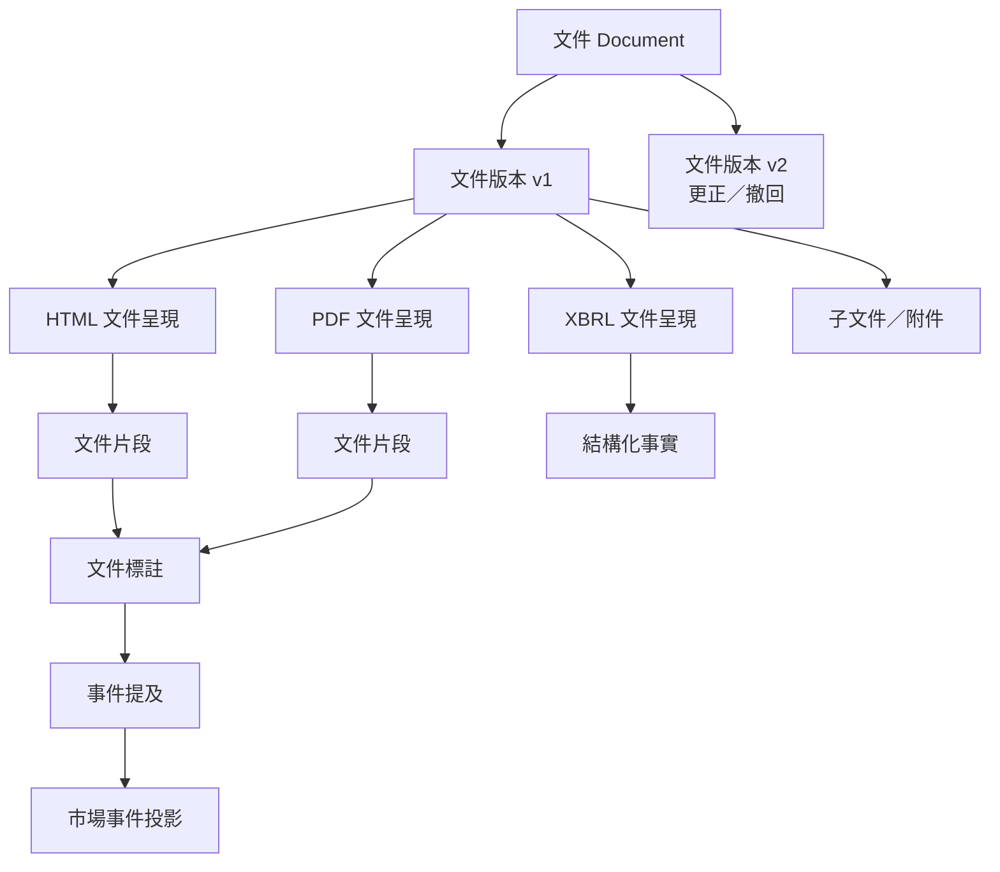
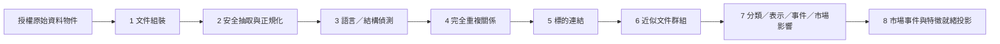

# 新聞、公告與財報處理管線

> **2026-08-15 product boundary:** ADR 0017 與主 spec 的 `COST-0-01` 將 `official-documents-only` 定為完整產品範圍；本文任何付費／契約新聞、外部 entitlement 或新聞完整產品 gate 均不再是需求。官方文件的不可變身分、sandbox、時間點、政策與刪除契約仍有效。

本文件記錄「定義新聞、公告與財報處理管線」的決策。管線將合法取得的台美新聞、公告、財報及機構報告轉成可追溯的標準文本、結構化事實、標的連結、文件群組、事件提及、市場事件與市場影響評估，同時保留來源版本、授權及資訊截止點語意；身分、來源使用資格、保存期限與政策性刪除遵守[安全與保存契約](security-identity-entitlement-and-retention.md)，來源與能力的分期entry gate遵守[分階段架構交接契約](phased-architecture-and-spec-handoff.md)。

## 設計原則

- 來源文件身分、內容證據與衍生文件標註分離保存。
- 去重只形成關係或分析投影，不刪除來源證據。
- 只有來源政策明確允許保存及模型用途的文字，才能進入正式 NLP。
- 正式財務數值優先使用官方結構化事實，不以 OCR 或語言模型覆蓋。
- 模型可 abstain；低置信或低品質輸出不被強迫轉成個股特徵。
- 更正、撤回、人工裁決及模型升級只建立新版本，不修改歷史預測輸入。
- 文件第一次可知、衍生處理完成與 feature-freeze 是三個不同時間概念。

## 文件身分模型



| 層次 | 身分與責任 |
| --- | --- |
| `Document` | 來源發布的一個穩定資訊單位；來源 namespace 加來源文件 ID 優先建立身分 |
| `DocumentVersion` | 某次初始發布、正常更新、更正或撤回的不可變內容狀態 |
| `Rendition` | 同一文件版本的 HTML、PDF、XBRL、純文字或官方語言形式 |
| `Segment` | 可定位到頁碼、段落、標題、表格、儲存格或 XBRL context 的最小處理範圍 |

URL 是有時效的定位方式，內容雜湊識別位元組／標準文本狀態，兩者都不是文件永久主鍵。附件若是獨立報告、簡報或契約，建立子 Document 並以 `attached_to` 關係連接；只有真正相同內容的替代格式或官方語言版本才屬於同一 DocumentVersion 的 rendition。

## 生產導向 MVP 範圍

正式處理：

- 台灣重大訊息、月營收、財務報告、法說簡報及公司公告；
- SEC 10-K、10-Q、8-K、6-K、20-F、40-F 及相關附件；
- 經授權新聞 feed、標題或摘要；
- 國際機構及官方總體報告中可合法保存的文字、表格與預測。

首版不處理社群貼文、論壇、留言、未授權研究報告及任意網站全文。新增來源仍須先通過來源政策與 adapter 契約，不因內容「公開可讀」而自動納入。

## 來源政策與內容保存模式

每個 DocumentVersion 及 Rendition 綁定擷取當時的來源政策版本。政策必須指定一種內容保存模式：

| 模式 | 允許行為 | 正式 NLP 資格 |
| --- | --- | --- |
| `full_content` | 保存及處理明確授權的全文／附件 | 只有模型訓練、衍生與至少七年保存均獲允許時具資格 |
| `summary_only` | 只保存與處理供應商授權摘要 | 僅以實際保存摘要產生特徵，標記 `content_scope=summary` |
| `metadata_link_only` | 保存允許的標題、來源、作者、時間、URL、來源 ID、雜湊 | 不抓全文，不產生全文 embedding、情緒或事件特徵 |
| `disabled` | 不擷取 | 無 |

管線不得以「只在記憶體處理」規避存取、保存或模型訓練限制。只有 URL 而無內容權利的文件可支援研究跳轉，但不能成為文字模型樣本。來源政策若改變，新的處理依新版本執行；既有內容依 tombstone、影響分析及刪除證據流程處置。

## 處理階段與資料集版本



每個階段發布獨立、不可變資料集版本，並保存輸入 manifest、處理組合版本、綱要、涵蓋報告、品質結果及 outbox 事件。失敗從上一個 published 階段重播，不更新同一文件資料列。

1. **文件組裝**：建立 Document、DocumentVersion、Rendition、附件關係及來源宣告的必要／可選內容清單。
2. **安全抽取與正規化**：在 sandbox 中抽取 HTML、PDF、Office、XBRL、文字與壓縮檔；建立標準文本、表格、座標映射及品質指標。
3. **語言／結構偵測**：在文件與片段層級辨識語言、script、標題、段落、列表、表格及 XBRL context。
4. **完全重複關係**：依原始位元組及標準文本雜湊建立 exact duplicate 關係。
5. **標的連結**：生成並裁決發行人、證券或掛牌的候選關係與角色。
6. **近似文件群組**：以版本化規則建立近似轉載／同事件文件群組。
7. **文件標註**：產生 taxonomy、embedding、事件提及、市場影響與其他可核驗 annotation。
8. **市場事件與特徵就緒投影**：聚合事件提及、文件群組及來源佐證，發布給 FeatureBuilder 的不可變輸入。

## 安全抽取與標準文本

所有文件視為不可信輸入。解析程序在無網路、唯讀、受 CPU／記憶體／執行時間／輸出大小／解壓大小限制的 sandbox 中執行，禁止腳本、巨集、外部資源與遞迴壓縮。媒體型別必須以內容檢查而非副檔名驗證；惡意內容掃描、decompression-bomb 防護與 parser crash 都只隔離單一物件。

每個 rendition 保存三種表示：

1. 不可變原始文件呈現；
2. 保留段落、標題、表格、頁碼及原始 offset 對照的標準文本；
3. 只用於 matching 的 aggressive fingerprint text。

標準文本使用保守 Unicode NFC、換行／空白與來源特定 boilerplate 規則，不移除數字、負號、貨幣、百分比、表格欄位或否定詞。每個轉換保存規則版本、原始座標映射及片段雜湊。

### PDF、OCR 與表格

抽取順序為原生文字、版面感知抽取、最後才 OCR。每個 rendition 保存文字涵蓋率、亂碼率、OCR confidence、reading-order、表格結構及語言可信度。品質不足時不強制產生 NLP；可改用同版本的可靠 HTML、XBRL 或官方摘要，否則保留 metadata 並標記缺失。

表格保存頁面／區域、列欄標頭、跨列欄關係、單位、幣別、期間及每個儲存格的原始位置。OCR 或語言模型推測的表格數值不得覆蓋官方結構化事實。

### 文件完整性

Document manifest 列出來源宣告的必要／可選 rendition 與附件。必要附件缺失時 outcome 為 `partial`，不得進入要求完整財報的特徵；可選附件缺失可發布，但涵蓋報告必須明列。來源未提供清單時標記 `coverage_unknown`，由資料集規則決定資格。附件後到只建立新的完整資料集版本。

## 財報與結構化事實

官方 XBRL／iXBRL facts 是正式財務數值的優先來源。每個 fact 保存 taxonomy／concept、value、unit、period、dimensions、decimals、filing／document version、原始 context 及首次取得時間。

HTML／PDF 用於管理層敘述、腳註、非結構化表格、交叉驗證及 XBRL 缺失補充。不同 rendition 的數值衝突並列保存並產生品質事件，不能靜默選擇。文字模型抽取的數值必須保留 evidence span 與低於結構化事實的來源優先級。

Surprise 必須使用資訊截止點前可得、帶有 vintage 且獲授權的法人預期。沒有 consensus 時標記 unavailable，不能由新聞語氣或事後數值反推。

## 語言與翻譯

每個 DocumentVersion 保存來源原文；Segment 另保存語言、script、信心及混合語言範圍。正式抽取使用支援繁體中文及英文的多語模型，不先將中文翻成英文並取代原文。

只有來源明示為官方翻譯或提供明確交叉引用時，才建立 `translation_of`。其他跨語文件即使 embedding 相似，也只能進入同一市場事件或文件群組，不能宣稱相同版本。機器翻譯若供介面閱讀，建立具模型版本的衍生 rendition，不作原始證據及首版模型預設輸入。

## 完全重複與近似文件群組

完全相同內容可共用內容定址物件，但每個來源的 Document、DocumentVersion、發布時間、首次取得時間、授權、撤回鏈與擷取收據各自保留。系統只建立 `exact_duplicate_of` 關係。

近似文件群組按下列版本化證據逐步建立：

1. 標準文本 exact hash；
2. 標題／正文 shingles 或 MinHash；
3. 多語 embedding 相似度；
4. 發布時間窗、來源、標的連結與事件一致性。

DocumentCluster 是可重算分析投影，不取代來源文件。不確定案例保持未分群，不為提高去重率錯誤合併。人工 merge／split 建立版本化裁決與新群組版本。

同一掛牌、事件群組及時間窗只產生一次主要事件貢獻，並另產生來源數、獨立來源數、官方來源旗標、首見／末見時間及報導持續度。代表文件依來源權威、內容完整度、語言及首次取得時間選擇，規則版本化且不刪除其他成員。

## 標的連結

每個標的候選保存 DocumentVersion／Segment、外部識別碼或文字 evidence、連結方法、模型／規則版本、分數、有效時間檢查、候選集合、角色及狀態：`confirmed`、`candidate`、`rejected` 或 `unresolved`。

官方 CIK、交易所代碼或來源明示 ID 的無歧義時間點對照可自動 confirmed。Ticker 必須套用發布時間、交易場所及別名有效期間；名稱／NER 只有高置信且與次高候選具足夠 margin 時才自動確認。閾值以保留 gold set 校準，優先確保 confirmed precision；只有 confirmed 連結進入正式個股特徵。

角色至少包括：

- `subject`
- `counterparty`
- `peer`
- `mentioned`
- `regulator`
- `market_or_sector`

市場影響及事件以實際包含該實體與證據的片段為範圍，不能把 document-level 分數複製給所有提及者。無法連結的市場／總體文件仍可產生市場或產業層級 annotation；明顯指向特定公司但候選衝突者建立隔離紀錄。

## 分類、表示與 annotation

來源原始分類完整保留，另映射到版本化、階層式、多標籤共同 taxonomy。首版頂層包括：

- 財報與營收；
- 財測與法人預期；
- 股利、資本配置與公司行動；
- 融資與信用；
- 併購、投資與組織重整；
- 營運、供應鏈與產能；
- 產品、客戶與合作；
- 治理、人事與所有權；
- 法律、監管與資安；
- 產業、總體與市場環境。

分類保存所有標籤機率、taxonomy 與模型／規則版本，不強迫單一標籤。

### Annotation 共同封套

每個文件標註至少保存：

- annotation ID、annotation kind 與 schema version；
- DocumentVersion、Rendition、Segment 及可回到原文的 evidence span；
- 標的連結、實體角色及事件關係；
- label／value、完整機率或 confidence；
- `abstained` 與品質狀態；
- 模型、規則與處理組合版本；
- 模型訓練資料截止時間；
- `prospective` 或 `retrospective`；
- computed time、輸入 manifest 與來源政策版本。

只有單一正負分數而無證據、完整機率或版本的輸出不得發布。

### Embedding 與長文件

管線依標題、段落、表格、頁面與 XBRL context 建立穩定 Segment，再生成 segment embedding、章節聚合及 document-level 表示。每個 embedding 綁定片段雜湊、前處理、tokenizer、模型、pooling、維度及處理組合版本。長文件採階層式聚合，不截取前 512 tokens 代表全文。

Embedding 與大量 annotation 以 Parquet 資料集版本保存；PostgreSQL 只保留文件索引、狀態、代表摘要、review queue、市場事件 projection 與必要查詢欄位。首版不部署向量資料庫；語意搜尋若成為需求，再在獨立 SemanticSearch seam 建立可刪除／重建的索引。

### 市場影響評估

一般語氣 tone 與市場影響分開。MarketImpactAssessment 針對 confirmed 標的連結、evidence Segment 及 1／5／20 交易日，輸出上漲／下跌／中性機率、影響強度、標的相關性、不確定性及「已被預期」的可用證據。它是模型關聯結果，不宣稱因果，也不是買賣訊號。

低置信輸出可以保存供研究但不得進入正式個股特徵；模型可以 abstain，不能為涵蓋率強迫分類。

## 事件提及與市場事件

EventMention 保存事件類型、evidence Segment、參與者及角色、事件／生效時間、金額、幣別、單位、期間、否定、推測、置信度與處理組合版本。它只代表文件中的抽取主張。

多個 mention 經來源權威、時間、標的及語意一致性規則聚合成版本化 MarketEvent。來源優先政策依事件欄位版本化；通常交易所／監管申報及發行人正式公告作事件事實主要證據，授權新聞作背景與市場反應證據，但來源權威不等於市場方向。

衝突數值、時間或狀態並列保存，MarketEvent 標為 `disputed`，等待來源更正或人工裁決；模型不得靜默挑選。

## 更正、撤回與時間點資格

新 DocumentVersion 觸發新的片段、連結、文件群組、annotation、事件提及與市場事件版本。舊派生物保持不變。

- 更正／撤回首次取得前的時間點視圖仍可看到舊版；
- 首次取得後的新特徵使用更正版，撤回內容不進入新的特徵快照；
- 既有預測仍引用原資料集版本；
- 滾動回測在每個資訊截止點使用當時可見狀態，即使消息日後被證明錯誤；
- 來源政策要求實體刪除時，執行 tombstone、引用影響分析及刪除證據流程。

正式每日預測的文件特徵同時要求：DocumentVersion 的 `first_observed_at <= information_cutoff`、annotation 使用當日允許的處理組合版本，以及必要階段在 feature-freeze 前成功完成。逾時文件不進入當日特徵快照，並記錄 processing-lag 缺失；後續預測才可使用。

平台建置前的文件只有在時間點契約下具`platform_observed`或有效`archive_attested`證據時，才能進入`historical_reconstruction`。重建使用的ProcessingBundle必須固定訓練截止、規則、模型、資源預算與模擬feature-freeze，且不得包含該fold cutoff後的人工裁決、taxonomy、連結或模型知識；所有主張與重建模式寫入衍生資料集及fold manifest。

滾動回測須模擬同一處理預算。每個annotation保存訓練截止時間、執行時間及`prospective`／`historical_reconstruction`／`retrospective_research`模式。缺歷史可得性證據、使用未來知識或不能重建當時處理資格者只能是`retrospective_research`，不得假裝當時已完成或通過正式升版回測。

## 處理組合版本與模型治理

每次 DocumentPipeline 執行固定一個不可變 ProcessingBundleVersion，包含：

- parser、OCR 與正規化規則；
- segmenter 與 language detector；
- identity rule 與 entity linker；
- exact／near-duplicate 規則；
- taxonomy 與分類模型；
- embedding 模型、tokenizer 與 pooling；
- event schema 與 extractor；
- 市場影響模型；
- 品質規則及來源優先政策。

Bundle 保存 artifact checksum、套件鎖定、Git SHA、訓練資料截止時間、模型／資料授權及核准狀態；執行期間不得漂移到「最新模型」。

正式管線預設本地或自託管 NLP。只有來源政策、資料處理合約、區域、保存及供應商訓練條款全數允許，才可啟用外部 inference adapter；每次外部呼叫進入譜系及稽核，並通過與本地 adapter 相同的輸出契約。

新的處理組合版本必須通過中英文 golden corpus、固定 point-in-time replay、舊版比較、資料集／特徵影響報告及 shadow 執行。評估至少涵蓋 extraction coverage、標的連結 precision、分類／事件品質、校準、abstention 與文件群組穩定性；人工核准後才供新正式特徵使用。既有預測不遷移。

## 人工標註與裁決

模型輸出、人工標註及人工處置分開保存。人工標註記錄標註者、guideline 版本、時間及 adjudication 狀態；裁決後 gold label 可用於訓練／評估，但不覆寫模型輸出。

研究人員不得直接修改文件群組、標的連結或市場事件資料列，只能建立版本化決策：

- confirm／reject 標的連結；
- merge／split 文件群組；
- accept／reject 事件提及；
- 裁決衝突欄位；
- 標記 extraction failure。

決策保存操作者、時間、理由、證據與 guideline 版本，並觸發新衍生資料集版本。高潛在影響、低置信或多來源衝突項目優先進 review queue。

## 深模組介面

外部呼叫端只使用：

```text
DocumentPipeline.process(DocumentProcessingRequest) -> DocumentProcessingResult
```

Request 固定輸入資料集版本、來源政策版本、資訊截止點、目標 stage、處理組合版本與執行／trace ID。Result 回傳各階段資料集版本、涵蓋報告、隔離摘要、品質結果及事件。

Rendition extractor、sandbox parser、OCR、language detector、entity linker、clusterer、classifier、embedder、event extractor 與 market-impact model 都是模組內部 adapter。這些 seam 以多媒體格式、多語模型、本地／外部 inference 與測試 fake 等實際變體證明其必要性；呼叫端不操作或組裝個別模型。

## 必須通過的驗收情境

- 同一公告的 HTML、PDF、XBRL 與附件正確組裝，結構化 fact 能回到官方 context。
- 繁體中文、英文、混合語言及官方翻譯關係正確保存。
- 相同新聞稿跨來源轉載時，授權、發布／取得時間、更正與撤回各自保留，特徵不重複放大。
- Ticker 重用、多公司提及及 ambiguous entity link 不會錯連個股特徵。
- 長財報、掃描 PDF、亂碼、表格及低品質 OCR 能 abstain 或選擇可靠 rendition。
- 更正、撤回、附件後到及來源要求刪除均建立新版本及可稽核影響鏈。
- `full_content`、`summary_only`、`metadata_link_only` 與 `disabled` 政策不能被 parser 或模型繞過。
- Parser crash、惡意檔案、巨集、外部資源、壓縮炸彈及處理逾時只隔離單一物件。
- Retrospective annotation 與 training cutoff 不合格的 bundle 無法進入正式回測或特徵。
- `archive_attested`文件只有在historical-reconstruction bundle不含未來知識並模擬處理預算時可進正式歷史回測；production仍只接受`first_observed_at`合格文件。
- 人工裁決形成新資料集版本，不改寫模型結果或歷史預測。
- 任一市場影響特徵可以追溯到原始文件片段、文件版本、來源政策、標的連結、annotation 及處理組合版本。

驗收 corpus 必須同時含台灣及美國一手文件、繁中及英文、結構化申報與掃描文件；只有 mock 或單一英文新聞範例通過不算完成。
