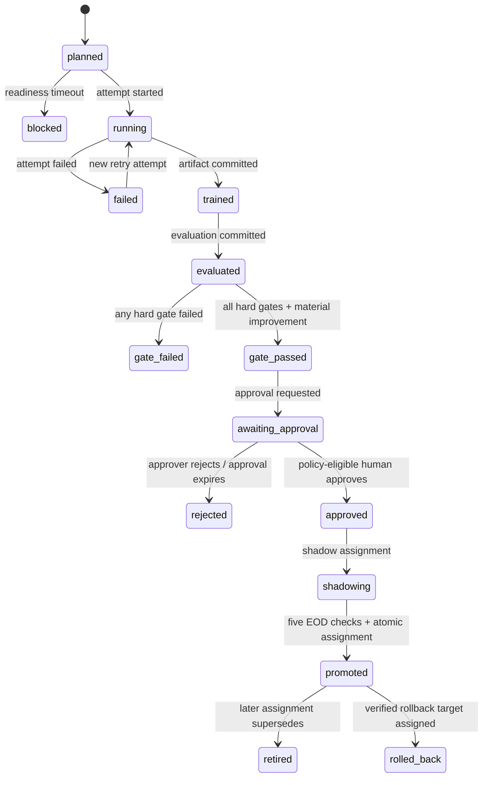

# 模型生命週期、升版與復現契約

> **2026-08-15 product boundary:** ADR 0017 與主 spec 的 `COST-0-01` 取代本文對固定七年／八季資料深度、外部簽章服務與付費來源的必要假設；fold 數與期間由實際合格歷史固定進 TrainingIntent，支援不足不得形成正式候選。本文其餘 append-only governance、approval、shadow、assignment、rollback 與 reproduction 契約仍有效。

本文件定義模型家族從訓練意圖、訓練嘗試、模型成品、回測評估、升版閘門、人工核准、shadow、服務指派、回退、漂移觸發到退役的權威流程。核心目標是讓任何現行模型都能回答「用什麼資料與程式產生、通過哪版規則、由誰核准、何時被指派、如何復現與回退」，而不把可變的 registry alias 當作歷史真相。

模型架構遵守 [`multimodal-trend-model.md`](multimodal-trend-model.md)，標籤與回測遵守 [`trend-label-and-backtest-contract.md`](trend-label-and-backtest-contract.md)，核准身分、來源使用資格、成品簽章、保存及政策性刪除遵守[安全與保存契約](security-identity-entitlement-and-retention.md)。本文件固定首版升版門檻；分期啟動、首個baseline entry gate與垂直驗收遵守[分階段架構交接契約](phased-architecture-and-spec-handoff.md)，監控呈現與告警路由另由觀測性設計負責。

## 權威來源與 projection

| 類別 | 權威位置 | 說明 |
| --- | --- | --- |
| 生命週期事件、決策與服務指派 | 應用 PostgreSQL `ml` schema | Append-only events 及由事件重建的目前 projection |
| 模型、校準器、大型評估、manifests | 內容定址物件儲存 | URI、checksum、size、媒體型別及政策引用在 ledger 登記 |
| Experiment tracking／registry UI | MLflow adapter（啟用時） | 可重建 projection，不是核准或現行模型真相 |
| Serving 快取 | 本機或部署快取 | 只快取已 pin 的服務指派，可刪除及重建 |

Dagster、MLflow 或未來 registry 不能直接寫入應用 `ml` schema 的權威表；它們透過 module interface 與 transactional outbox 交換應用 UUID、artifact URI、checksum、metric summary 及 trace ID。MLflow outage 只使 projection 成為 `projection_pending`，不更改 canonical lifecycle。

## 領域身分

| 身分 | 不可變內容／責任 |
| --- | --- |
| `ModelFamily` | 服務範圍、輸出契約及允許互相比較的模型成品序列；MVP 一個共享台美三期間家族 |
| `TrainingIntent` | Trigger、cutoff、完整資料／程式／設定 manifest 與 idempotency key |
| `TrainingRun` | 某個 intent 的一次 attempt；trial 也是 run，但不天然是候選模型 |
| `ModelArtifact` | 自包含模型成品、checksum、schema、校準器、參考分布與譜系 |
| `EvaluationReport` | 固定八季回測、baselines、ablations、切片、成本與資源證據 |
| `BootstrapGatePolicyVersion` | 首個正式logistic相對class-prior的單次啟動資格；首個production指派後永久停用 |
| `GatePolicyVersion` | 不可變 hard gates、比較與 material-improvement 規則 |
| `GateDecision` | 一個 artifact 依一版政策逐閘門通過／失敗的證據 |
| `ApprovalDecision` | 人工核准或拒絕，綁定 artifact、report、policy 及 expected assignment |
| `ServingAssignment` | `production` 或 `shadow` 在一段有效期間的 artifact 指派 |
| `PromotionEvent`／`RollbackEvent` | 指派改變的原因、前後 assignment 及操作者／自動規則 |
| `ReproductionRun` | 隔離環境重建樣本、成品與評估的執行及差異報告 |
| `PolicyImpactAssessment` | 授權、刪除或安全事件對成品與指派的譜系影響 |

所有實體使用內部 UUID；內容型物件另有 canonical manifest hash。模型成品沒有 `production` 可變欄位，服務資格與目前指派是獨立決策。

## 深 module interface

外部 workflow、排程、管理介面及測試只使用：

```text
ModelLifecycle.execute(LifecycleCommand) -> LifecycleResult
ServingAssignmentResolver.pin(PinRequest) -> PinnedServingAssignment
```

`ModelLifecycle` 隱藏狀態轉移、角色分離、idempotency、閘門、核准效期、shadow、compare-and-swap、outbox、回退與 retention 行為。`ServingAssignmentResolver` 在 EOD batch 開始時解析並驗證一次服務指派；回傳結果 pin 到整批結束，批次中途不跟隨新升版。

內部真實 seam 只有具替代需求者：

- `LifecycleStore`：PostgreSQL adapter 與 transaction-capable test adapter；
- `ArtifactRepository`：內容定址物件儲存 adapter 與本機測試 adapter；
- `ExperimentTracker`／`ModelRegistry`：MLflow adapter、no-op／in-memory test adapter；
- `LifecycleEventPublisher`：transactional outbox adapter 及同步測試 adapter。

呼叫端不操作 MLflow run、alias、資料庫表或物件 key，也不能繞過 `ModelLifecycle` 直接建立服務指派。

## Append-only 狀態機



`blocked`、`failed`、`gate_failed`、`rejected`、`superseded`、`retired`、`policy_quarantined` 及 `rolled_back` 都是事件投影結果。任何更正都新增事件；拒絕不可翻轉，重新評估或核准需新 decision。回退只建立指向舊核准成品的新服務指派，不把 artifact 狀態「改回 production」。

## 訓練觸發與行為

五類 trigger 都建立 TrainingIntent、通過同一 readiness barrier、八季評估、hard gates 與人工核准：

| Trigger | 時機 | 訓練行為 |
| --- | --- | --- |
| `scheduled_incremental` | 每週第一個共同 readiness window | Warm-start 現行模型；固定 architecture、feature schema、normalizer；完整 rolling 7-year 訓練視窗，最多 5 epochs；重新擬合六個 calibrators |
| `scheduled_full` | 月末後第一個 readiness window | 使用已核准 config 從頭重建 normalizer，三 seeds、最多 50 epochs |
| `scheduled_hpo` | 季末後第一個 readiness window | 最多 30 trials；選定 config 後另建 intent，從頭訓練三 seeds |
| `drift_early` | 漂移規則連續成立 | 使用現行 config 從頭重訓，不臨時擴大搜尋空間 |
| `manual_rebuild` | 人工明確提出 | 必填 reason／incident／change reference，仍不可略過 gate |

同一 cutoff 發生碰撞時，季度取代月度、月度取代週度；coalesced／cancelled／superseded 都保存事件。排程到點不等於資料可用。

排程能力依證據逐步啟用：P2先只允許人工 `manual_rebuild` 建立首個baseline；P4先啟用每月 `scheduled_full`，連續兩次完整成功後才啟用每週 `scheduled_incremental`，再到下一個完整季度才可啟用 `scheduled_hpo`。`drift_early` 需先具有合格參考窗與連續兩次漂移評估；任何啟用都不縮短readiness、gate、shadow或人工核准。

### Readiness barrier

Barrier 要求台灣及美國所需項目全部合格：

- CoverageReport 與來源 outcome；
- 成熟標籤與 FeatureDataset；
- 股票池、交易日曆、調整版本與處理組合；
- 來源政策的訓練、保存及衍生資格；
- 允許的 latest-mature session（兩市場可不同，但必須明列）。

最多等待 24 小時。逾時轉 `blocked` 並告警，不退回舊快照、不以部分市場或部分資料偷偷訓練。

## TrainingIntent manifest

啟動前固定：

- Source、dataset、FeatureSnapshot、label 與 fold manifests；
- 股票池、日曆、調整、處理組合及來源政策版本；
- Model／HPO config、feature schema、seeds 及 parent artifact；
- 程式 Git SHA、container image digest、套件鎖定與硬體／精度 profile；
- 交易成本情境、baselines、ablations 與 GatePolicyVersion；
- Trigger evidence、cutoff、建立者、run／trace ID 及資源預算。

Canonical manifest hash 加 ModelFamily、cutoff 與 trigger priority 構成 idempotency key。Manifest 含 `latest`、未解析選擇條件、缺失 checksum 或不合格政策時不能進入 `running`。

同一 intent 同時只有一個 active TrainingRun attempt；暫時性失敗最多新增三個 attempts，永不覆寫先前 log、metric 或輸出。輸入或設定改變必須建立新 intent。

### HPO trials

Trial 是 `scheduled_hpo` intent 下的 child TrainingRun，只保存 trial 參數、驗證指標、資源及短期 checkpoint。依 validation 規則選出的 config 必須建立新 TrainingIntent，以三 seeds 從頭訓練、校準及回測後才可成為候選模型；trial checkpoint 永遠不能直接核准或升版。

## BootstrapGatePolicy 與一般 GatePolicy

兩種政策的所有適用條件都是 hard gates；任一失敗即否決，不以加權總分互相抵銷。`BootstrapGatePolicyVersion` 只解決尚無現行模型時，若一般政策要求勝過最佳logistic或incumbent就無法建立首個正式logistic的循環依賴；它不是日後放寬升版的替代路徑。

### BootstrapGatePolicyVersion v1

只有regularized multinomial logistic、且模型家族尚未曾建立production服務指派時可使用。它必須在相同八季fold、三seeds、六個market × horizon cells及成本情境下，equal-cell macro-F1至少勝過class-prior `1.0 percentage point`，並通過本文件所有適用的資格、時間點、防洩漏、校準、經濟、穩定、涵蓋、營運、安全、復現、人工核准及五次shadow條件。

Bootstrap只免除「勝過最佳既有logistic」、「相對incumbent非劣」與「相對incumbent實質改善」三類不存在比較對象的條件；下列條文提到最佳prior／logistic時以class-prior作唯一比較，提到incumbent或material improvement時不適用，其餘絕對條件不變。Class-prior本身不能取得production服務指派。首個production服務指派一旦建立，該ModelFamily永久拒絕任何新的BootstrapGateDecision，即使日後所有production指派被撤銷。若沒有logistic通過，正式預測維持blocked，不以fixture、prior或人工例外取代。

### GatePolicyVersion v1

首個production指派建立後，所有logistic、multimodal與neural候選都使用一般政策：候選同時需勝過最佳prior／logistic baselines、相對現行模型非劣，且至少一項實質改善。不得因模型類型、排程、漂移或現行模型停用而改走Bootstrap。

#### 資格與復現

- Required manifests、CoverageReport、來源政策、checksums、schema、防洩漏契約及 interface tests 100% 通過；
- 三個預先登錄 seeds、prior／logistic baselines 與全部 ablations 完成；
- Sample membership、標籤及 metrics 在核准 runtime 重播一致；
- 同環境 CPU 逐筆機率最大差 `<= 1e-6`；核准 mixed-precision GPU 路徑 `<= 1e-4`；
- 任何 `latest`、retrospective contamination、policy block、缺件或 artifact corruption 直接否決。

#### 統計

在相同最新 8 個完整季度，以 session 為 cluster、20-session blocks、2,000 次 paired bootstrap：

- 六個 market × horizon cells 等權 macro-F1 至少勝過最佳 prior／logistic baseline 1.0 percentage point；
- 相對現行模型的 95% CI lower bound `> -0.5` percentage point；
- 任一 cell 的 point decline 不超過 1.5 percentage points。

#### 校準

- 六 cells 等權 ECE `<= 0.05`；
- 每個 full-support cell `<= 0.08`，degraded-support cell `<= 0.10`；
- 六個 calibrators 均為 `sufficient_data`；identity fallback 不可升版；
- 等權 NLL 與 multiclass Brier 各自不比現行模型惡化超過 1%；首版不比最佳校準 baseline 差。

#### 經濟

- 成本後 rank IC 在台灣與美國 aggregate 都 `> 0`，六 cells 至少四個 `> 0`；
- 等權 IC information ratio `>= 0.30`；
- Top-20% long 相對市場基準的成本後 excess return 兩市場 aggregate 都非負，至少四 cells 非負；
- 最大回撤惡化不超過 `max(2 percentage points, incumbent drawdown 的 10%)`；
- 換手增加超過 25% 時必須仍有更高成本後報酬；
- 美股 market-neutral 只作 diagnostic，不是 hard gate。

#### 穩定性與涵蓋

- 8 季至少 6 季 equal-cell macro-F1 delta `>= -0.5` point，且不得連續三季落後；
- 三 seeds macro-F1 標準差 `<= 1.0` point，worst seed 仍勝過最佳 baseline；
- 樣本數 `>= 500` 的市場／期間／產業／規模／流動性主要切片，任一 macro-F1 decline 不超過 2 points；
- Degraded coverage 不比現行模型減少超過 5 points，該群 macro-F1 不下降超過 2 points。

#### 營運與安全

- Trainable parameters `<= 15M`；
- 核准 MVP 股票池 CPU EOD predict 加 attribution `<= 10 分鐘`；
- 完整每日管線 `<= 2 小時`；
- ModelArtifact 可無網路載入，不含不安全 callable 或未授權原文；
- Checksum、runtime、source-policy、ForecastBatch schema 與機率不變量 100% 通過；
- Critical security finding、不可重現載入或 artifact corruption 直接否決。

#### 實質改善

至少符合一項：

- Equal-cell macro-F1 `+0.5` percentage point；
- NLL 或 Brier 相對改善 `>= 2%`；
- Equal-cell rank IC `+0.005`；
- 成本後 annualized excess return `+1.0` percentage point；
- 其他結果非劣時，CPU latency 或 artifact size 改善 `>= 20%`。

BootstrapGatePolicyVersion與GatePolicyVersion都是不可變domain artifact。門檻變更只適用新GateDecision，不回頭把舊失敗變成功或撤銷舊核准證據。

## ReproductionRun

GateDecision 前必須在隔離、無網路、由 container image digest 與套件鎖定重建的核准 runtime 執行：

1. 解析 manifests 並驗證所有 inputs／artifacts checksums；
2. 重建 sample membership、趨勢標籤與 normalizer；
3. 以 primary seed 重建 ModelArtifact；
4. 重跑評估並產生逐項差異報告；
5. 套用 CPU／GPU 數值容差及完整性 gate。

失敗即 veto。成功報告、runtime、硬體／精度 profile、輸出 hashes 與差異保存至少七年。

## 人工核准

- 每次核准綁定一個內容定址且不可變的 `ModelApprovalPolicyVersion`；caller 不能傳入臨時 self-approval 開關；
- `separated_duties` 要求核准者具 `model_approver` 權限，且不能是該 TrainingIntent 的建立者或 TrainingRun 執行者；
- `owner_operated` 只允許政策指定的穩定 owner principal 核准，即使該 principal 同時建立／執行訓練；Decision 與 UI 必須明記沒有獨立審查；
- Decision 綁定 artifact checksum、EvaluationReport、GatePolicyVersion、ModelFamily 及 expected current assignment；
- 核准／拒絕必填理由；拒絕不可翻轉；
- 核准 7 個曆日內未升版即失效；
- Artifact、report、來源政策資格、critical security 狀態或 expected assignment 改變時立即失效。

兩種輪廓都只能在人類具備 `model_governance.approve` 行動權限且全部 hard gates 已通過後作成決定。切換到多人治理要建立新的政策版本；既有 owner-operated Decision 保留原始 `independent_review=false`，不能事後改寫成職責分離。

同一 artifact 失效或遭拒後若要再考慮，必須用新 report／gate 及新 approval request；不能編輯舊 Decision。

## Shadow 與 promotion

通過 hard gates 後建立 shadow assignment，在 5 個不同且遞增的合格日期完成台美共同 EOD runs；日期間可有文件化的每日停機，停機本身不算 run，也不要求主機連續多日在線：

- Artifact cold-load 與 checksum；
- FeatureBatch／FeatureSchema compatibility；
- CPU 十分鐘 SLA；
- ForecastBatch 機率與結構不變量；
- 對現行模型的 prediction／availability／latency 差異報告。

Shadow prediction 不對使用者顯示為正式結果，且不取代 production PredictionRecord。首版不按使用者 canary，避免同一資訊截止點有兩個「現行模型」。

### 原子 promotion transaction

先把成品 staged 到 serving 可讀位置並完成 checksum、runtime、schema、政策與 cold-load 驗證，再於單一 PostgreSQL transaction：

1. 鎖定 ModelFamily；
2. 驗證 approval、shadow、rollback target 及 expected current assignment；
3. Append PromotionEvent；
4. 結束舊 assignment 有效期並建立新 production ServingAssignment；
5. 寫入 projection／cache／通知 outbox。

切換採 compare-and-swap。Transaction commit 後的 MLflow projection、cache warming 與通知可冪等重試；它們不能反過來決定升版結果。新 assignment 只從下一個未開始的 EOD batch 生效。

## Serving pin 與預測不可變性

Serving 在每個 EOD batch 開始時解析、驗證及 pin 一個 assignment；整批使用同一 ModelArtifact，批次中途 promotion 不改變已開始的預測。

升版、回退、來源更正或重新校準永不改寫舊 PredictionRecords。歷史研究重算建立 `retrospective_replay` run／dataset，明確保存事後模式、輸入及模型版本，不能取代當時 production、混入正式線上績效或假裝當時可知。

## 回退與 break-glass

每次 promotion 前重新驗證 rollback target：

- Approved／eligible；
- Artifact checksum、runtime 及 cold-load；
- 目前 FeatureSchema 與來源政策相容；
- Serving smoke tests 通過。

之後每日輕量驗證。除首次部署外，沒有合格 rollback target 不得 promotion；首次部署失敗則停止正式預測。Target 失格立即撤銷資格並告警。

### 自動回退

下列可立即驗證的 serving failure 觸發 compare-and-swap 回退：

- Artifact checksum 或載入失敗；
- 整批 schema incompatibility；
- NaN、負值、總和不為一等無效機率；
- 不可用率比 shadow baseline 增加超過 5 percentage points；
- CPU SLA 連續兩次違反。

資料／prediction drift 與成熟標籤品質下降具有延遲及雜訊，只告警並允許人工回退，不自動判定舊模型必然較佳。回退不刪除、重算或重新歸屬既有預測。

Break-glass 永遠不能把未通過候選升版。只有雙人核准可以 `stop_serving`、切到既有 eligible／approved artifact 或撤銷 assignment；事件必須保存 incident ID、理由、操作者、前後狀態與事後檢討。

## Drift-triggered candidate

任一條件連續兩個週檢查窗成立才建立 `drift_early` TrainingIntent：

- 至少 10% critical features 的 PSI `>= 0.25`；
- OOD／degraded rate 相對訓練基線增加 `>= 10` percentage points；
- 有 60-session 成熟標籤時，equal-cell macro-F1 下降 `>= 3` points 且 bootstrap CI 排除 0；
- ECE `> 0.10`；
- Aggregate rank IC `<= 0`。

來源 outage、coverage failure、schema incident 或 policy block 先隔離／修復資料，不以重訓掩蓋。Drift trigger 只產生候選，仍走同一 readiness、八季回測、hard gates、shadow 及人工核准。

## 過時階梯

候選失敗時維持現行 assignment，不因排程到了就換版：

| 條件 | 行為 |
| --- | --- |
| 45 日沒有成功 monthly-full 評估 | 標記 `stale`、告警並在研究介面顯示 |
| 最近完整 GateDecision 超過 90 日 | 升高過時警示，要求人工處置 |
| 超過 120 日、來源政策失效或 FeatureSchema 不相容 | 停止正式預測，等待合格模型 |

過時是治理狀態，不自動修改預測機率或偽造低信心分數。

## 授權、刪除與安全影響

來源政策撤回、刪除要求或安全事件沿 lineage 建立 PolicyImpactAssessment。受影響 artifact 轉 `policy_quarantined`，禁止新 TrainingIntent、核准或 ServingAssignment；現行指派立即切到仍 eligible 的 approved target，沒有 target 則停止正式預測。

政策要求實體刪除時，物件依 policy workflow 刪除；canonical ledger 保留不含被禁止內容的 tombstone、原 checksum、刪除範圍、時間、依據及 deletion certificate。刪除不能以 silent 404 取代稽核證據。

## 保存政策

| 類別 | 保存期 |
| --- | --- |
| Promoted／approved／rejected ModelArtifacts | 至少 7 年；現行與 rollback target 在任職期間不過期，退役後再計 7 年 |
| Evaluation／gate／approval／assignment／prediction lineage | 至少 7 年 |
| Trial／failed-run manifest、params、metrics、logs、checksums | 至少 7 年 |
| 未入選 trial checkpoint | 90 日 |
| 未完成暫存物 | 30 日 |

來源政策要求更短保存、隔離或刪除時，政策處置及 tombstone 優先。

## Reconciliation 與故障恢復

週期 reconciler 以 canonical ledger 加內容定址物件為準，檢查：

- Event sequence、目前／shadow assignment 及 expected current；
- Artifact URI／checksum／runtime；
- MLflow run／model links；
- Serving cache 的 pinned assignment；
- Outbox delivery 與 orphan projections。

缺失 projection 由 outbox 冪等補建；多餘或錯誤 MLflow 記錄標為 orphan，不影響 production。Serving cache 無法證明等於 pinned assignment 時 fail closed 或使用已驗證 rollback target，不能自行選檔名、更新時間或 `latest`。[部署契約](deployment-topology-capacity-and-recovery.md)固定 PostgreSQL／物件儲存的 RPO、RTO、復原集合、備份與跨區還原；恢復後仍必須通過本 reconciliation 才能 serving。

## 必須通過的 interface 情境

- 同一 manifest／cutoff／trigger 重送只得到同一 TrainingIntent；設定變更建立新 intent。
- 暫時失敗產生新 attempt 且舊 log 不被覆寫；第四次失敗不再自動重試。
- 季／月／週排程碰撞依優先級合併，不產生重複候選。
- 任一市場 readiness 不合格時，24 小時後 blocked 而非部分訓練。
- HPO trial checkpoint 無法建立 approval 或 production assignment。
- 任一 hard gate 失敗即 veto；修改 GatePolicyVersion 不改變舊 GateDecision。
- 首個正式logistic只能在無既有production指派時使用BootstrapGatePolicy，且未勝class-prior至少1 point時維持blocked。
- 首個production指派建立後，任何BootstrapGateDecision都被永久拒絕；後續logistic與neural一律走一般GatePolicy。
- MLflow 停機時 canonical lifecycle 可前進，恢復後 projection 與 checksum 可重建。
- 建立者／執行者不能核准自己的候選；過期或內容改變的核准不能 promotion。
- 五次 shadow 未完成、rollback target 不合格或 expected assignment 改變時 compare-and-swap 失敗。
- EOD batch 在 promotion 前後各自 pin 單一 assignment，不出現半批混用。
- 自動回退只建立新 assignment；既有 PredictionRecords 不變。
- Break-glass 無法把 gate-failed artifact 升版。
- ReproductionRun 在無網路環境重建並符合數值容差，否則 gate failed。
- Policy quarantine 能沿 lineage 停用受影響 artifact；無合格 target 時停止預測。
- 45／90／120 日過時階梯不被低信心數值掩蓋。
- Ledger、MLflow 與 cache 衝突時，只有 ledger＋checksum-valid artifact 能決定服務。
