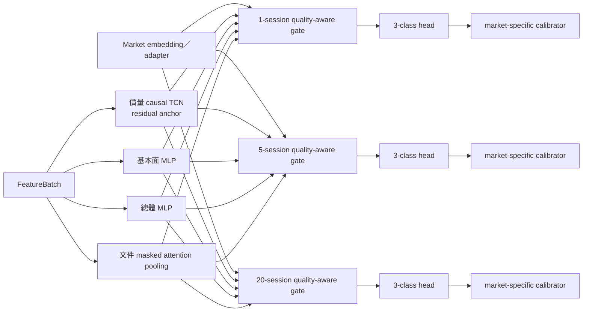

# 多模態趨勢模型與訓練設計

> **2026-08-15 product boundary:** ADR 0017 與主 spec 的 `COST-0-01` 取代本文對商業新聞／consensus、付費 encoder API、固定股票池與固定歷史深度的必要假設；模型只能使用合格官方零成本模態及本機 open-license artifacts。本文的缺值語意、TrendForecaster seam、校準、ablation 與 fail-closed 原則仍有效。

本文件固定生產導向 MVP 的多模態趨勢模型：它以時間點正確的價量、基本面、總體及文件模態資料，對台灣與美國掛牌一次產生 1／5／20 交易日上漲、下跌、盤整機率、信心分數、資料支援狀態及主要影響因素。標籤、回測摺與測試隔離遵守 [`trend-label-and-backtest-contract.md`](trend-label-and-backtest-contract.md)；候選模型升版門檻與排程由模型生命週期設計另行固定，baseline到neural的分期與股票池資格遵守[分階段架構交接契約](phased-architecture-and-spec-handoff.md)。

## 決策摘要

- 首版使用一個跨台美共享模型，不各自維護兩套完整網路。
- 價量表示是每個預測期間的 residual anchor；基本面、總體與文件是可缺失的加權增量。
- 共享模態 encoder 與 late gated fusion；市場差異由 market embedding、市場別正規化及小型 adapter 表達。
- 三個預測期間使用獨立 quality-aware gate 與分類 head；六個市場 × 預測期間校準器分開擬合。
- 大型多語文字 encoder 在文件管線中預先執行並凍結；趨勢模型不讀原文、不端到端微調文字模型。
- 外部只跨越一個深 `TrendForecaster` module interface；TCN、MLP、pooling、gate、head 及框架 checkpoint 都是 implementation 細節。
- ModelArtifact 離線、自包含、內容定址；推論不連網、不抓資料、不解析文件、不查詢 `latest`。
- 模型只回報 OOD／資料支援訊號；漂移判定、重訓及升版由外部生命週期與監控 module 負責。

## 深模組與 seam

外部呼叫端只使用：

```text
TrendForecaster.train(TrainingRequest) -> ModelArtifact
TrendForecaster.predict(PredictionRequest) -> ForecastBatch
```

這個 seam 有兩類實際 adapter：

1. `NeuralTrendForecaster`：本文件定義的 TCN／MLP／文字 pooling／gated fusion implementation。
2. `BaselineTrendForecaster`：market × horizon prior 與正規化 multinomial logistic implementation，同時作契約測試與升版基準。

呼叫端不能選擇或組裝 encoder、gate、head、calibrator 或 optimizer。這些是深 module 內部 seam，只有 implementation 測試可以替換；外部測試與正式呼叫都穿過相同的 `TrendForecaster` interface。

### TrainingRequest

Request 只引用不可變輸入與預先登錄設定：

- training、validation、calibration FeatureDataset manifest；
- 對應成熟趨勢標籤資料集與回測摺 manifest；
- feature schema、label rule、股票池、交易日曆及調整版本；
- model config／HPO search-space version、primary seed 與兩個 stability seeds；
- 來源政策、處理組合、套件鎖定及程式 SHA；
- GPU／CPU／時間／trial 等資源預算與 run／trace ID。

`train` 回傳 primary seed 的不可變 ModelArtifact，並在成品內引用三 seeds、baselines、ablations、校準及資源使用報告。訓練 implementation 可以從 DatasetReader 讀取 Request 已固定的資料集版本，但不能自行解析可變資料選擇條件或改成最新資料。

### PredictionRequest

Request 包含：

- ModelArtifact ID／內容雜湊；
- 一個不可變 FeatureBatch 及其 FeatureSnapshot、schema、資訊截止點與股票池版本；
- 被請求的掛牌、anchor session、1／5／20 預測期間；
- run／trace ID 與資源預算。

同一 ModelArtifact 與 FeatureBatch 必須產生不受請求順序及批次組成影響的結果。任何橫斷面排名或市場相對特徵都在 FeatureSnapshot 建立時固定，`predict` 不能依目前 batch 重新計算。

## FeatureBatch 共同封套

每個模態除了數值／表示外，都攜帶：

- `observed_mask` 與有效時間；
- `age`／staleness；
- coverage、quality 及來源 outcome；
- feature schema／dataset／processing bundle 版本；
- source-policy eligibility；
- 需要時可回到來源紀錄或文件片段的 evidence pointer。

缺失不能以數值零或「中性」冒充。Gate 只在 eligibility 與 availability mask 允許時使用該模態；數值零若具有業務意義，必須同時有 `observed=true`。

### 視窗與張量契約

| 模態 | 時間範圍 | 首版形狀／上限 | 說明 |
| --- | --- | --- | --- |
| 價量 | 252 realized sessions | `[listing, 252, price_feature]` | causal、masked；以內部調整版本產生 |
| 基本面 | 8 個季度 vintage | `[listing, 8, fundamental_feature]` | 依當時已知申報版本及業務有效期 |
| 月頻總體 | 24 個 vintage | `[market_scope, 24, macro_feature]` | 保留 release／revision vintage 與 age |
| 季頻總體 | 8 個 vintage | `[market_scope, 8, macro_feature]` | 不以日後修訂回填歷史 |
| 文件 | 過去 20 realized sessions | 最多 64 個 segment 表示 | 只用授權合格、point-in-time 完成的文件標註 |

### 價量資格與新掛牌

Anchor session 必須有有效調整收盤價。252-session 視窗依有效 session 數分類：

| 條件 | 價量支援 | 預測狀態 |
| --- | --- | --- |
| `valid_sessions >= 240` | `full` | 可為 `full`，仍取決於可選模態 |
| `60 <= valid_sessions < 240` | mask 加 left padding | `degraded` |
| `valid_sessions < 60` 或 anchor 缺價 | 不合格 | `unavailable`，不產生機率 |

不得以未來價格、另一掛牌價格或無證據 forward fill 補齊。模型以自然存在的上市年齡與缺漏 mask 訓練 degraded 情境。

### 可選模態的空值語意

- 基本面與總體 vintage 在其業務有效期內可以 carry forward，但 age 必須持續增加；日後修訂不回填舊時間點。
- 「沒有文件事件」只有在預期來源、股票池與時間窗的涵蓋報告完整時才是有效空集合。
- `partial`、`policy_blocked`、處理逾時、低品質 abstention 或未知 coverage 都是缺失／降級，不是中性消息。
- 任一可選模態缺失時仍可預測，但 `prediction_status=degraded` 並保存逐模態原因。

## 正式 feature schema

首版只接受具共同經濟語意及版本的 feature ID，不接受 provider 原生欄名直接穿入模型。

### 價量

- 內部調整 log return、open-close gap、high-low range；
- log volume、turnover、成交／流動性及 Amihud 類量測；
- 多尺度 realized volatility、drawdown 與趨勢統計；
- point-in-time 市場／產業相對報酬與橫斷面 rank；
- 公司行動、停牌、半日市及資料品質旗標。

不輸入 nominal raw price、ticker 或名稱字串。未調整行情仍保存在證據鏈中，但模型價量特徵由明確 AdjustmentVersion 產生。

### 基本面

- 收入／獲利／資產／現金流成長；
- margin、ROA／ROE 及其他獲利能力；
- 營運現金流、自由現金流與 accrual 類量測；
- leverage、利息保障、流動性與資本結構；
- point-in-time valuation、market cap／規模及相對產業 rank；
- filing age、revision、coverage、unit／currency 及品質旗標。

### 總體與市場狀態

- 政策利率、殖利率曲線、信用與流動性；
- 通膨、產出／成長、就業與景氣指標；
- FX、商品、主要指數、波動與市場廣度；
- 國際機構預測 vintage 與預測修訂；
- 市場／國家 scope、release age 及 point-in-time availability。

### 文件情報

- 凍結的多語 segment embedding；
- 市場影響評估、事件類型及強度；
- 來源、文件類型、標的角色、age、quality、abstention；
- evidence pointer 與處理組合版本。

20-session 視窗先保留授權合格且具 confirmed 標的連結，或明確市場／產業 scope 的 segment；`subject` 優先，`counterparty`、`peer` 等角色必須明示。文件群組先去重，再依版本化的來源權威、品質、角色與 recency 規則決定性排序到 64 筆。不得以未來標籤、測試結果或事後訓練的 relevance 選擇 segment。

## 正規化契約

- Median、IQR、winsorization quantile、缺值統計及任何 learned preprocessing 只從回測摺訓練區擬合。
- 市場別 robust normalizer 與 feature schema 一起包入 ModelArtifact；validation、calibration、test 及正式推論只套用。
- Point-in-time 橫斷面 rank 只使用該 FeatureSnapshot 的股票池及合格 session，不能用今日成分回算歷史。
- 首版不使用 listing ID embedding，避免記憶特定掛牌、擴大 survivor bias 或讓新掛牌無法泛化。
- Schema 新增、刪除、重新定義、shape 或 unit 不相容時 fail closed；不以欄位順序猜測相容。

## NeuralTrendForecaster implementation



### 容量基準

- 共同 latent dimension：128；market embedding：16。
- 價量 encoder：causal masked TCN，6 個 residual blocks、kernel 3、dilation `1,2,4,8,16,32`、128 channels，receptive field 253 sessions。
- 基本面 encoder：MLP `256 -> 128`；總體 encoder：MLP `128 -> 128`。
- 文件 encoder：2-head masked attention pooling，再投影到 128。
- 每個 horizon 有獨立 quality-aware gate 與三分類 head。
- 整個 forecast module 不超過 15M trainable parameters；凍結的上游文字 encoder 不計入，但其 artifact、訓練截止與授權版本必須列入譜系。

Gate 以價量表示作 residual anchor，只把 availability／policy mask 允許的可選模態表示作加權增量。訓練期只對可選模態執行 modality dropout，另以總占比不超過 10% 的單模態 auxiliary head loss 保留可辨識訊號。Gate 使用率與長期 collapse 是監控指標，但不以強迫均勻權重讓無效模態進入預測。

模態依賴權重只作 reliance metadata；它不是主要影響因素、因果影響或買賣理由。

## 訓練目標

主 loss 先在每個 `market × horizon` cell 內求 mean weighted cross-entropy，再等權平均六個 cell：

```text
L_main = mean_{market in [TW, US], horizon in [1, 5, 20]}(
           mean_i(class_weight[market,horizon,y_i] * CE_i)
         )
L_total = L_main + auxiliary_weight * L_aux
0 <= auxiliary_weight <= 0.10
```

每個 cell 的類別權重只由該回測摺訓練區計算、正規化後限制於 0.5–2.0。掛牌或時間樣本不因類別、資料長度或市場而複製；禁止跨時間 oversampling、SMOTE 及測試分布重抽樣。Focal loss 不作預設，避免以較差機率校準換取表面分類分數。

## Optimizer、停止與 seeds

- AdamW、gradient clipping 1.0、warmup 後 cosine decay；最多 50 epochs。
- Early stopping 監控市場 × horizon 等權 validation NLL，patience 7。
- 每個候選使用三個預先登錄 seeds；報告平均、標準差及最差表現，不允許依驗證或測試結果挑選幸運 seed。
- ModelArtifact 使用預先指定 primary seed 的權重；首版不以 seed ensemble 隱藏不穩定或增加推論成本。
- GPU 可用時允許 mixed precision，但 CPU／GPU、精度模式、數值容差與套件版本都進入訓練 manifest。

## Validation 與機率校準

回測摺的一年校準／驗證區依時間再切分：

1. 前 9 個月只用於 architecture／超參數選擇與 early stopping。
2. 選定模型與所有 preprocessing 凍結。
3. 後 3 個月按市場 × horizon 分別擬合 multiclass temperature scaling，共六個 calibrators。
4. Calibrator 不能使用測試季度；樣本或類別涵蓋不足時使用 identity calibrator，`calibration_status=insufficient_data`，且不得宣稱已校準。

信心分數嚴格維持：

```text
confidence = 1 - entropy([p_up,p_down,p_flat]) / log(3)
```

不以人工 coverage 權重乘改信心分數。資料支援狀態、校準狀態、逐模態 age／quality 與 OOD flags 分開回傳及分層評估。

## 有限 HPO

標籤規則、交易日曆、資訊截止點、模態視窗、股票池或回測區段不是模型超參數。允許的首版搜尋空間為：

| 參數 | 空間 |
| --- | --- |
| TCN channels | `{64,128}` |
| MLP hidden | `{128,256}` |
| learning rate | log scale `1e-4` 至 `3e-3` |
| weight decay | log scale `1e-6` 至 `1e-2` |
| dropout | `0.10` 至 `0.35` |
| optional modality dropout | `0.10` 至 `0.40` |
| auxiliary loss weight | `0` 至 `0.10` |

每次最多 30 個可提早停止 trials，使用同一 chronological split、資料版本及預先登錄 seeds；測試季度對 scheduler、pruner、trial 排名與人工選擇全部不可見。搜尋演算法與季調參排程由模型生命週期 module 管理。

## ForecastBatch

每個請求掛牌 × horizon 都回傳一筆結果或結構化不可用原因。可用結果至少包含：

- `listing_id`、anchor／target session、market、horizon；
- `p_up`、`p_down`、`p_flat`，三者有限、非負且容差內總和為 1；
- `confidence_score` 與 `calibration_status`；
- `prediction_status`：`full`、`degraded`、`unavailable` 或 `schema_error`；
- 逐模態 availability、age、quality、coverage 與 `data_support`；
- 前五項正／負主要影響因素及 evidence pointer；
- 模態依賴權重、support distance 與 OOD flags；
- ModelArtifact、FeatureSnapshot、日曆、調整、處理組合及來源政策版本。

單一掛牌缺失或 schema failure 只影響該掛牌／horizon，不使整批失敗；batch-level artifact mismatch、內容雜湊錯誤或整體 schema 不相容則 fail closed。結果對批次排序與組成不變，並使用可重複的穩定輸出排序。

## 主要影響因素

Neural adapter 對每個 horizon 的目標分類 logit 使用 Integrated Gradients，依模態、具名 feature family 及時間桶聚合；文件貢獻必須映射回實際 DocumentVersion／Segment evidence。每側最多回傳五項正／負貢獻，並保存 explainer version、baseline 定義、aggregation rule、completeness delta 及計算狀態。

主要影響因素描述模型關聯，不是因果結論。模態依賴權重、一般文件 tone、模型信心與 attribution 是四個不同概念，介面與研究 UI 不得互相替代。

## ModelArtifact

不可變、自包含 ModelArtifact 至少封裝或內容定址引用：

- 模型權重、architecture／model config 與 trainable parameter count；
- feature schema、市場別 normalizer、winsorization／缺值統計；
- market embedding／adapter、三個 gates／heads 及六個 calibrators；
- Integrated Gradients 設定與訓練參考分布；
- label、calendar、adjustment、stock-universe、dataset、processing bundle 及 source-policy dependency manifests；
- training／validation／calibration 回測摺、三 seeds、baselines、ablations 及 HPO reports；
- optimizer、套件鎖定、runtime、硬體／精度、程式 SHA、建立時間及內容雜湊。

Artifact 不包含未獲授權的新聞原文，也不能以序列化 callable、遠端程式或載入時下載補件達成「自包含」。載入器驗證 allowlisted format、schema、checksum、runtime compatibility 與來源政策資格後才可推論。

## Baselines 與 ablations

所有候選至少以相同回測摺、校準與交易成本情境比較：

- market × horizon empirical prior；
- 正規化 multinomial logistic 價量基準；
- neural price-only ablation；
- 分別移除基本面、總體、文件；
- 關閉 market adapter 的共享模型。

完整多模態模型不因較複雜而預設勝出。報告必須顯示各模態在 full／degraded、台灣／美國及 1／5／20 日的增益或傷害；正式統計、校準、經濟與複雜度升版門檻由模型生命週期契約決定。

## OOD 與 drift seam

ModelArtifact 保存訓練 feature reference distributions。`TrendForecaster` 只負責：

- feature schema／shape／unit／category compatibility 驗證；
- support distance、未知類別與範圍外旗標；
- schema 不相容的結構化失敗；
- 仍可安全計算但超出參考支援的 `degraded` 結果。

它不跨日累積 PSI／分布漂移、不發告警、不啟動訓練、不替換校準器，也不把自己升版。這些責任由外部模型生命週期及監控 module 使用不可變預測與成熟標籤資料完成。

## 台美共享與分拆條件

MVP 只維護 shared encoders／fusion 加市場 adapter 的候選架構。Separate-market 模型不能因單季分數或直覺自動啟用；它必須作為新候選，在至少 8 個完整季度與三個預先登錄 seeds 中，穩定改善目標市場的統計、校準及成本後經濟結果，同時不惡化另一市場、degraded coverage、10 分鐘 CPU 推論 SLA 與營運成本。確切改善門檻及人工核准由模型生命週期票券固定。

## 算力護欄

- Forecast module 總 trainable parameters 不超過 15M。
- 單一回測摺可在一張 16 GB commodity GPU 完成訓練；無 GPU 時 baseline 與縮小股票池路徑仍可執行。
- 已預先計算 embedding 的正式 EOD 推論，對已配置 MVP 股票池須在 CPU 10 分鐘內完成。
- 文件管線、特徵建置、推論、解釋及發布的完整每日路徑仍須符合各市場收盤後 2 小時 SLA。
- 全市場擴展前以代表性資料量測並另定可驗收 listing count、batch size、記憶體、artifact 大小及成本上限。

## 必須通過的 interface 情境

- Neural 與 baseline adapter 接收相同 Request、回傳相同 ModelArtifact／ForecastBatch 契約。
- 變更 TCN、MLP 或框架不要求 FeatureBuilder、backtest 或 serving 呼叫端改寫 encoder 組裝邏輯。
- 價量少於 60 sessions 或 anchor 缺價時不產生虛假機率；60–239 sessions 可重現 degraded 路徑。
- 完整來源涵蓋下沒有文件與來源 partial／policy-blocked 產生不同 availability 狀態。
- 未來文件、retrospective annotation、測試季度 normalizer 與 calibration 樣本不能進入 artifact。
- 一個市場或 horizon 樣本較多時，不改變六個 cell 等權 loss 語意。
- Optional modality dropout 不會丟棄價量 residual anchor；全遮罩模態不會得到 gate 權重。
- 三類機率校準後總和為 1；identity fallback 明確標示未充分校準。
- 同一 artifact／FeatureBatch 在不同 batch 順序與組成下產生相同逐掛牌輸出。
- 文件主要影響因素可回到證據片段；gate weight 不出現在因果或 attribution 欄位。
- Artifact 在無網路環境載入且不查 `latest`；checksum、schema 或來源政策不合格時 fail closed。
- 單一掛牌 schema／資料錯誤不拖垮其餘結果，整體 artifact 不相容則不允許部分猜測。
- OOD 只改變支援狀態及旗標，不讓推論 implementation 自動重訓或升版。
- 完整模型、baselines 與每個 ablation 使用完全相同的回測摺、校準及成本情境。
