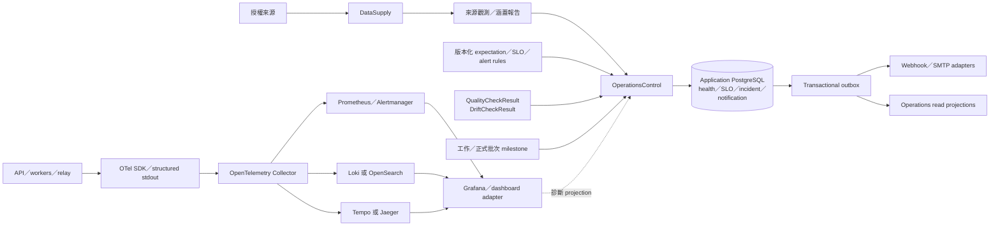

# 可觀測性、來源健康、漂移與事故契約

## 狀態與範圍

本文件固定生產導向 MVP 的服務目標、來源健康評估、資料品質與漂移、重試／限流／熔斷、隔離／補跑、營運事故、通知、telemetry、儀表板及演練契約。它使用[資料平台](data-platform-architecture.md)、[模型生命週期](model-lifecycle-and-promotion.md)與[深模組／REST 契約](service-boundaries-and-api-contracts.md)既有的不可變證據、`WorkCoordinator`、`OperationsControl`、outbox 及正式預測批次語意；各階段必須交付的營運深度與SLO證據由[分階段架構交接契約](phased-architecture-and-spec-handoff.md)索引。

本文件不決定 authentication、行動權限、來源使用資格、secret backend、部署 HA 或 Kubernetes 資源；[安全契約](security-identity-entitlement-and-retention.md)固定前四者，[部署契約](deployment-topology-capacity-and-recovery.md)固定其餘實作，但都不能改變本文件的健康、事故與 SLO 語意。

## 核心原則

1. 來源健康、資料集資格、預測資料支援及使用者服務影響是不同層次，不能被單一紅綠燈或平均分數取代。
2. `OperationsControl` 在 application PostgreSQL 保存版本化健康、SLO、事故與通知投遞真相；監控後端與工具 UI 都是 projection。
3. 硬性 schema、integrity、譜系與政策條件 fail closed；可選模態才允許有明確證據的降級。
4. 每個正式結果都可從事故或 dashboard 下鑽到固定的 work、資料集、特徵、模型與預測批次 ID。
5. 重試、補跑及自動修復不能改寫舊資料、舊預測、舊事故或舊評估。
6. Telemetry 是短期診斷訊號，不是七年來源證據、模型復現資料或營運決策的唯一真相。

## 分層狀態模型

| 層次 | 回答的問題 | 權威紀錄 |
|---|---|---|
| 來源健康評估 | 預期來源分區是否可存取、準時、完整、相容、未損壞且政策合格？ | `SourceHealthAssessment` |
| 資料集資格 | 某資料集版本能否發布並供指定下游用途使用？ | DatasetCatalog qualification／publication |
| 資料支援狀態 | 某次預測各模態是否 full、degraded 或 unavailable？ | FeatureSnapshot／PredictionRecord |
| 服務影響 | 正式預測與研究查詢是否符合使用者 SLO？ | `SloEvaluation`／營運事故 |

一個新聞來源 partial 可以讓文件模態 degraded，但不必使價量預測不可用；一個行情 integrity failure 即使被發布前攔截，也會阻止必要資料集及正式預測。Dashboard 必須保留這條因果鏈，不能把下游綠色反推為來源沒有問題。

## 架構與權威資料



Prometheus alert evaluation 可以產生 `OperationalSignal`，但事故聚合、severity、acknowledgement、suppression、resolution 及通知投遞仍由 `OperationsControl` 決定。

## 深 interface

`OperationsControl` 隱藏 expectation 解析、健康維度、SLO 計算、fingerprint、事故相關、通知節流及恢復判斷：

```text
record_source_observation(SourceObservation) -> SourceHealthAssessment
record_work_milestone(WorkMilestone) -> MilestoneEvaluation
record_check(QualityCheckResult | DriftCheckResult) -> CheckRef
record_operational_signal(OperationalSignal) -> IncidentRef | NoIncident
transition_incident(IncidentTransitionCommand) -> IncidentRef
plan_recovery(GapAssessment) -> RecoveryPlan
evaluate_slos(SloWindowRequest) -> SloEvaluationSet
```

外部呼叫端不自行計算 severity、重試次數、來源 ready 狀態或通知對象。時間、亂數、notification、telemetry 及來源外呼是注入 adapter；測試以固定 clock、固定 jitter 及 in-memory notification adapter 驗證相同 interface。

### Quality／drift result

```text
QualityCheckResult | DriftCheckResult
  check_id
  check_version
  scope
  reference_window
  observation_window
  observed
  threshold
  status
  sample_size
  evidence_ref
  tool
  tool_version
  created_at
```

SQL／Python、GX 與 Evidently 可以產生相同 result。工具預設門檻、UI 狀態或 workspace 不是 application truth，也不能直接建立 TrainingIntent、模型回退或事故。

## 服務目標

### SLO 表

| User outcome | SLI／window | Objective | Budget／硬性語意 |
|---|---|---|---|
| 正式預測批次準時發布 | 每市場最近 250 個 eligible realized sessions 的 on-time complete batches／eligible batches | ≥99% | 最多兩次逾時；每次仍建立事故 |
| 60-session 快速護欄 | 每市場最近 60 個 eligible sessions | ≥59／60，且不能連續兩次 miss | 違反立即升高事故 |
| 批次完整與可追溯 | 每個 published batch 的股票池掛牌均有三期間結果或明確 unavailable，且譜系／schema／機率／checksum 有效 | 100% | 硬性不變量，不能用 budget |
| 研究 REST 可用性 | 最近 30 日有效、已驗證、bounded requests 的非 5xx／timeout 比率 | ≥99.5% | 約 216 分鐘 budget |
| 研究 REST latency | 成功 bounded query latency | p95 ≤500 ms；p99 ≤1.5 s | 與可用性分開 |
| Evidence projection | evidence projection 在核心 prediction publication 後 15 分鐘內追上 | ≥99% | 1% 可超時；政策不明仍 fail closed |

Client 4xx 不進 API availability error numerator；5xx、503、server timeout 與 synthetic query failure進入。內部／供應商 maintenance 造成使用者影響仍計入 SLO。交易日曆已知休市及 expectation policy 事先定義的無發布日不是 eligible observation。

### 批次完成定義

正式預測批次只有在下列條件全部成立時才算完成：

1. 股票池每個掛牌都有 1／5／20-session PredictionRecord 或結構化 unavailable reason；
2. ModelArtifact、FeatureSnapshot、DatasetVersions、CalendarVersion、AdjustmentVersion 及 ServingAssignment 譜系完整；
3. 三類機率有限、非負、容差內總和為一，且信心與資料支援語意有效；
4. schema、coverage、checksum 及 policy qualification 驗證通過；
5. 核心 research projection 與 PredictionRecords 在同一 PostgreSQL transaction 發布。

### 每市場 deadline

基準是 versioned exchange calendar 的實際收盤 instant，包括半日市與臨時休市：

| Milestone | Deadline | 失敗行為 |
|---|---|---|
| Information cutoff readiness | T+90 分鐘 | 必要輸入未 ready，建立 SEV2 deadline-risk |
| FeatureSnapshot ready | T+105 分鐘 | 更新同一 forecast-batch 事故 |
| ForecastBatch validated | T+115 分鐘 | 升高通知及保護 daily-critical 資源 |
| Core publication complete | T+120 分鐘 | 正式 SLO breach |

各來源另依自己的 expected availability 與 grace window 先行評估。四個 milestone 使用同一 forecast-batch fingerprint，不形成四個獨立事故。

### Error-budget 行動

- 消耗 50% budget：要求根因分析、提高可靠性工作的優先級，限制高風險部署與大型回補。
- Budget 耗盡：暫停非修復性正式部署、模型 promotion 及大型回補，直到視窗恢復或具稽核風險核准明確豁免。
- 安全修補、政策／刪除處置及事故修復不受凍結。
- 每次 batch miss、連續兩次 miss 或 60 sessions 低於 59／60都立即告警，不等 250-session 視窗結束。

## Expectation policy

每個來源資料集以不可變版本固定：

```text
source_id
dataset_id
market_or_scope
expected_partition_spec
release_schedule
grace_window
trading_calendar_or_release_calendar_version
expected_key_set_rule
required_and_optional_attachments
schema_compatibility
coverage_and_integrity_rules
freshness_classes
rate_and_concurrency_policy
source_policy_version
entitlement_ref
effective_interval
```

最小健康評估單位是：

```text
source × dataset × market/scope × expected partition × observation window
```

供應商層級紅綠燈只投影最嚴重狀態與受影響範圍，不能以新聞正常掩蓋同供應商行情失敗。

歷史基線只能偵測異常，不能重寫 expectation。市場休市、半日市、臨時休市及 release calendar 變更由版本化 calendar／policy 決定，不以週末規則或最近資料猜測。

## 來源健康維度

每個 Assessment 保存六個獨立維度及證據，不計 0–100 綜合分數。

### Freshness

```text
freshness_lag = first_observed_at - expected_available_at
```

若尚未取得，lag 使用 evaluation instant 相對 expected time。另保存 source-published time、業務有效時間、first-observed time 及對 information cutoff 的 data age；健康以 first-observed time 為準。

`on_time`、`late`、`expired` 的 grace／max-age 由資料集 policy 固定。來源事後回填 published-at 不能把 late 改成 on-time。

### Coverage

```text
coverage_ratio =
  eligible_expected_keys_received / expected_keys
```

Assessment 同時保存 expected、received、missing、unexpected、invalid、quarantined 及 unknown key set reference。硬性必要行情與識別資料通常要求 100% expected keys；可選資料依用途設定門檻。

文件「沒有事件」只有在所有預期來源／分區均成功檢查時才是有效空集合；否則是 `coverage_unknown`，不能當作中性消息。

### Schema

- 新增已容許的 optional field：記錄新 fingerprint 與 warning，既有 decoder 可繼續。
- 欄位順序或表面格式：使用具名解析與 contract tests，不以位置猜測。
- 欄位刪除、型別、單位、時區、枚舉或業務語意變更：blocked、quarantine、事故。
- Schema drift 與統計 data drift 使用不同 check ID、狀態及處置。

### Integrity

Checksum、壓縮容器、媒體型別、Parquet footer、主鍵唯一性、價格／交易量／期間等交叉欄位不變量失敗時阻止發布。Integrity failure 不能降級成 warning 或用舊版本靜默替代。

### Policy／access

認證、entitlement、來源政策、合約有效期、rate limit 及 robots／API access 分開保存。401／403 不當作一般 outage 重試；政策資格未知時，受影響的新擷取、訓練、預測與展示 fail closed。

### 重複與更正

| 類型 | 語意 |
|---|---|
| 重複 receipt | 輪詢證據，正常可接受 |
| 相同內容物件 | 內容定址去重，不直接告警 |
| 同一來源主鍵不同內容 | 更正或衝突，建立新版本並分類 |
| 正規化主鍵碰撞 | 身分／decoder integrity failure，隔離及事故 |
| 文件近似重複 | DocumentGroup 品質指標，不是來源失敗 |

只有相對來源基線異常或內容／身分碰撞才告警。

### Access、error 與 latency

每個 attempt 記錄結構化 outcome、HTTP／protocol category、connect、time-to-first-byte、download、decode、quality、publish latency、retry count 與累積等待。HTTP 200 只代表傳輸成功，不代表 schema、coverage、integrity 或 dataset qualification 成功。

### 衍生 readiness

| 狀態 | 條件 |
|---|---|
| `ready` | 指定用途的全部 required dimensions 合格 |
| `degraded` | Required 合格，optional dimension 明確不合格且用途允許降級 |
| `blocked` | Required dimension 不合格、政策禁止或 integrity failure |
| `unknown` | 無足夠證據判斷 |

Required dimension 為 unknown 時下游 fail closed；Assessment 仍保留 unknown，不偽裝成 blocked 原因已知。

### 動態 anomaly

- 依 dataset、weekday／session／release type 建立可比較 baseline。
- 至少八個可比觀測後才啟用。
- 超過設定的絕對下限，且偏離 robust median 超過 3 MAD，連續兩個視窗才產生 warning。
- MAD 為零或樣本不足時只使用絕對門檻並回報 baseline status。
- 硬性 schema、integrity、coverage、policy 或使用者 SLO 立即告警，不等第二窗。
- Baseline 永不自動修改 expectation policy；變更建立新 policy version。

## Retry、rate limit 與 circuit

### Outcome 分類

| Condition | Outcome／處置 |
|---|---|
| Connection reset、timeout、408、可恢復 5xx | transient failure，進 retry policy |
| 429 | `rate_limited`，尊重 Retry-After |
| 401／403 | credential／entitlement／policy blocked，不盲目重試 |
| 404 且仍在 grace window | not-yet-available，依 release schedule 再探測 |
| 404 且超過 grace | missing／permanent failure，產生健康影響 |
| Schema、checksum、主鍵或 integrity | quarantine，不以 retry 掩蓋 |
| Invalid command／固定資源不存在 | permanent failure |

### Daily-critical retry

使用 full jitter：

```text
delay ~ Uniform(0, min(cap, base × 2^attempt))
base = 2 seconds
cap = 2 minutes
max_attempts = 5
max_total_wait = 15 minutes
```

次數或總等待先到即結束 attempt。有效 Retry-After 優先，但若會跨越批次 deadline，critical attempt 結束並轉 recovery work，不長占 worker。來源 policy 可降低預算，不能突破供應商限制或批次剩餘時限。

Maintenance／backfill 使用獨立較慢 policy 與 pool，不沿用 daily-critical 優先權。

### 集中限流

`WorkCoordinator` 依 source＋credential＋endpoint group 共享 token bucket、最大併發及 quota usage。Collector 不能自行 sleep 或建立全域 rate state。Rate headroom、429 與 Retry-After 進來源健康 projection。

### Circuit breaker

- 五次連續 transient failure，或最近至少十次中失敗率 ≥50%，開 circuit。
- 初次 open 1 分鐘；half-open 只允許一個 probe。
- Probe 再失敗則指數延長，cap 15 分鐘；成功依健康恢復規則逐步 close。
- 429 進 rate-limited state，不與 provider outage 混同。
- Credential／policy blocked 直到 credential、entitlement 或 policy version 改變才探測。
- Circuit 只抑制外呼；deadline、coverage、expected-evaluation 與 SLO clock 繼續。

## 隔離、fallback 與恢復

### 隔離

隔離紀錄保存原始物件、receipt、checksum、來源／資料集／分區／記錄範圍、原因、first／last occurrence、owner、事故及 resolution evidence。

修復必須以新 decoder、身分主張、來源政策或輸入版本產生新 DatasetVersion。舊隔離內容不可修改、刪除失敗證據或人工勾選放行；resolution 指向替代版本。

### Stale fallback

- 必要資料超過 freshness／coverage 門檻時阻止正式下游。
- 可選模態只有在 `DataSelection` 明訂 max age、來源政策合格且時間點正確時才能選較早版本。
- FeatureSnapshot 保存實際版本、age、selection rule 與 degraded reason。
- Policy blocked、checksum failure、schema 不相容或身分不明的版本永不可 fallback。
- 沒有合格版本時使用 unavailable，不以 last-known-good 冒充最新。

### 晚到資料

- Cutoff 前已 first-observed、只因內部處理延誤：修復後可發布逾時正式批次，但計 SLO breach。
- Cutoff 後才 first-observed：不能進入該 cutoff 正式預測。
- 來源更正／補件建立新 DatasetVersion，不修改已發布 PredictionRecord。
- 研究影響使用明示 `retrospective_replay`，不混入正式歷史績效。

### Recovery plan

Gap detector 產生固定 missing partitions、expectation／schema／policy version、checkpoint、下游影響及資源預算的不可變 RecoveryPlan。它從最後 committed checkpoint／published artifact 繼續，經相同 module interface 執行。

Daily-critical 永遠優先；repair／backfill 在 maintenance／backfill-training pool 限制併發。每個結果通過 checksum、coverage、schema、lineage 及下游 reconciliation 後才能關閉事故。大範圍重播先產生 impact preview，不覆蓋或刪除舊版本。

## 資料與模型漂移

### 排程

| Frequency | Checks |
|---|---|
| 每個 EOD | Schema、range、missing、coverage、OOD、資料支援、預測分布、gate／模態依賴摘要 |
| 每週 | ModelArtifact reference 對最近 20／60 realized sessions 的 PSI／分布距離、degraded／OOD rate，按市場、期間、模態與主要切片 |
| 成熟標籤更新後每週 | 最近 60 sessions 的 equal-cell macro-F1、NLL、Brier、ECE、rank IC、可用率及 bootstrap CI |
| 每月 | 完整切片、文件 abstention／標的連結品質、calibration、gate collapse、成本後經濟結果及長期趨勢 |

樣本不足回傳 `insufficient_data`，不能當作 pass 或 healthy。

### Drift-early 門檻

任一條件連續兩個週窗成立才建立 `drift_early` TrainingIntent：

- 至少 10% critical features 的 PSI ≥0.25；
- OOD／degraded rate 相對訓練基線增加 ≥10 percentage points；
- 有 60-session 成熟標籤時，equal-cell macro-F1 下降 ≥3 points 且 bootstrap CI 排除 0；
- ECE >0.10；
- Aggregate rank IC ≤0。

TrainingIntent 仍走完整重訓、八季回測、hard gates、shadow 與人工核准。來源 outage、schema、coverage 或 policy 問題先修資料，不以重訓掩蓋。Prediction distribution、gate collapse 或單一 feature drift 可以告警，但不能單獨自動回退。

## Alert、事故與通知

### 分離語意

- `AlertEvaluation`：某規則、scope、window 在一個時點的 pass／warn／fire／recover 結果。
- `NotificationDelivery`：把事故或摘要投遞至 webhook／SMTP 的一次嘗試。
- 營運事故：將多個訊號關聯成具影響、owner、severity 及生命週期的權威紀錄。

每次 retry、每個 ticker 或每個下游 stage 不直接建立事故。

### Severity

| Severity | 典型影響 |
|---|---|
| SEV1 | 已向使用者服務錯誤／損壞／無譜系預測；兩市場服務中斷；禁止內容外洩；錯誤模型指派且無安全回退 |
| SEV2 | 單市場 T+120 breach；必要來源／正式批次 blocked；研究 API 大範圍不可用；超過 5% 股票池異常 unavailable；promotion／rollback failure |
| SEV3 | 可選模態、evidence projection、非關鍵來源或 maintenance／backfill 降級 |
| SEV4 | 尚無使用者影響的 statistical anomaly、capacity trend 或 observation |

相同 integrity 問題在發布前完整攔截通常是 SEV2；已污染使用者結果升 SEV1。

### Fingerprint 與抑制

```text
rule_id
+ source/dataset or workflow
+ market/scope
+ affected batch/window
```

重複訊號附加 occurrence，不新建事故。已知上游事故可抑制下游通知，但所有 evaluations 仍保存。不得以 listing/ticker 建立數百個事故；保存受影響股票池集合 reference。

恢復要求連續兩個成功 evaluation 或一個完整正式批次。Resolved 後復發建立新事故並連回 prior incident，不改寫舊 timeline。

### 生命週期

```text
open -> acknowledged -> mitigating -> monitoring -> resolved
```

每次轉換保存 actor、time、reason、evidence。Incident 保存 owner、severity、受影響市場／資料集／批次、root-cause category、runbook、recovery condition、work 與 prediction impact。

SEV1、重複 SEV2 或 error-budget exhaustion 要求 post-incident review。自動 recovery 可以推進 monitoring；SEV1／SEV2 final resolve 需要人工確認。

### 通知

| Severity | 路由與升級 |
|---|---|
| SEV1 | Webhook＋SMTP 立即；5 分鐘未 ack 升級；未緩解每 15 分鐘摘要 |
| SEV2 | Webhook＋SMTP 立即；15 分鐘未 ack 升級；每 30 分鐘更新 |
| SEV3 | Webhook 最多每小時聚合；每日 SMTP 摘要 |
| SEV4 | Dashboard＋每日摘要 |

Delivery 使用 transactional outbox、idempotency key、attempt、status、retry 與 dead-letter。Payload 不含新聞原文、credential、內部 object URI 或 sensitive entitlement detail。

### Maintenance suppression

Suppression 必須有 actor、owner、reason、scope、start／expiry 與關聯 change。它只抑制通知，不停止 health／SLO evaluation。SEV1、integrity、policy 及 security rules 不得被一般 maintenance suppression；內部／供應商 maintenance 造成使用者影響仍計入 SLO。

## Source policy、credential 與時間

- Terms、robots、API docs 及 license page 每週重新取得 hash；變更建立 policy review。
- Credential／token 每日 non-secret validity check；到期前 30／14／7／1 日告警。
- 商業 entitlement／contract 到期前 90／60／30／7 日提醒。
- TLS certificate 到期前 30／14／7 日提醒。
- 權利變更不明時 policy-block 新擷取、訓練、正式預測與展示；既有內容依當時政策及正式刪除流程處置，監控不得直接刪除。

Duration 使用 monotonic clock；領域 instant 使用同步 UTC clock。Clock offset：

- >500 ms：warning；
- >2 seconds：阻止新的正式 information cutoff／prediction publication，建立 SEV2。

## Process health 與合成探測

| Probe | 語意 |
|---|---|
| `live` | 程序 event loop／process 未死鎖；不查遠端依賴 |
| `startup` | Configuration、migration、schema 及角色必要 artifact 可載入 |
| `ready` | Runtime role 能安全服務；API 可讀 PostgreSQL／有效快照，worker 可取得 lease／必要儲存 |

外部來源 probe 不進 process readiness，避免來源故障造成 restart storm。

每五分鐘 synthetic client 查詢代表性台股、美股、歷史預測、unavailable representation、ETag／304 及 latency。Probe 使用正式 REST contract，但使用安全、固定、低權限 synthetic identity。

Dead-man evaluations 覆蓋 Dagster daemon、outbox relay、worker pools、OTel Collector、notification relay，以及每個 expected source／milestone／drift schedule。連續缺少兩個 heartbeat 或 expected evaluation 建立監控缺口事故。

## Telemetry contract

### 標準 seam

應用只輸出：

- [OpenTelemetry OTLP](https://opentelemetry.io/docs/specs/otlp/) metrics／logs／traces；
- [OpenMetrics](https://prometheus.io/docs/specs/om/open_metrics_spec/) endpoint；
- 結構化 JSON stdout；
- [W3C Trace Context](https://www.w3.org/TR/trace-context/) propagation。

OTel Collector 是 receiver／processor／exporter seam。Compose 預設單節點 Prometheus＋Alertmanager、Grafana、Loki、Tempo；deployment 必須 pin 已測版本。Grafana／Loki／Tempo 使用前須依[官方授權說明](https://grafana.com/licensing/)完成組織審查；若不接受，經相同 OTLP／OpenMetrics seam 使用 OpenSearch／Jaeger adapter，不改應用 instrumentation 或事故真相。

### Correlation

Logs／traces 可帶：

- `trace_id`、`work_id`、`attempt_id`、`incident_id`；
- `forecast_batch_id`、`dataset_version_id`、`feature_snapshot_id`、`model_artifact_id`；
- source、dataset、market、operation、outcome。

Metric labels 只用低基數 source、dataset、market、operation、outcome、severity。Listing、ticker、document、URL、work／trace ID 不得作 metric label；metrics 可用 exemplar 連 trace。

Telemetry 禁止 credential、token、新聞／申報原文、完整外部 payload、presigned URL、未遮罩個資及禁止展示 entitlement detail。

### 核心 metric catalog

| Metric family | 低基數 dimensions |
|---|---|
| `source_fetch_attempts_total`／`source_fetch_duration_seconds` | source、dataset、market、operation、outcome |
| `source_partition_freshness_seconds`／`source_coverage_ratio` | source、dataset、market、status |
| `source_circuit_state`／`source_rate_limit_headroom` | source、endpoint-group |
| `work_attempts_total`／`work_duration_seconds`／`work_queue_age_seconds` | work-kind、pool、outcome |
| `forecast_milestone_age_seconds`／`forecast_batch_completed_total` | market、milestone、status |
| `research_http_requests_total`／`research_http_duration_seconds` | route-template、method、status-class |
| `outbox_lag_seconds`／`projection_lag_seconds` | projection／consumer、status |
| `quality_checks_total`／`drift_checks_total` | check-id、scope-class、status |
| `incident_count`／`notification_delivery_total` | severity、state／channel、outcome |
| `otel_export_failed_total`／`otel_dropped_items_total` | signal、exporter、reason |

Metric 不承載 DatasetVersion、PredictionRecord 或 Incident 的完整證據；權威 ID 保存在 logs／traces／PostgreSQL evaluation。

### Sampling

- Error、SEV、approval／promotion／rollback 及正式 EOD critical path：100%。
- 正常研究 API：10%。
- 例行 maintenance：1%。
- Sampling policy 版本化並保存；容量調整不能降低 mandatory categories。

### Retention

| Data | Retention |
|---|---|
| Canonical health／SLO／incident／notification／quality／drift result＋evidence reference | 7 年 |
| Prometheus high-resolution metrics | 30 日 |
| Daily low-resolution SLI／capacity rollups | 至少 15 個月 |
| 一般 structured logs | 30 日 |
| 一般 traces | 7 日 |
| Error／governance／formal-EOD traces | 30 日 |
| Redacted SEV1／SEV2 incident bundle | 7 年 |

Incident bundle 引用 canonical evidence，不複製未授權原文。Retention expiry 自動執行並留 deletion／rollup evidence；telemetry retention 不取代來源政策。

### Meta-observability

監控 Collector queue／export／drop、Prometheus scrape／rule／storage、Alertmanager route／delivery、Loki／Tempo ingest／query 及 dashboard data-source freshness。

Exporter 必須非阻塞且有界緩衝；monitoring backend 故障不能拖垮正式批次。Telemetry loss 形成事故，OperationsControl 仍可從 application database、work／outbox 及本機受控 logs 恢復 canonical state。

每週執行 synthetic incident → rule evaluation → webhook／SMTP → acknowledgement → controlled resolve 的完整測試。

## Dashboard

| View | 必要內容 |
|---|---|
| 服務總覽 | 台／美 T+120、SLO、budget、60-session guard、API、evidence lag、未結事故 |
| 來源健康 | source×dataset×market 六維健康、deadline、coverage、circuit、rate、policy／credential |
| 關鍵路徑 | T+90／105／115／120、work／attempt、queue、retry、stage latency、pool saturation |
| 品質與漂移 | Schema、integrity、quarantine、feature／prediction drift、資料支援、insufficient-data |
| 模型營運 | Production／shadow assignment、OOD、calibration、成熟標籤績效、gate collapse、stale ladder |
| 事故與通知 | Severity、owner、MTTA／MTTR、suppression、delivery、repeat、post-incident review |

每張圖表明示 evaluation time、資料視窗與 projection freshness，unknown 不顯示為零。下鑽使用受控 application ID 導向健康評估、work、DatasetVersion、ForecastBatch 或 Incident；Grafana dashboard URL 不是稽核證據。

## Rules as code

正式 expectation、quality、drift、SLO 與 alert rule 必須版本控制：

```text
rule_id
rule_version
scope
SLI_or_check
window
threshold
severity
owner
runbook_ref
fingerprint
dependencies
recovery_condition
suppression_eligibility
effective_interval
```

變更需要 code review、deterministic historical replay 及至少七日 shadow evaluation。緊急規則可縮短 shadow，但綁定 Incident ID 並要求事後檢討。新版本只影響新 evaluation，不回寫歷史健康、SLO 或事故。

每條 rule 具有 full、degraded、blocked、unknown、recover、duplicate、late-event 與 suppression fixture；SLO fixture 必須驗證 99%／250 sessions 的離散算術。

## 自動修復權限

允許：

- 已登記 retry／full jitter／circuit／half-open；
- expired lease recovery；
- outbox redelivery、idempotent projection rebuild；
- 暫停非關鍵 pool 保護 daily-critical；
- 模型生命週期明定條件下回退到既有 eligible approved artifact。

禁止：

- 修改或放行隔離證據；
- 自動改 schema、expectation、來源政策、entitlement 或 severity；
- 使用超齡 stale data；
- promotion 未核准模型；
- 刪除 evidence、改寫 PredictionRecord 或追溯 first-observed time；
- 自動 final-resolve SEV1／SEV2。

## Runbook 與演練

每條 SEV1／SEV2 rule 及自動修復在啟用前必須有 runbook：

- 影響及確認方式；
- 權威 query／ID 與 dashboard；
- 安全停止、retry、quarantine、recovery、rollback；
- 禁止操作及 escalation owner；
- recovery verification；
- 必須保存的 evidence。

每季以 fixture／sandbox 演練：

- 429、timeout、5xx、credential／policy block；
- schema breaking change、partial／unknown coverage、identity collision；
- object corruption、PostgreSQL／outbox interruption；
- invalid probability、assignment／rollback failure；
- evidence projection lag；
- webhook／SMTP failure；
- clock skew、missing heartbeat、OTel drop。

演練不得污染正式 PredictionRecord。平台既定每季 restore verification 另須證明健康、事故、outbox 與 dashboard projection 可重建。

## 驗收情境

- 同供應商行情失敗、新聞正常時，資料集與受影響範圍分開呈現，供應商彙總不平均成綠色。
- 文件來源全部檢查且無文件，與某來源未完成所造成的 coverage-unknown 產生不同資料支援。
- 來源把舊發布時間寫入補件時，freshness 仍依 first-observed 判定 late。
- 一次 404 在 grace window 內排程探測；逾時後轉 missing，不產生無限 retry。
- Retry-After 跨越 T+120 時結束 critical attempt，SLO 照常 breach，recovery work 另行建立。
- Circuit open 時 expected evaluation、deadline 與 SLO 仍持續，沒有「沒有請求所以健康」。
- Optional stale version 只有在 DataSelection policy 允許時使用，FeatureSnapshot 明示 age／degraded；required stale 阻斷。
- Cutoff 後才 first-observed 的資料不能重寫正式預測；retrospective replay 保持事後標示。
- 一個上游來源事故可關聯下游 feature／forecast alerts，通知只發聚合事故而所有 evidence 仍保存。
- Monitoring maintenance suppression 不排除 SLO，也不能抑制 integrity／policy／SEV1。
- Grafana／Prometheus 全停時正式批次不被 exporter 阻塞，OperationsControl canonical state 仍可查，telemetry loss 另成事故。
- Clock offset 超過兩秒時無新正式 cutoff／prediction publication。
- Drift rule 連續兩窗建立 TrainingIntent，但不直接 promotion、rollback 或更改機率。
- Rules 新版不改寫舊 evaluation；shadow 與 historical replay fixture 可證明差異。
- SEV1／2 只有人工可 final-resolve；synthetic notification 可驗證 webhook、SMTP、dead-letter 及 escalation。

## 後續票券接點

- [安全契約](security-identity-entitlement-and-retention.md)固定 synthetic identity、行動權限、來源使用資格、secret provider、telemetry redaction、incident／evidence access 及 webhook authentication。
- [部署契約](deployment-topology-capacity-and-recovery.md)固定 Collector／Prometheus／Grafana-stack 或替代 adapter 的程序、資源、storage、backup、TLS、HA 與 network policy。
- 最終分期架構票券可依 MVP 容量縮短非 canonical telemetry retention，但不能降低 SLO、健康證據、事故、規則、資料／模型漂移或七年 canonical retention。
