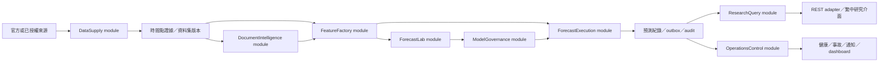

# 分階段架構核准與規格化交接契約

> **2026-08-15 supersession:** ADR 0017 與主 spec 的 `COST-0-01` 正式取代本文 P2＋所有 `DEP-*` 採購／契約／entitlement gates、付費新聞／consensus、固定七年／八季深度、600＋1,400／2,000 listings，以及必要 Kubernetes／三 failure domains／跨區 DR。這些舊段落只保留決策歷史，不再形成 entry／exit 或 ticket requirement；實際階段契約以修訂後主 spec 與 tickets 06–39 為準。

## 狀態、權威與使用方式

本文件是台美個股趨勢預測系統的整體分期、垂直 tracer bullet、entry／exit、外部依賴與 `/to-spec` 交接權威。它不重述各領域契約；身分與時間點、資料平台、文件、標籤與回測、模型、生命週期、研究介面、module interface、營運、安全及部署語意，仍分別由本文件的追溯矩陣所列設計契約與 ADR 決定。

發生衝突時採下列優先順序：

1. `CONTEXT.md` 固定領域語彙，ADR 固定難以逆轉的架構取捨；
2. 各領域設計契約固定其不變量與驗收數值；
3. 本文件固定分期、依賴、整合次序及規格交接；
4. 後續規格只能細化 implementation 與驗收步驟，不能重開已核准語意。

本文件核准架構與規格化準備，不宣稱任何外部授權已取得，也不代表功能程式已完成。

兩個支撐本交接的架構決策是[台美雙市場垂直tracer bullets](../adr/0015-dual-market-vertical-tracer-bullets.md)與[不改寫首次取得時間的具證據歷史重建](../adr/0016-attested-history-without-rewriting-observation.md)。

## 系統上下文與垂直形狀

系統是日終、研究決策支援、單一組織部署，不執行交易。正式路徑以一個市場、一個資訊截止點、一版股票池及一個固定服務指派建立不可變預測紀錄；台灣與美國共享身分、時間點、資料集、特徵、模型輸出、治理及研究查詢語意，市場差異只在已有實際變體的 adapter、交易日曆、正規化與小型模型 adapter 後處理。

每條 tracer bullet 至少穿過來源 adapter、時間點證據、資料集／特徵、預測、權威帳本、REST／研究介面及營運證據。Dagster 只呼叫普通 workflow；application module 不因部署程序而互相建立 HTTP。只有兩個實際 adapter 或 production＋test 替代需求成立時才保留 seam。

## 不可跨階段削弱的不變量

- 永不以 ticker 作永久身分，永不以供應商 `latest` 或 adjusted close 作歷史真相。
- Production 資料只使用資訊截止點前平台實際觀測且用途、保存、衍生及展示資格均有效的版本。
- Fixture、shadow、production、retrospective replay 是互斥的預測執行用途；只有 production 可發布正式預測紀錄。
- 可選模態可形成帶原因的 degraded／unavailable／policy-blocked；必要的身分、日曆、價量、公司行動、現行模型或譜系不足時不能產生正式機率。
- 所有正式資料集、特徵、標籤、模型、評估、服務指派、預測、健康、事故與核准都有不可變版本譜系。
- Registry、telemetry、dashboard、Dagster metadata 與研究 projection 皆可重建，不是權威真相。
- 任一 hard gate 失敗、來源資格未知、證據缺件或權限不明時 fail closed；修復建立新證據，不回寫舊結果。
- Baseline forecaster 永久保留為 `TrendForecaster` adapter、比較基準與回退證據；神經模型不因排程或完成訓練而自動取代它。

## 深 module 的分期深度

| Module | 穩定 interface 責任 | 首次有深 implementation | 刻意延後 |
| --- | --- | --- | --- |
| `DataSupply` | 合法擷取、證據、身分、資料集資格與選擇 | P1 fixture；P2 正式行情 | 任意網頁爬蟲、社群 crawler |
| `DocumentIntelligence` | 文件版本到可追溯衍生情報 | P3 | P1／P2 空殼、端到端文字微調 |
| `FeatureFactory` | 固定資料選擇產生不可變特徵快照 | P1 | 線上 feature store |
| `ForecastLab` | 訓練、回測、校準、候選證據 | P2 baseline；P4 neural／HPO | P1 空殼、NAS／online learning |
| `ForecastExecution` | 固定用途與服務指派，批次推論及發布 | P1 fixture；P2 production | REST 即時單股推論 |
| `ModelGovernance` | 閘門、核准、shadow、指派、回退 | P1 fixture限制；P2 bootstrap；P4完整 | Registry alias 作權威 |
| `ResearchQuery` | 已發布研究 projection 的受權查詢 | P1 | 卷宗、協作、公開匿名網站 |
| `OperationsControl` | 工作、健康、事故、通知與 outbox 真相 | P1 | Telemetry backend 作權威 |

## 共用 hard gates

| Trace ID | Gate | 否決條件與權威契約 |
| --- | --- | --- |
| `GATE-POLICY-01` | 來源權利與授權 | 權利未知、到期、用途／保存／展示／刪除不合格；安全契約與來源研究矩陣 |
| `GATE-PIT-01` | 身分、時間點與譜系 | 身分歧義、cutoff 洩漏、公司行動／日曆缺件、`latest`、不可重建；時間點契約 |
| `GATE-DATA-01` | 涵蓋與品質 | 必要分區不完整、schema／integrity 失敗、缺 qualification；資料平台與營運契約 |
| `GATE-MODEL-01` | 標籤、回測與升版 | 防洩漏、校準、穩定、經濟、復現、安全或人工核准任一失敗；回測與模型生命週期契約 |
| `GATE-SEC-01` | 身分、安全與供應鏈 | 繞權、secret 暴露、未簽成品、Critical／High 未處置或刪除不可驗證；安全契約 |
| `GATE-OPS-01` | SLO、故障與稽核 | T+120／REST SLO、重試、fencing、outbox、事故或稽核不成立；營運契約 |
| `GATE-DEPLOY-01` | 容量、HA與DR | 對應輪廓的容量、故障注入、restore、RPO／RTO或部署世代失敗；部署契約 |
| `GATE-UX-01` | 研究呈現 | 機率、信心、資料支援、cutoff、譜系、授權顯示或無障礙不正確；研究介面契約 |

Gate 的數值與細節只存在於權威領域契約；後續規格引用 trace ID，不另造較寬鬆版本。

## 歷史證據與預測執行用途

### 歷史證據等級

| 等級 | 充分證據 | 正式每日預測 | 正式歷史訓練／回測 | 隔離研究 |
| --- | --- | --- | --- | --- |
| `platform_observed` | 平台原始物件、收據與真實 `first_observed_at` | 可，且 production cutoff 只接受此級 | 可 | 可 |
| `archive_attested` | 可信archive的as-of版本、修訂／撤回語意、完整性與契約證明 | 不可 | 可 | 可 |
| `published_current_only` | 目前發布內容或發布日，但無法證明歷史版本及修訂語意 | 不可 | 不可 | 可 |
| `unknown`／`self_asserted` | 未驗證或由 adapter／操作者自行宣稱 | 不可 | 不可 | 不可，維持blocked或隔離 |

歷史可得性主張不修改 `first_observed_at`、`observation_sequence` 或舊時間點視圖。`archive_attested` 只建立明示的 `historical_reconstruction` selection，不能發布當時的 production 預測紀錄。

### 預測執行用途

| 用途 | 可用模型 | 可用資料 | 可見性與發布 |
| --- | --- | --- | --- |
| `fixture` | 決定性 fixture adapter | 合成／固定 fixture | 只供工程驗收，帶明顯標章，不進正式歷史 |
| `shadow` | 已核准候選或驗證中的合格模型 | 正式合格輸入 | 隔離比較，不取代 production |
| `production` | 有效 production 服務指派 | 只有 `platform_observed` cutoff 視圖 | 唯一可建立正式預測紀錄 |
| `retrospective_replay` | 明確指定的歷史模型 | 明確歷史選擇，可含合格 `archive_attested` | 標示事後性質，不覆寫或混入正式績效 |

## 五階段交付矩陣

| 階段 | 股票池 | 核心資料／模型 | 研究與營運 | 部署輪廓 | Entry／Exit |
| --- | --- | --- | --- | --- | --- |
| P1 雙市場工程脊柱 | 台 1＋美 1 fixture | 豐富 fixture、`FixtureTrendForecaster`、權威帳本／outbox | 最小矩陣、標的頁、REST、health／audit | Compose 完整 E2E | `P1-ENTRY-01`／`P1-EXIT-01` |
| P2 正式價量 baseline | 台 10＋美 10 | 足以形成每摺七年訓練窗與八季測試的合格行情／公司行動，prior＋logistic，bootstrap gate | 搜尋、歷史／譜系、EOD SLO／通知 | Compose 主路徑＋K8s smoke | `P2-ENTRY-01`／`P2-EXIT-01` |
| P3 多模態研究 pilot | 台 100＋美 100 | 公告／申報、基本面、總體、授權新聞條件式，multimodal logistic | 完整研究 MVP、文件品質／sandbox／review queue | Compose＋持續 K8s smoke | `P3-ENTRY-01`／`P3-EXIT-01` |
| P4 受治理神經模型 | 台 100＋美 100 | 分步 neural、HPO、IG、漂移、完整生命週期 | 模型治理與shadow證據 | 完整 production staging | `P4-ENTRY-01`／`P4-EXIT-01` |
| P5 正式基準部署 | 台 600＋美 1,400 | 全類別商業／官方資料gate，最佳合格模型 | 50使用者、容量、安全、HA、DR、營運演練 | K8s單區三failure-domain HA＋異地DR | `P5-ENTRY-01`／`P5-EXIT-01` |

## P1：雙市場工程脊柱

### Entry

- `P1-ENTRY-01`：Compose、PostgreSQL 與本機 filesystem `ObjectRepository` 可用；fixture 政策、loopback 身分及固定股票池已版本化。

### Tracer bullets

- `P1-TRACE-TW-01`：一個 XTAI fixture 掛牌以至少 253 sessions、ticker 有效期、公司行動、late／revision／missing 情境穿過完整垂直路徑。
- `P1-TRACE-US-01`：一個美國主要交易所 fixture 掛牌以相同共同契約及美國日曆差異穿過完整垂直路徑。
- `P1-TRACE-OUTBOX-01`：在 canonical transaction commit 後、outbox delivery 前注入 crash，恢復後 projection 不重複、不遺失。
- `P1-TRACE-AUTH-01`：相同行動權限下分別驗證有效與無效來源使用資格，REST、workflow 與 projection 一致 fail closed。

### Exit

- `P1-EXIT-01`：Windows Docker Desktop 與 Linux CI 都能以一個 Compose 命令及一個 acceptance runner 完成雙市場 EOD、REST／UI、故障、重啟與不可變 acceptance bundle。
- Bundle 必須明示僅證明工程脊柱；fixture 模型不可 promotion、不可進 production route、不可解除授權 blocker。

## P2：正式價量 baseline

### Entry

- `P2-ENTRY-01`：`DEP-MKT-TW-01` 與 `DEP-MKT-US-01` 已提供至少七年保存、模型／衍生用途，以及足以形成最新八季回測中每摺七年訓練窗的EOD、symbol history及公司行動證據；否則正式路徑維持 `policy_blocked`，fixture 工程可繼續。
- `P2-ENTRY-02`：P1 acceptance bundle通過，10＋10代表性manifest含ticker變更、ADR／股別、半日市、公司行動及訓練史中的下市標的。

### Tracer bullets

- `P2-TRACE-TW-01`：TWSE OGDL當期adapter加契約歷史adapter，從未調整行情建立內部調整版本及合格台股正式歷史資料集。
- `P2-TRACE-US-01`：契約美股adapter以相同 Collector／Decoder、checkpoint、policy與reference graph contracts建立正式歷史資料集。
- `P2-TRACE-PIT-01`：backfill qualification逐項證明session、身分生命週期、端點、修訂、公司行動、政策及歷史證據等級；current-final資料不能混入。
- `P2-TRACE-MODEL-01`：class-prior與regularized multinomial logistic用七年窗、八季walk-forward、三seeds、六calibrators及成本情境形成候選；首個logistic只走 `BootstrapGatePolicy`。
- `P2-TRACE-EOD-01`：市場收盤後 T+90解析一次資料選擇與服務指派，T+120前交易發布每掛牌三期間結果或機器原因；late資料只進下一次或重播。

### Exit

- `P2-EXIT-01`：兩市場各五次合格EOD shadow、10＋10歷史資格、bootstrap gate、人工核准、重現、回退、來源政策、故障恢復、Compose small smoke與K8s smoke全數通過，才可建立首個production服務指派。
- 首個logistic未勝class-prior至少 1 percentage point，或任一絕對gate失敗，則正式 serving 維持blocked。

## P3：多模態研究 pilot

### Entry

- `P3-ENTRY-01`：P2 bundle通過；台美官方文件、基本面與總體來源已有合格政策、時間點及歷史證據。
- `P3-ENTRY-02`：新聞權利依賴可未完成，但系統及bundle必須明確標為 `official-documents-only`，不得宣稱新聞整合完成。

### Tracer bullets

- `P3-TRACE-DOC-TW-01`：台灣 MOPS／OGDL 重大訊息、月營收及財報摘要形成版本化文件、FinancialFact、標的連結、annotation與證據。
- `P3-TRACE-DOC-US-01`：SEC 8-K／6-K／10-Q／10-K／company facts經相同深 `DocumentPipeline.process` interface形成美國路徑。
- `P3-TRACE-MACRO-01`：CBC＋DGBAS、BLS＋BEA及一個權利核准的OECD Economic Outlook dataflow保存release／vintage；FRED只allowlist，IMF未確認前legal hold。
- `P3-TRACE-NEWS-01`：若台美各有合格來源，contract-required新聞adapter驗證保存、模型／embedding、情緒、展示及刪除模式；缺任一市場則正式產品gate阻斷。
- `P3-TRACE-NLP-01`：安全sandbox、去重、confirmed連結、taxonomy、事件、凍結多語embedding、影響評估及版本化review queue通過中英文golden corpus。
- `P3-TRACE-MODEL-01`：multimodal logistic對價量only與各單模態做ablation；只有完整gate、人工核准與五次shadow通過才可取代價量baseline。

### Exit

- `P3-EXIT-01`：100＋100代表性manifest、五次EOD shadow、T+120／REST SLO、文件sandbox／刪除／修訂／裁決與golden品質全部通過；完整研究介面展示機率、信心、支援、影響因素、允許證據、vintage、回測及譜系。
- 結構化fact exact match `>=99.5%`、confirmed link precision `>=99%`、taxonomy macro-F1 `>=0.80`且ECE `<=0.10`、事件macro-F1 `>=0.75`；錯公司、錯證據或繞政策是hard failure。

## P4：受治理神經模型

### Entry

- `P4-ENTRY-01`：P3 bundle通過；100＋100正式feature schemas、處理組合、baseline與核准runtime固定，完整production staging可用。

### Tracer bullets

- `P4-TRACE-NEURAL-01`：`NeuralTrendForecaster`依price-only、基本面、總體、文件、quality-aware gate順序通過同一interface與ablation，不一次引入全部變數。
- `P4-TRACE-MARKETS-01`：共享候選分別以台灣與美國掛牌完成資料選擇、特徵、推論、歸因、shadow ledger、REST研究projection及營運證據，並按六個market × horizon cells驗收，不讓共享模型掩蓋單一市場失敗。
- `P4-TRACE-TEXT-01`：文件module以授權、凍結、版本化多語encoder最多產生64個segment embeddings；TrendForecaster不讀原文或微調encoder。
- `P4-TRACE-REPRO-01`：每個正式TrainingIntent固定image、lock、hardware／precision、seeds與manifest，在無網路核准runtime重建primary seed、樣本、標籤、normalizer及評估。
- `P4-TRACE-HPO-01`：HPO只見validation、最多30 trials；選定config另建intent並以三seeds從頭訓練，trial checkpoint不可promotion。
- `P4-TRACE-ATTR-01`：Integrated Gradients決定性、證據完整、遮罩模態為零且completeness相對誤差median `<=5%`、p95 `<=10%`，CPU推論加歸因仍 `<=10分鐘`。
- `P4-TRACE-DRIFT-01`：漂移連續兩週才建候選，不自動promotion；來源異常先修資料，只有可立即驗證serving failure可依規則回退。

### Exit

- `P4-EXIT-01`：共享候選完成三seeds、八季回測、baselines／ablations、HPO、六calibrators、歸因、無網路重現、hard gates、人工核准、五次shadow及promotion／rollback／stale／drift／policy情境。
- Neural未勝出不代表P4失敗；治理路徑通過且logistic維持現行模型是合格結果。

## P5：正式基準部署

### Entry

- `P5-ENTRY-01`：P4 bundle通過，台600＋美1,400逐掛牌資格完成；`DEP-NEWS-TW-01`、`DEP-NEWS-US-01`、`DEP-INSTITUTIONAL-01`與`DEP-CONSENSUS-01`全部合格，否則只可維持受限pilot。
- `P5-ENTRY-02`：掛牌有240 sessions以上可full，60至239為degraded，低於60或anchor缺價為unavailable並保留原因，不以刪除樣本美化涵蓋。

### Tracer bullets

- `P5-TRACE-CAPACITY-01`：台600／美1,400、每日5,000文件、七年資料、50使用者、REST 10持續／50突發RPS下，三次最差EOD T+105、推論歸因 `<=10分鐘`、REST p95 `<=500ms`／p99 `<=1.5s`、關鍵資源p95 `<=70%`。
- `P5-TRACE-HA-01`：三failure-domain staging實際注入application程序、pod、node、zone、PostgreSQL、PgBouncer及object故障，驗證PDB、拓撲、lease／fencing、repair及保留容量。
- `P5-TRACE-SEC-01`：OIDC AAL2／WebAuthn、workload identity、授權矩陣、secret輪替、default-deny、audit chain、policy deletion、signed artifacts、SBOM／provenance／CVE及獨立滲透全數通過。
- `P5-TRACE-DR-01`：月restore、季度預測全鏈及region failover／failback實測DB RPO `<=15分鐘`、object RPO `<=24小時`、RTO `<=4小時`，重播刪除ledger並維持單一部署世代。
- `P5-TRACE-CUTOVER-01`：正式資料／信任根、唯讀研究、擷取／projection、五次台美EOD shadow、原子production指派／發布／通知依序切換，每步都有觀察與回退。

### Exit

- `P5-EXIT-01`：platform、data、model、source及security owner共同簽署最終acceptance bundle；model approver、source steward與安全雙人控制不被多數票取代，任一hard-gate owner可veto。
- 最終bundle綁定來源／契約、2,000掛牌資格、全譜系、現行／回退模型、shadow、容量、安全、restore／DR、SLO／事故、UI／REST無障礙及核准；錯誤發布、繞權、遺失、OOM或Critical／High未處置皆否決。

## 外部 dependency register

| ID | 依賴與owner角色 | 最低權利／內容 | 驗證證據 | 阻斷 |
| --- | --- | --- | --- | --- |
| `DEP-MKT-TW-01` | 台灣行情契約；source steward＋法務／採購 | 足以建成最新八季回測中每摺七年訓練窗的未調整EOD、公司行動、symbol history，且至少七年保存、內部建模／衍生 | 已簽契約、entitlement測試、來源政策版本、backfill qualification | P2正式台股及其後 |
| `DEP-MKT-US-01` | 美國行情契約；source steward＋法務／採購 | 同上並涵蓋目標美國掛牌 | 同上 | P2正式美股及其後 |
| `DEP-NEWS-TW-01` | 台灣新聞；source steward＋法務／採購 | 保存、NLP／embedding／情緒、模型、內部展示、刪除 | 契約、內容模式、刪除演練、golden來源樣本 | P3完整新聞宣稱、P5完整產品 |
| `DEP-NEWS-US-01` | 美國新聞；source steward＋法務／採購 | 同上 | 同上 | P3完整新聞宣稱、P5完整產品 |
| `DEP-INSTITUTIONAL-01` | 國際機構預測；data owner＋法務 | 至少一個核准forecast dataflow，含vintage、保存與模型使用 | dataset allowlist、條款／契約、vintage qualification | P5完整產品；P3研究路徑依選源 |
| `DEP-CONSENSUS-01` | 公司級法人consensus；source steward＋法務／採購 | 台美目標涵蓋、歷史vintage、內部建模／衍生 | 契約、coverage、revision／vintage qualification | P5完整產品 |

依賴未滿足時，adapter維持 `disabled`／`policy_blocked` 並提供機器可讀原因；不得以免費網站、測試key、一般網頁爬蟲或人工下載替代。未選供應商、價格、配額及region是部署者輸入，不是重新設計module interface的理由。

## Acceptance bundle 共用契約

每階段發布內容定址、不可變且可比較的bundle，至少包含：

- 階段、trace IDs、Git／image／deployment／migration／fixture digests；
- 來源政策、entitlement、dependency狀態、資料與股票池manifests；
- provider、module、REST／event schemas及contract test結果；
- 端到端、failure、security、SLO、容量／資源及適用的restore證據；
- 資料集、特徵、標籤、模型、服務指派、預測、audit與事故譜系ID；
- 未通過、degraded、policy-blocked與例外的逐項原因；
- owner核准、有效期、前一bundle ID及重現命令。

下一階段只引用通過的前一bundle。失敗建立新的blocked／failed證據，不修改既有bundle；只有安全、政策或完整性事件能沿譜系撤銷資格。

## `/to-spec` 交接

只建立五份垂直規格，順序與建議名稱如下：

1. `phase-1-dual-market-engineering-spine`
2. `phase-2-qualified-price-baseline`
3. `phase-3-multimodal-research-pilot`
4. `phase-4-governed-neural-forecaster`
5. `phase-5-production-baseline-deployment`

每份規格必須：

- 引用該階段全部entry、tracer、exit及共用gate trace IDs；
- 將每個tracer寫成可從外部觀察結果驗收的垂直情境，不拆成資料平台、模型平台、UI或監控等水平規格；
- 明列依賴register狀態及blocked行為，不把採購、法務或憑證建立寫成程式成果；
- 直接繼承安全、時間點、容量、SLO、回測、譜系、無障礙與失敗數值，不重新提問或放寬；
- 先建立tracer bullet票券，再建立同階段exit-bundle票券；可平行的implementation工作仍受前一bundle與外部entry gate約束；
- 明列fixture只證明工程、正式來源與模型另需資格的限制。

## Trace matrix

| Trace範圍 | 權威設計契約 | 主要ADR／研究 | 後續規格驗收焦點 |
| --- | --- | --- | --- |
| P1工程脊柱 | [資料平台](data-platform-architecture.md)、[module／REST](service-boundaries-and-api-contracts.md)、[研究介面](research-experience.md) | ADR-0005、0010、0011、0012、0015 | 1＋1 fixture、outbox crash、auth、REST／UI、Compose重啟 |
| P2時間點行情 | [時間點](point-in-time-data-contracts.md)、[標籤／回測](trend-label-and-backtest-contract.md)、[模型生命週期](model-lifecycle-and-promotion.md) | ADR-0002、0004、0007、0009、0016；[台灣](../research/taiwan-market-data-sources.md)／[美國](../research/us-global-market-data-sources.md)來源研究 | 七年資格、10＋10、bootstrap logistic、五次shadow、首個指派 |
| P3文件與多模態 | [文件管線](document-processing-pipeline.md)、[多模態模型](multimodal-trend-model.md)、[研究介面](research-experience.md) | ADR-0006、0008、0013；來源研究 | 100＋100、雙語golden、sandbox、vintage、ablation、完整研究介面 |
| P4神經與治理 | [多模態模型](multimodal-trend-model.md)、[模型生命週期](model-lifecycle-and-promotion.md)、[營運](observability-source-health-and-incidents.md) | ADR-0003、0008、0009 | 分步neural、HPO、IG、重現、drift、promotion／rollback |
| P5部署與產品gate | [部署](deployment-topology-capacity-and-recovery.md)、[安全](security-identity-entitlement-and-retention.md)、[營運](observability-source-health-and-incidents.md) | ADR-0011至0014；[平台研究](../research/cloud-neutral-data-mlops-components.md) | 2,000掛牌、完整來源類別、容量、HA、安全、DR、cutover |
| 所有production預測 | [時間點](point-in-time-data-contracts.md)、[module／REST](service-boundaries-and-api-contracts.md)、[安全](security-identity-entitlement-and-retention.md) | ADR-0001、0002、0004、0012、0013、0016 | 只用platform-observed、固定production指派、不可變PredictionRecord |

## Deferred-capability register

| 能力 | 目前作法／seam | 重開所需證據 |
| --- | --- | --- |
| Message broker | PostgreSQL transactional outbox | Outbox量測不足、兩個實際transport adapter、failure／migration／rollback |
| Distributed SQL／query、lakehouse format | PostgreSQL＋Parquet＋ObjectRepository | 容量報告證明既有介面瓶頸、兩個adapter及資料遷移證據 |
| Online feature store／vector DB／GPU serving | 批次FeatureSnapshot、現有搜尋投影、CPU推論 | 使用者／SLO或容量證明需求，兩個adapter與降級／回退 |
| Application module微服務化 | 程序內深module、普通interface | 獨立擴縮／故障量測、遠端與in-memory adapter、語意一致性與ADR |
| 卷宗／PDF／郵件、觀察清單、協作、自訂版面 | 比較矩陣、標的頁、REST | 使用者研究與授權顯示需求，不得建立第二套計算語意 |
| 社群／論壇／任意IR crawler | Disabled registry與來源政策 | 完整存取、保存、模型、展示、刪除權；視為新治理專案 |
| 分市場完整模型、Transformer、端到端文字、ensemble、online learning、LLM理由、NAS | Shared model＋baseline adapters | 預先登錄改善假設、算力／授權、完整回測、gate與可回退adapter |
| Provider-specific IaC | Portable Compose、Helm、typed config與provider contracts | 雲商、region、預算及managed替代選定後另建部署spec |

自動下單、券商、個人化投資建議、盤中低延遲／高頻、多租戶SaaS、公開匿名及未授權資料不是deferred MVP能力，而是新產品／威脅模型或永久out-of-scope。

## Change control

- Adapter-only變更：在既有interface內新增來源或provider adapter，補齊政策、資格、contract tests、migration與rollback；不需要ADR。
- 核心語意變更：影響資訊截止點、歷史證據等級、身分、趨勢標籤、預測紀錄、服務指派、gate、資料所有權、module interface、遠端seam或部署所有權時，必須更新權威設計契約、trace matrix及符合條件的ADR。
- 數值變更：任何SLO、容量、回測、品質、安全或DR門檻只對新版本決策生效，不回算或改寫既有bundle與結果。
- 延後能力重開：除上述文件外，還需量測／使用者證據、至少兩個實際adapter、failure／policy、migration／rollback與架構評審。

## 規格化就緒判定

交給 `/to-spec` 前必須同時成立：

- 五階段各有entry、至少一條台灣與美國端到端路徑、exit及穩定trace ID；
- 歷史證據、bootstrap gate、預測執行用途及外部dependency語意已回寫權威契約；
- 主要設計文件雙向連到本交接文件，兩份新ADR已接受；
- 決策地圖只留下真正的來源、量測與provider IaC輸入，不留已解決產品範圍；
- dependency與deferred register都有owner／重開證據或明確blocked狀態；
- 本文件與既有契約的link、trace ID、表格及關鍵不變量通過靜態一致性檢查。
