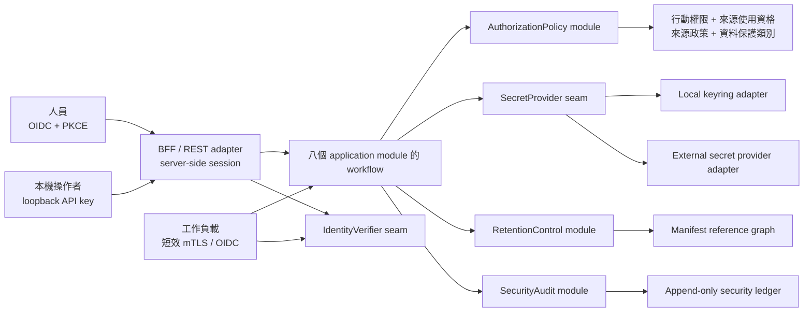

# 安全、身分、來源授權與保存控制

> **2026-08-15 product boundary:** ADR 0017、0018 與主 spec 的 `COST-0-01` 取代本文對每個 P2＋來源皆需 principal entitlement、來源必須免帳號／免 API key、外部 OIDC／WebAuthn／KMS、商業簽章、獨立滲透測試及固定七年保存的必要假設。公開或零付費方案皆以 dataset-level SourcePolicyVersion 建立來源使用資格；來源憑證另由本機開源 SecretProvider 管理。本文的 ActionGrant、用途／環境交集、secret 不外洩、append-only audit 與 policy deletion 仍有效。

本文件固定生產導向 MVP 的信任域、人員與工作負載身分、行動權限、來源使用資格、secret、加密、資料保護、保存／刪除、安全稽核、供應鏈、執行隔離與安全驗收契約。它延伸既有的[資料平台架構](data-platform-architecture.md)、[文件處理管線](document-processing-pipeline.md)、[模型生命週期](model-lifecycle-and-promotion.md)、[模組與 REST 契約](service-boundaries-and-api-contracts.md)及[營運與事故契約](observability-source-health-and-incidents.md)，不取代其中的時間點、譜系、升版或營運語意；分期安全entry／exit與商業來源dependency由[分階段架構交接契約](phased-architecture-and-spec-handoff.md)固定。

本文是工程安全與來源權利控制設計，不是法律、法遵或資料供應商契約意見。來源可否使用、保存、訓練、展示或再散布，仍須以部署主體實際適用的版本化方案與條款證據判斷；需要付款、sales／人工核准、採購或協商契約的來源不進必要產品路徑。程序身分、網路、備份、復原與供應鏈 gate 的部署形狀由[部署契約](deployment-topology-capacity-and-recovery.md)落實。

## 決策摘要

- 一個部署只服務一個組織；`local/dev/test/staging/prod` 是分離的信任域，不共用身分、資料、secret 或加密根。
- 正式人員登入採 OIDC Authorization Code + PKCE；本機 API key 只允許 loopback 的 local/dev。
- 人員與工作負載都先形成不可偽造的 `SecurityContext`；網路位置、管理員稱號或外部 IdP group 不構成隱含信任。
- 行動權限與來源使用資格是兩條獨立軸線；授權決策還要同時套用用途、環境、資料保護類別及來源政策，任一未知或衝突即拒絕。
- 來源政策與來源使用資格由應用擁有版本化真相；reverse proxy、Dagster、資料庫、OPA 類工具或各 REST handler 不能另建一套權限語意。
- Secret 值不進 repository、設定、資料庫、工作命令、artifact、response、outbox、log 或 trace；只有真正連線的 adapter 能透過 `SecretProvider` 取得短效租約。來源憑證的存在或有效性不會取代來源使用資格。
- 七年是正式資料／模型／預測／治理證據的最低產品要求。來源原文若不允許七年保存及模型用途，不得成為正式模型輸入。
- 來源內容與受其限制的衍生物可被政策性刪除；不含被禁止內容的核准、授權、tombstone、刪除證明及安全稽核保留不可變證據。
- 正式 image、模型成品與部署 bundle 以 digest 定址、簽章並附 provenance／SBOM；未驗證產物不得執行。
- 正式 runtime 預設最小權限、default-deny ingress／egress、無特權容器；不可信文件與模型成品在隔離、無 secret、無網路環境處理。
- 首版不公開匿名介面、不處理個人投資組合／券商憑證／下單，也不把受管資料送到外部 AI provider。

## 信任域與部署範圍

`local/dev/test/staging/prod` 各自使用不同的 OIDC client、issuer allowlist、資料庫、物件儲存、secret namespace、工作負載身分、簽章信任政策及加密根。正式設定若偵測 local key mode、測試 issuer、共用憑證、未簽 image 或非正式 secret provider，必須啟動失敗。

正式資料不得直接複製到非正式環境。除非來源政策及資料保護類別明確允許，測試使用合成、遮罩或獨立授權資料。未來若要服務另一組織，以另一個隔離部署交付；多租戶不是在既有 schema 加 `tenant_id`，而是新的 threat model、來源契約及隔離設計。

正式 UI 與 REST adapter 只在私有網路、VPN 或 identity-aware reverse proxy 後提供，沒有匿名正式路徑。本機只綁 loopback。未來公開網站必須從經核准的唯讀發布資料集建立獨立部署，不能直接暴露內部 `ResearchQuery`。



這些安全 interface 是八個既有 application module 使用的橫切 seam，不形成新的遠端微服務，也不讓 caller 繞過既有 `ResearchQuery`、`DataSupply`、`ModelGovernance` 或 `OperationsControl` interface。

## 核心安全模型

| 型別 | 不變量 |
| --- | --- |
| `Principal` | 穩定識別一名人員、本機 key 或工作負載；不以 Email、顯示名稱或可重用帳號作永久身分 |
| `SecurityContext` | 由可信驗證 adapter 產生，包含 principal、environment、authentication method、assurance、session／credential ID、issued／expiry、step-up time；caller 不能自行建構正式 context |
| `ActionGrant` | 授予 principal 可執行的原子操作、範圍、環境、有效期間及核准證據；角色只是 grant bundle |
| `SourceEntitlement` | 指定資料集、授權主體／席次、用途、環境、地域、有效期間、允許行為、保存／刪除、顯名、契約及證據版本 |
| `SourcePolicyVersion` | 某資料集在一段時間適用的擷取、保存、處理、訓練、推論、展示、匯出、再散布、顯名及刪除規則 |
| `DataProtectionClass` | `public_source`、`internal`、`licensed`、`restricted` 或 `secret`；來源公開不自動使系統衍生物可公開 |
| `OperationIntent` | 固定 actor 要執行的 action、resource、purpose、environment、information time、輸出／匯出形態與 request context |
| `AuthorizationDecision` | 不可變 allow／deny、穩定 reason codes、所有適用政策／grant／entitlement、遮罩／欄位／匯出限制、decision ID、時間及最晚有效時間 |
| `SecretRef` | 可保存的不透明 reference，沒有 secret value；包含 provider namespace、用途及允許的 workload class |
| `SecretLease` | 不可序列化的短效 secret 租約，帶版本、issued／expiry、使用目的及撤銷狀態；不得進 REST、工作命令、artifact 或 log |
| `SourceCredentialReadiness` | 不含 secret value 的 `missing`、`configured`、`validation_failed`、`valid`、`expired` 或 `revoked` 結果；綁定 provider、credential kind、SecretRef、版本、最近驗證時間與修復連結 |
| `RetentionDecision` | 對一組物件與相依產出計算的最低保存期限、最晚刪除期限、legal hold／衝突及允許處置 |
| `DeletionCertificate` | 不含被禁內容的刪除範圍、依據、核准、執行、驗證、未完成項及時間證據 |
| `SecurityAuditEvent` | 對認證、授權、secret、受限讀取、治理、部署及安全處置的不可變行為證據 |

資料保護類別的預設控制如下：

| 類別 | 範例 | 預設展示／匯出 | 額外控制 |
| --- | --- | --- | --- |
| `public_source` | 明確採 OGDL／public-domain 的來源事實 | 仍須來源政策及顯名；不等同匿名公開 | 保存來源、版本、顯名及第三方權利例外 |
| `internal` | 預測、特徵、一般評估及營運資料 | 具相應角色的人員內部使用 | OIDC、授權決策、靜態／傳輸加密 |
| `licensed` | 商業行情、新聞、法人預測及受限衍生物 | 預設不匯出原始內容 | 來源使用資格、欄位／席次限制、完整讀取稽核、應用層加密 |
| `restricted` | 契約、來源政策、稽核、事故、個人識別及安全設定 | 依職責遮罩，匯出需雙人核准 | 欄位加密、獨立 storage policy、短效下載 |
| `secret` | API key、token、私鑰、KEK／DEK | 永不展示或匯出 | SecretProvider、短效租約、使用稽核、輪替／撤銷 |

## 身分驗證

### 正式人員 OIDC

正式人員使用 Authorization Code Flow + PKCE `S256`。驗證 adapter 固定 issuer、client、redirect URI、audience 與簽章演算法 allowlist，驗證 signature、`iss`、`aud`、`exp`、`nbf`、`iat`、nonce 及 state；禁止 implicit flow、resource-owner password grant、`alg=none`、演算法混淆及自動 issuer discovery 到未核准網域。

所有正式人員至少使用 AAL2 多因素驗證。角色／政策／來源使用資格、核准、升版、匯出、刪除與 break-glass 等高風險操作，要求最近 15 分鐘內以 phishing-resistant WebAuthn／FIDO2 完成 step-up；OTP 不能滿足這個 step-up。

瀏覽器採 BFF／server-side session。Refresh token 只在後端，瀏覽器只持有 `__Host-` 前綴、`Secure`、`HttpOnly`、`SameSite=Strict`、`Path=/` 的 session cookie，並使用 CSRF token。閒置期限 30 分鐘、絕對期限 8 小時；登出、撤權、帳號停用及事故撤銷會終止 server session。OIDC 故障時不接受新登入或 step-up，既有 session 只活到原期限。

OIDC subject 是穩定外部身分。本地保存版本化 grant 與證據；IdP group 只作受控映射輸入，不是最終權限真相。一般 grant 最長 90 天，正式管理 grant 最長 30 天；停用帳號、group 移除或緊急撤銷須在 5 分鐘內使 session 及新決策失效。

### 本機 API key

本機 key 只在 local/dev 且 bind address 為 loopback 時可用。格式為 `key_id.secret`，secret 使用 CSPRNG 產生至少 256 bits 熵、只顯示一次，伺服器保存帶 secret-provider pepper 的 HMAC。每把 key 固定 owner、environment、scopes、issued／expiry／revoked；預設有效 24 小時、最長 30 天，沒有 wildcard 或預設管理員權限。

輪替最多重疊 10 分鐘並可立即撤銷。正式設定、非 loopback binding 或未指定 owner／scopes 時，local key mode 使程序啟動失敗。

### 工作負載身分

REST、Dagster、資料擷取、文件 sandbox、特徵、訓練、推論、治理、outbox／notification relay 分別使用獨立工作負載身分，不共用人員帳號或萬用 bearer token。核心只接收已驗證 principal：

- 本機 Compose adapter 使用每個 runtime role 獨立的短效 mTLS 身分；
- 正式 adapter 使用平台 OIDC 或 SPIFFE X.509-SVID，固定 trust domain、audience 及 workload name；
- JWT 工作負載憑證最長 5 分鐘；動態 X.509／資料庫 lease 最長 1 小時並自動輪替；
- 來源靜態憑證只由獲准 source adapter 在使用時 checkout。

### 來源憑證管理

Operations 程式頁面與 REST 只回傳 provider、credential kind、readiness、SecretRef ID、版本、最近設定／驗證時間、遮罩後識別提示及版本化 provider-owned registration／key-management URL，永不回傳 credential value。`source_credential.read` 可查狀態；`source_credential.manage` 才可 set、rotate、revoke、validate，所有動作套用 SecurityContext、CSRF／step-up、purpose、environment、provider allowlist 及 append-only audit。

Set／rotate request 的 key、secret 或 token 是 write-only request body，handler 在同一呼叫內交給 `SecretProvider` 後即丟棄；應用資料庫只保存新 SecretRef 與 readiness metadata。舊、新版本可在 provider 允許的短暫輪替視窗並存，但 adapter 每次 work attempt 只取得被 pin 的單一短效 SecretLease；撤銷後的新 attempt 不得再 checkout 舊版本，既有來源政策與歷史授權決策不被改寫。

Validate 是明確的 provider adapter 操作：缺少 secret 時不產生網路呼叫；authentication failure 更新 `validation_failed`，provider／network failure 保留可區分的 transient 結果，成功只證明 credential 可驗證，不會自動啟用未合格資料集。任何 response、exception、telemetry、audit 或 support bundle 都先經 secret redaction 與 known-value canary 檢查。

「重新申請」只導向來源政策中固定並經 egress allowlist 驗證的 provider-owned HTTPS URL，回到程式後由使用者輸入替代憑證。應用不代填外部帳號、不處理 CAPTCHA、email／MFA、不替使用者接受條款，也不把一般 redirect 目的地當成可信 URL；只有 provider 有另行合格的正式發行 API 時才可增加自動發行能力。

### Break-glass

保留兩個具名、平時停用的緊急帳號，使用獨立硬體 WebAuthn 及雙人保管復原材料。啟用綁定 SEV1 incident ID、最長 60 分鐘並立即通知。它只能恢復身分、可用性及安全設定，不能授予來源使用資格、查看未授權原文、核准／升版模型、匯出資料或刪除證據；一個工作日內完成檢討並輪替復原材料。

## 行動權限、角色與職責分離

行動權限是原子 grant，角色只是方便管理的非階層 bundle。工作負載直接取得最小 grant，不套用人員角色。

| 預設人員角色 | 允許範圍 | 明確不包含 |
| --- | --- | --- |
| `prediction_reader` | 查看來源政策允許的預測與解釋 | 原文、匯出、訓練、治理 |
| `research_analyst` | 研究查詢、實驗、回測及獲准衍生資料 | 正式升版、來源政策、原始受限內容匯出 |
| `data_operator` | 擷取、重試、隔離及資料品質處置 | 改來源權利、直接放行隔離、刪證據 |
| `model_operator` | 建立訓練意圖、執行訓練／評估、產生候選 | 核准自己建立的候選、改正式指派 |
| `model_approver` | 核准／拒絕候選及既有回退目標 | 建立／執行同一升版、繞過 hard gates |
| `source_steward` | 維護來源政策、契約證據、來源使用資格與刪除要求 | 安全身分管理、執行實體刪除 |
| `security_admin` | 身分映射、grant、step-up、secret 與安全政策 | 因管理角色自動取得來源內容或 audit 全文 |
| `platform_admin` | 部署、備份、容量及基礎設施 | 因基礎設施權限取得研究內容、來源權利或模型核准 |
| `auditor` | 受控唯讀查詢核准、授權、使用及刪除證據 | 修改、刪除或不受限匯出稽核資料 |

正式環境下列操作採雙人控制，發起者不能核准自己的變更：

- 候選由 `model_operator` 建立，另一位 `model_approver` 核准，自動化工作負載執行升版；
- 來源政策由 steward 提交契約證據，另一位 steward 核實權利，security admin 核實技術限制；
- 管理 grant 不得自我授予，至少另一位 security admin 核准；
- 政策性刪除由 source steward 核准範圍、platform admin 執行；
- 保存例外、audit 匯出及停用安全控制需要第二人、理由、票券及到期日。

## 授權決策 module

所有入口只驗證身分並形成 `SecurityContext`；`AuthorizationPolicy` 是唯一決策 module。REST、CLI、Dagster、notebook、資料庫 view 或個別 application module 都不能自行把 deny 改成 allow。

```text
AuthorizationPolicy.evaluate(
  SecurityContext,
  OperationIntent
) -> AuthorizationDecision
```

決策採以下交集，deny 優先：

```text
allow =
  valid_identity
  AND action_grant_allows
  AND source_entitlement_allows
  AND source_policy_allows
  AND data_protection_class_allows
  AND purpose/environment/time/resource_state_allows
  AND all_required_approvals_are_valid
```

任一必要政策、契約、身分、時間、時鐘或譜系為 unknown／expired／conflict 時 fail closed。多來源產出沿 lineage 套用所有上游限制的交集。`purpose` 是由受控 operation catalog 決定的枚舉，不接受 caller 自由填字規避政策。

`AuthorizationDecision` 回傳 allow／deny、穩定 reason codes、適用 grant／entitlement／policy／classification、遮罩／欄位／匯出限制、decision ID、evaluated time 及 `valid_until`。Allow cache 最長 60 秒；撤銷事件立即清除。對 caller 不可見的資源以 `not_found` 防止列舉，真正 deny 原因只進受控 security audit。

### 來源使用資格

每個資料集是最小來源權利單位。資格至少記錄：來源與資料集、授權主體／席次、market、environment、geography、purpose、valid from／to、契約／訂單／法務證據、允許的 ingest／retain／transform／train／infer／display／export／redistribute／attribute、內容保存模式、最低保存／最晚刪除、備份與終止後處置。

狀態為：

```text
draft -> under_review -> active -> suspended | expired | revoked
```

只有具完整證據及雙人核准的版本能 `active`。Suspended／expired／revoked 在 60 秒內使 allow cache 失效，阻止新的擷取、處理、訓練、推論、展示與匯出；既有內容進入影響評估，不由授權 module 直接刪除。

政策與資格變更建立新版本。增加權限的版本先通過 fixtures、30 日歷史決策 replay、staging 及最長七日 shadow evaluation，正式核准前仍維持 deny；緊急限制版本可綁 incident 立即生效。舊決策不重算或覆寫。

## SecretProvider 與加密

```text
SecretProvider.checkout(
  SecretRef,
  SecretUseContext
) -> SecretLease
```

只有真正需要連線的 adapter 可以 checkout。`SecretUseContext` 固定 workload principal、environment、source／destination、purpose、request／work ID 及所需 lease duration。Secret value 不進 source registry、Dagster metadata、PostgreSQL、artifact manifest、REST、outbox、trace 或 exception。

本機由 Windows Credential Manager／OS keyring 保存真實值；啟動工具按需建立 ACL 限縮的暫時 Compose secret file，停止後移除。禁止真實 `.env`、Compose YAML secret、提交測試 key 或把正式 secret 帶入 fork／pull-request runner。正式 adapter 經 workload identity 對接 Vault、雲端 secret manager 或 Kubernetes CSI provider；原生 Kubernetes Secret 只有在 etcd 靜態加密、最小 namespace RBAC、存取 audit 及停用不必要 token 掛載後才可作兼容 adapter。

憑證依 environment、source、purpose 及可行的 workload 分離。動態 lease 使用 provider 較短期限；靜態來源 key 原則上每 90 天輪替。Provider 不支援時建立具 owner、補償控制及到期日的例外。新舊版本只在 canary 驗證窗口重疊，成功後立即撤銷舊版。Provider outage 只能使用尚未到期 lease，不能延長或回退到環境變數／舊 key。

所有傳輸優先 TLS 1.3；外部來源相容需求下最低 TLS 1.2，內部工作負載採 mTLS。PostgreSQL、物件、模型成品及備份全部靜態加密。Envelope encryption 將 DEK 與 KEK 分離，manifest 只保存非機密 key ID；`licensed` 原文、商業行情、契約／security evidence 另作應用層加密及金鑰分區。

每個環境有獨立根信任。KEK 至少每年輪替，疑似洩漏時立即輪替並重包裝 DEK；復原材料雙人保管、離線加密備份並每季還原。舊 key 在所有需保留內容完成重包裝或合法刪除後才能銷毀。Python runtime 不宣稱無法可靠提供的記憶體 zeroization。

敏感值型別禁止預設 `str`／`repr`／serialization，集中遮罩 header、query、exception、trace、job metadata、notebook 及通知 payload。CI 執行 secret scanning；疑似洩漏直接撤銷及事故處置，不以刪 log 當作修復。

## 原文保存、七年證據鏈與政策性刪除

### 內容保存模式

每個 `DocumentVersion`、行情檔及外部原始物件綁定擷取當時的來源政策版本：

| 模式 | 行為 | 正式模型資格 |
| --- | --- | --- |
| `full_content` | 保存及處理明確授權全文／附件／原檔 | 只有擷取、七年保存、備份、模型訓練、衍生與內部展示均獲允許 |
| `summary_only` | 只保存供應商授權摘要 | 只以該摘要產生允許的衍生物，明示 `content_scope=summary` |
| `metadata_link_only` | 保存允許的標題、來源、時間、URL、來源 ID、雜湊 | 不抓全文，不產生全文 embedding、情緒、事件或訓練樣本 |
| `disabled` | 不連線、不擷取 | 無 |

同一政策在擷取、解析、NLP、特徵、訓練、推論、研究查詢、匯出及備份重複執行。Memory-only、temp、cache、notebook、搜尋索引或外部 AI 呼叫都不是規避權利的例外。

### 期限計算

七年是正式產出及治理證據的最低產品要求，不是所有外部內容的無條件保存權。`RetentionControl` 沿 manifest reference graph 計算：

| 類別 | 最低保存期限 |
| --- | --- |
| Prediction、evaluation、gate、approval、assignment、授權決策、安全／治理 audit | 事件後至少 7 年 |
| ModelArtifact 與必要 runtime evidence | 最後一次正式指派或正式預測後至少 7 年 |
| 契約、來源政策與來源使用資格證據 | 失效／終止後至少 7 年，除非原文件權利要求更短處置 |
| 原始、正規化、特徵與標籤 | 最後一個正式相依產出的 7 年期限結束，且不得超過來源 `delete_by` |
| 未入選 trial checkpoint | 90 日；manifest、params、metrics、logs、checksums 仍至少 7 年 |
| 未完成 staging | 30 日，且不得仍被 published／audit reference 引用 |

若來源的最晚刪除期限早於相依產出需要的最低保存期限，來源轉 `policy_blocked`，不能再建立正式相依。已知不允許七年原始證據鏈的內容只能降為較窄保存模式或研究隔離。

Segment、embedding、摘要、事件、特徵、訓練樣本、搜尋索引、cache 及可能記憶內容的模型權重都是受來源政策治理的衍生物，不因「已轉換」自動免除限制。

### 政策性刪除 workflow

```text
request
  -> verify authority/policy/scope
  -> tombstone and block new use
  -> lineage impact preview
  -> dual approval
  -> delete primary/replica/cache/index/export/derived/model
  -> verify
  -> deletion certificate
```

來源 policy 撤回或刪除要求先讓受影響資料集及 artifact `policy_quarantined`。現行模型切到仍合格的 approved target，沒有 target 則停止正式預測；首版不承諾 model unlearning，而是刪除受管衍生物並從合格資料重訓。

一般目標為 24 小時內阻斷使用、7 天內清除線上副本；契約或合法要求更短時使用更短期限。物件不得按資料夾日期或裸 path 刪除，實體清除只能由 retention implementation 經受控內部 interface 執行。刪除證明保存 policy／contract、object set、原允許的 commitment／checksum、核准、各 storage outcome、時間及驗證，不保存被禁止內容。

一般災備鏈最長 35 天。含 tombstone 內容的備份隔離且不得用於研究或正式處理；任何還原先重播 deletion ledger，再開放 runtime。契約要求更短時縮短備份期限或使用可驗證的獨立金鑰銷毀。

Legal hold 可暫停一般例行清除，但不被工程設計推定為必然凌駕來源契約或權利人要求。衝突時進 `policy_conflict`：立即停止擷取、處理、展示及匯出，隔離加密內容並等待具證據的法務決定；契約沒有保留例外時，刪內容而保留允許的 tombstone／刪除證明。

治理／核准／預測／授權決策／刪除證明可使用 append-only ledger 與受控 immutable storage；可被政策要求刪除的內容依來源及保存類別放入可精確刪除的加密分區。不得以 WORM／object lock 把來源內容鎖過最晚刪除期限。

研究匯出預設只有預測、聚合及獲准衍生欄位。每次匯出保存 decision、欄位、purpose、recipient、expiry 及 content hash；受控下載預設 7 日到期。原始行情、新聞全文、契約及 security audit 預設禁止，來源撤權時匯出也進通知、撤銷及處置證據。

## Security audit

Security audit 與高容量 telemetry 分離。下列事件 100% 記錄、不抽樣：登入／失敗／登出、session／key 建立輪替撤銷、每次授權 allow／deny、grant／entitlement／policy 變更、secret checkout metadata、受限內容讀取、匯出、模型治理、保存／刪除／hold、break-glass、部署／安全設定，以及 audit 本身的查閱／匯出。

事件至少包含 event ID、principal／workload、session、action、resource class／內部 ID、purpose、environment、AuthorizationDecision ID、適用 policy version、outcome／reason、actor-observed／server-received／database-committed time、ledger sequence、request／trace、deployment version，以及高風險變更的 before／after hash 與 approval chain。禁止 token、secret、原文、完整 query、presigned URL 及任意 payload。

狀態變更、audit event 與 outbox 在同一 PostgreSQL 交易提交；audit 失敗則變更失敗。Secret checkout、來源外呼、受限讀取及匯出無法記錄時 fail closed。只有明確列為 `public_source`／`internal` 的唯讀衍生預測可以在受控降級模式寫入本機加密 append-only spool，恢復後依序補交；spool 不得含受限內容。

應用資料庫角色只能 insert audit 事件，不能 update／delete。事件使用單調 sequence 及 hash chain；每日分區摘要／Merkle root 以獨立 KMS key 簽署並寫到不同管理權限的 immutable storage。每日驗證鏈、筆數、缺口與簽章，異常為 SEV1；每季 restore 驗證 audit chain 可重建。

Auditor 經受控 query 查看遮罩證據；security admin、source steward、platform admin 只見職責需要範圍，沒有任何一般角色能修改或刪除 ledger。Audit 匯出需要 auditor＋security admin 雙人核准。核心事件只存穩定 principal ID；姓名／Email 在可更新 directory projection，離職或個資處置不重寫問責事件。

上述權威 security audit 至少保存 7 年；HTTP access log、trace 及 debug 依既定短期 telemetry 期限。時間使用同步 UTC、duration 使用 monotonic clock；偏差 >500 ms 告警，>2 秒阻止新正式預測、核准、grant／policy 變更，但仍允許記錄拒絕、事故及安全修復。

## 軟體供應鏈與正式產物

正式 image、套件、模型及 deployment bundle 只能由受保護 CI 從已審查 commit 建立；開發者本機產物不可部署。Build 記錄 source revision、builder identity、workflow、dependency lock、base digest、參數及 output digest；MVP 至少產生 SLSA Build L2 可驗證 provenance，Build L3 隔離 builder 是正式成熟目標。

所有正式 image、deployment bundle、SBOM 及 ModelArtifact 以 digest 定址並簽章。CI 優先使用 Sigstore/Cosign keyless identity，驗證固定 repository、workflow、branch／tag、issuer 及 builder。Compose smoke test 與 Kubernetes admission 都先驗 digest、signature、provenance 與信任政策；tag 只作顯示。

依賴鎖定直接／傳遞版本及 hash，base image 也 pin digest。每個 image／模型 runtime 產生 SPDX 或 CycloneDX SBOM、license inventory、vulnerability report，與產物保存 7 年。禁止 `latest`、未鎖 Git dependency、啟動下載程式碼或從 public registry 臨時補件。

正式 release gate：

| 發現 | 行動／修補時限 |
| --- | --- |
| CISA KEV 或可利用 Critical | 阻止新部署；72 小時內修補或停用 |
| 網路可達或處理不可信內容的 High | 阻止 release；14 日內修補 |
| Medium | 30 日 |
| Low | 90 日 |

例外需要 reachability、owner、補償控制、雙人核准及最長 30 日 expiry；Critical／High 最長 7 日。安全例外不能創造來源權利、延後最晚刪除、接受未簽產物、關 audit 或讓未核准模型升版。

正式 branch 禁止直接寫入，變更經 CI 及至少一名非作者審查。Authentication、authorization、來源政策、刪除、crypto、CI workflow 與 deployment config 另需指定 security/code owner。Pull request／fork 不取得正式 secret，不在具正式 signing authority 的 runner 執行不受信任程式碼。

## Runtime、文件與模型隔離

所有 runtime 非 root、固定 UID／GID、read-only root filesystem，只開明確 writable volume／temp；drop all capabilities，再逐項加入必要能力；啟用 `no-new-privileges`、seccomp／等效 sandbox、CPU／memory／PID／file-size 限制。禁止 privileged、host network、host PID、任意 hostPath 或 Docker socket。

PDF、Office、HTML、archive 等不可信文件在獨立、無 secret、無 egress、唯讀輸入 sandbox 處理，限制 CPU、memory、wall time、頁數、檔案大小、archive depth 及 expansion ratio。停用 macro、JavaScript、外部資源、embedded executable；結果只能以固定 schema 輸出，crash／malware／bomb 只隔離單一物件。

正式模型只使用 safetensors／ONNX、JSON config、Parquet statistics 等資料型格式；行為由已簽 application image 的核准程式碼提供。禁止 pickle、joblib、任意 PyTorch callable checkpoint、remote code、load hook 及自動下載。外部／MLflow artifact 先驗 source、digest、signature、schema、runtime compatibility，再於無網路 reproduction runtime 載入。

來源文件是資料，不是指令。任何文字中的 prompt、URL、script 或「忽略規則」不得改變 parser、workflow、source registry 或 security policy。正式 NLP／embedding／模型預設在受控本地 runtime；新增外部 AI adapter 前，來源政策、資格、分類、供應商保存／訓練、跨境及刪除條件必須全部明確允許，且 provider 不得用內容訓練通用模型。

## 網路、REST 與通知

正式網路 default-deny ingress／egress。只有 reverse proxy 可進 REST runtime；worker／scheduler／training／parsing 不接受外部 ingress；PostgreSQL、object store、secret provider 只接受指定 workload；只有 source adapter 經集中 egress policy 存取核准來源；telemetry 單向輸出，監控 runtime 不能反向控制正式 workflow。網路位置不取代 workload authentication 或 AuthorizationDecision。

來源外呼只接受 source registry 核准的 HTTPS hostname、port 及 endpoint class。每次 DNS resolution／redirect 重驗 hostname 與 IP，拒絕 loopback、link-local、RFC1918、metadata endpoint、未核准 port、跨 hostname redirect 及 DNS rebinding；限制 redirect、response bytes、timeout 及 concurrency。使用者不能提交任意 URL 讓平台 fetch。

REST UI 同源、預設停用 CORS、cookie mutation 需 CSRF token，啟用嚴格 CSP、HSTS 及安全 headers；限制 body、page size、duration、concurrency 及 identity／IP／endpoint-class rate。管理、匯出及非冪等命令使用更低 quota，不對失敗 mutation 自動 retry。外部錯誤只回穩定 code 與 correlation ID，不洩漏資源、policy、stack、object URI 或 source entitlement detail。

Webhook 每個 destination 使用獨立 secret，對 timestamp＋event ID＋raw body 做 HMAC-SHA-256；接收端使用 5 分鐘 replay window 及 event ID dedupe。輪替短暫接受新舊 key；禁止 redirect，destination hostname allowlist。SMTP 使用 TLS、專用帳號及既定 redaction；通知 payload 沒有原文、secret、object URI 或敏感 entitlement。

## Threat model 與 ML security

Threat model 依 environment、principal、資料流、trust transition 及 module seam 版本化，涵蓋一般軟體威脅及 data poisoning、model poisoning、evasion、model extraction、training-data disclosure、惡意文件、source compromise 與 artifact tampering。首次正式部署前完成；每季及重大 source、identity、external connection、policy 或 deployment 變更時更新。

通過 TLS 且來自核准 hostname 不是正式資料資格。DataSupply 還驗來源身分、官方 signature／checksum（若有）、schema、發布與 first-observed time、歷史分布、跨來源一致性及突變。疑似 poisoning 形成 security incident，隔離 dataset、阻止下游 FeatureSnapshot／TrainingIntent／promotion；現行模型是否受影響由 lineage assessment 決定，不因單一 anomaly 自動重訓掩蓋。

Prediction interface 只提供既定三類校準機率、信心、資料支援及獲准解釋，不提供 embedding、raw logits、training row、模型下載或無限制 bulk query。來源使用資格、rate limit、匯出及 audit 共同降低模型抽取與資料外洩風險。

## Security incident、例外與退役

下列至少為 SEV1：secret／private key 洩漏、未授權原文／商業資料存取、來源資格繞過、audit chain 破壞、正式 image／模型 signature 失敗、CI signing identity 濫用、confirmed poisoning、政策性刪除未完成及 break-glass 濫用。

處置立即撤銷或隔離受影響 principal、secret、dataset、artifact、assignment 或 deployment；凍結非修復性 promotion／export，保存遮罩證據，沿 lineage 計算 Prediction／Model／Export 影響，依契約及適用要求通知 owner。Recovery 後仍須人工確認、rotation／rebuild、復測及 post-incident review。

安全例外必須有 type、scope、owner、risk、compensating controls、雙人核准、ticket、start／expiry 及驗證。它不是 break-glass，也不能變更來源權利或刪除義務。

退役時撤銷 workload、OIDC client、API key、source credential、webhook secret 及 CI signing authority；停止排程／匯出，計算所有最低保存與最晚刪除期限，清除 online／backup／cache／index／derived content 並建立刪除證明。允許保留的七年 governance／audit evidence 移交受控 archive，明訂後續查閱、key custody 及 restore 責任。

## 正式啟動與 release gate

正式 runtime 啟動前必須驗證：

- 正式 OIDC issuer／audience 且 local key disabled；
- HTTPS／mTLS、正式 SecretProvider、獨立 workload identity；
- 最小 database／object roles、靜態加密、SecurityAudit 可交易寫入；
- image／model signature、provenance、SBOM 及 allowlisted digest；
- default-deny network／egress、clock health；
- 所有 active source policy／entitlement／contract evidence；
- break-glass、backup restore、audit chain 最近一次演練未逾期。

任一必要條件缺失即啟動失敗。正式 release 以 OWASP ASVS 5.0 Level 2 為 Web 基線，通過：

- OIDC/JWT issuer、audience、nonce、alg、expiry、replay 及 session tests；
- grant／entitlement／classification／deny precedence 的完整 decision matrix；
- IDOR、enumeration、CSRF、CORS、CSP、injection、SSRF、redirect、rate-limit tests；
- Secret redaction、revocation、rotation、provider outage 及泄漏 scenario；
- malicious file、archive bomb、parser fuzzing、unsafe deserialization；
- webhook signature／replay、audit chain、clock skew；
- policy deletion、derived impact、backup restore then re-delete；
- image、IaC、dependency、SBOM、license、CVE、signature、provenance；
- workload identity、database role、object prefix、network reachability provider contracts。

首次正式部署前完成獨立 security assessment／penetration test，之後至少每年一次，或在 authentication、authorization、document parsing、多租戶、外部公開及 deployment platform 重大變更後重做。Critical／High finding 修復並重測前不得上線。

## 關鍵驗收情境

- 正式設定嘗試啟用 local API key，runtime 啟動失敗且留下不含 key 的 audit／incident evidence。
- 有 `research_analyst` 行動權限但沒有 CNA 新聞來源使用資格，查詢不能看到原文、摘要或可逆衍生內容。
- 有來源使用資格但沒有 `export` grant，畫面可依政策查看而匯出被拒絕；caller 只見穩定錯誤，audit 保留真實原因。
- 一個多來源特徵包含 OGDL 與商業行情，上游限制交集使輸出不能被誤標為公開或再散布。
- Source entitlement 到期，60 秒內阻止新 ingest／train／infer／display；既有 artifact 進 impact assessment 而不是由 auth module 直接刪除。
- Policy 要求 3 年刪除但正式預測需要 7 年復現，來源在建立新正式相依前即 `policy_blocked`。
- 刪除要求涵蓋原文、embedding、搜尋索引與受影響模型；系統先 stop／fallback，再產生各 storage outcome 及 deletion certificate。
- 從含 tombstone 內容的備份還原時，先重播 deletion ledger；未完成前 REST、training 及 export 不可開放。
- OIDC outage 時既有 session 不延長，高風險操作因無法 step-up 被拒；workload 也不能以人員 key 替代。
- SecretProvider outage 時 source adapter 只能完成尚在有效 lease 內的工作，過期後形成 credential blocked，不使用 `.env` fallback。
- 惡意 PDF 觸發 parser crash／archive bomb／外部 URL，只隔離單一物件，sandbox 無 secret、無 egress，正式 worker 不受控程式碼影響。
- 未簽 ModelArtifact、錯誤 builder provenance、CISA KEV image 或 pickle artifact 都在正式載入前被拒。
- Audit row 被移除或 sequence 缺口，daily verifier 建立 SEV1；platform admin 無法用正常 interface 刪除或修補鏈。
- Break-glass 可以停止受損部署或修復 IdP mapping，但不能核准 gate-failed 模型、看未授權全文或延後最晚刪除。
- 退役流程撤銷全部 identity／secret，受管內容依期限刪除，允許保留的七年 ledger 仍可被 auditor 以受控方式驗證。

## 主要規格依據

- [OpenID Connect Core 1.0](https://openid.net/specs/openid-connect-core-1_0-final.html)、[OAuth 2.0 Security BCP RFC 9700](https://www.rfc-editor.org/rfc/rfc9700.html)、[JWT BCP RFC 8725](https://www.rfc-editor.org/rfc/rfc8725.html)、[PKCE RFC 7636](https://www.rfc-editor.org/rfc/rfc7636.html)
- [NIST SP 800-63B-4 Authentication Assurance](https://pages.nist.gov/800-63-4/sp800-63b/aal/)及[Authenticator 要求](https://pages.nist.gov/800-63-4/sp800-63b/authenticators/)
- [SPIFFE 標準與工作負載身分](https://spiffe.io/docs/latest/spiffe-specs/)
- [NIST SP 800-57 Part 1 Rev. 5 Key Management](https://csrc.nist.gov/pubs/sp/800/57/pt1/r5/final)、[TLS BCP RFC 9325](https://www.rfc-editor.org/rfc/rfc9325.html)
- [Docker Compose secrets](https://docs.docker.com/compose/how-tos/use-secrets/)、[Kubernetes Secret good practices](https://kubernetes.io/docs/concepts/security/secrets-good-practices/)
- [NIST SP 800-88 Rev. 2 Media Sanitization](https://csrc.nist.gov/pubs/sp/800/88/r2/final)
- [NIST SP 800-53 Rev. 5](https://csrc.nist.gov/Pubs/sp/800/53/r5/upd1/Final)、[NIST SP 800-207 Zero Trust Architecture](https://csrc.nist.gov/pubs/sp/800/207/final)
- [SLSA v1.2](https://slsa.dev/spec/v1.2/)、[Sigstore verification](https://docs.sigstore.dev/cosign/verifying/verify/)、[NIST SSDF 1.1](https://csrc.nist.gov/pubs/sp/800/218/final)、[CISA KEV](https://www.cisa.gov/known-exploited-vulnerabilities-catalog)
- [OWASP ASVS 5.0](https://owasp.org/www-project-application-security-verification-standard/)
- [NIST AI 100-2 E2025 Adversarial ML](https://csrc.nist.gov/pubs/ai/100/2/e2025/final)、[NIST SP 800-61 Rev. 3 Incident Response](https://csrc.nist.gov/pubs/sp/800/61/r3/final)
