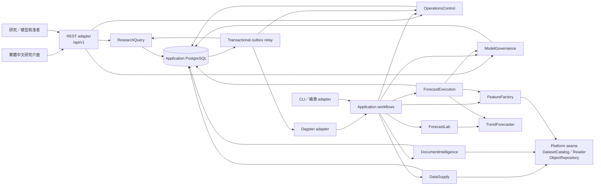
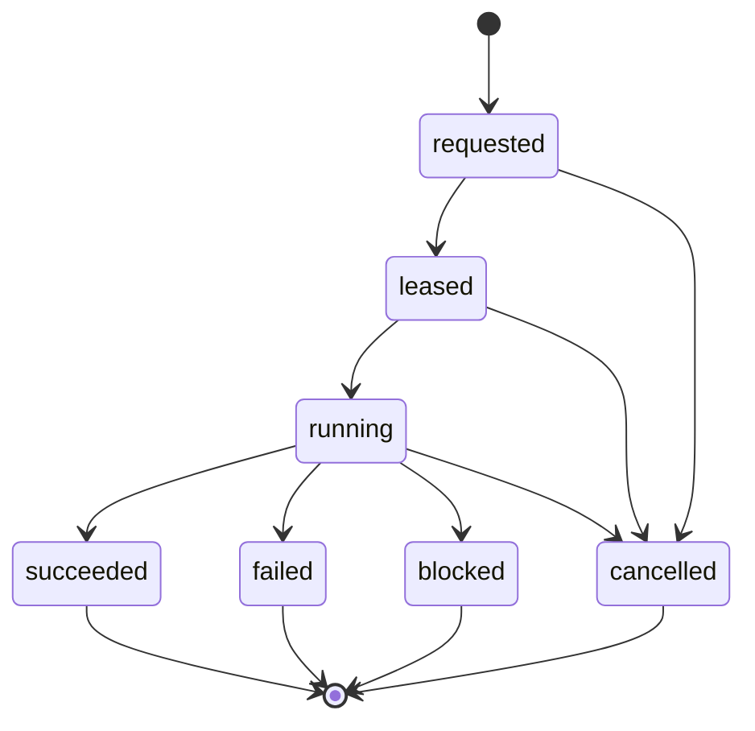

# 深模組、REST、事件與排程契約

> **2026-08-15 product boundary:** ADR 0017 與主 spec 的 `COST-0-01` 取代本文任何必須連接商業 provider、外部 entitlement service、Kubernetes 或固定規模的部署假設；深模組與 REST 必須以官方零成本來源及 stable unavailable／excluded outcomes 表達缺口。本文其餘 module／event／workflow seam 契約仍有效。

## 狀態與範圍

本文件固定生產導向 MVP 的 application module、穩定 interface、REST adapter、Dagster asset、不可變 artifact、outbox event 及工作狀態語意。它延伸既有的[資料平台架構](data-platform-architecture.md)、[多模態模型設計](multimodal-trend-model.md)、[模型生命週期](model-lifecycle-and-promotion.md)與[研究介面](research-experience.md)，但不取代各文件已固定的領域契約；module的分期深度與垂直tracer bullets由[分階段架構交接契約](phased-architecture-and-spec-handoff.md)固定。

本文件只定義程序與模組如何協作。來源 freshness／告警由[可觀測性契約](observability-source-health-and-incidents.md)固定，身分、來源使用資格、secret、保存與安全稽核由[安全契約](security-identity-entitlement-and-retention.md)固定；程序、副本、資源池、HA與容量由[部署契約](deployment-topology-capacity-and-recovery.md)固定。

## 決策摘要

- 首版是模組化單體，不是微服務集合。八個 application module 共用程式庫與 application image。
- 模組依完整行為與不變量劃分，不依 HTTP endpoint、資料表或 ETL 步驟劃分。
- 同程序呼叫使用普通 Python interface；首版模組間沒有 HTTP、gRPC 或訊息代理。
- Dagster／CLI 啟動長任務；REST 只提供唯讀研究、唯讀營運狀態及小型、可稽核的人工核准決定。
- 模組只交換冪等命令、小型結果、不可變 ID／artifact reference 及版本化事件，不交換可變 ORM entity 或裸資料表。
- 正式預測批次固定一個市場、資訊截止點、股票池與服務指派；研究請求只讀已發布預測，永不臨時執行模型。
- 權威狀態與 outbox 同交易提交；事件用於 projection、監控及未來遠端 adapter，不以隱式事件編舞取代明確 workflow。

## 架構形狀



Dagster、REST、CLI 與 outbox relay 都是 adapter。任何一個 adapter 被替換，都不得改變 application module 的結果、不變量或 artifact。

## Application modules

| Module | 擁有的完整行為 | 穩定 interface | 不擁有 |
|---|---|---|---|
| `DataSupply` | 來源資格、擷取、證據、解碼、正規化、涵蓋、隔離與資料集發布 | `materialize(SourcePartitionRequest)`；`resolve(DataSelection)` | 文件 NLP、特徵工程、模型推論 |
| `DocumentIntelligence` | 文件版本處理、去重、標的連結、事件、標註、embedding、政策合格衍生結果 | `process(DocumentBatchRequest)` | 原始來源存取、正式財務 fact 真相、趨勢預測 |
| `FeatureFactory` | 時間點資料解析、調整、交易日對齊、特徵綱要、缺資料語意與特徵快照 | `build(FeatureSnapshotRequest)` | 模型訓練、模型指派、預測發布 |
| `ForecastLab` | 訓練、有限 HPO、baselines、ablations、校準、滾動回測與候選證據 | `develop(TrainingIntentRef)` | 人工核准、升版、正式模型選擇 |
| `ForecastExecution` | 固定服務指派、取得特徵、載入模型、批次推論、歸因與正式預測發布 | `run(ForecastRunCommand)` | 即時單股推論、模型訓練、升版決定 |
| `ModelGovernance` | 訓練意圖、候選證據、閘門、人工決定、shadow、服務指派與回退 ledger | 具前置條件的生命週期命令與 `pin_assignment` | 訓練 implementation、registry alias、研究頁組裝 |
| `ResearchQuery` | 掛牌搜尋、預測快照、證據展示政策、歷史／回測及 URL 導向查詢 | bounded query interface | 正式推論、權威預測寫入、原文儲存 |
| `OperationsControl` | 工作租約／attempt、來源健康 projection、事故、outbox delivery 與通知狀態 | 工作命令與唯讀營運查詢 | Dagster metadata、Prometheus 時序、通知供應商真相 |

### 平台 module 與內部 seam

既有 `EvidenceStore`、`DatasetCatalog`、`DatasetReader`、`ObjectRepository`、`WorkCoordinator`、`IncidentRegistry` 與 `TrendForecaster` 仍是深 platform module。它們可以被多個 application module 經 interface 使用，但不成為獨立網路服務，也不進入 REST。

- `DatasetCatalog` 是 canonical dataset manifest 與 reference graph 的唯一寫入 seam。
- `ObjectRepository` 隱藏本機檔案、SeaweedFS 與 S3-compatible implementation。
- `TrendForecaster` 保留 neural 與 baseline 兩個 adapter；`ForecastLab` 與 `ForecastExecution` 不組裝 encoder、gate 或 calibrator。
- `WorkCoordinator` 統一 lease、fencing、attempt 與 retry；Dagster run state 只是 projection。

「八個 application module」不代表程式只能有八個 module；它限制的是 application capability 與資料所有權，不禁止 module 內部有可測的深 seam。

## 資料所有權

只有擁有者可寫入其 schema；其他 module 只能經 owner interface 或明確 read projection 取得資料。

| Schema／權威資料 | 寫入擁有者 | 讀取方式 |
|---|---|---|
| `catalog`、`ingestion`、`quality` | `DataSupply` | `DataSupply.resolve` 或 catalog read projection |
| `lineage` dataset manifest／object graph | `DatasetCatalog` platform module | 不可變 ID 與 manifest interface |
| `documents` 文件索引、處理狀態、review queue、市場事件 projection | `DocumentIntelligence` | 政策合格 read projection |
| `ml` lifecycle ledger、gate、approval、assignment | `ModelGovernance` | lifecycle query／pinned assignment |
| `serving` 預測紀錄、批次與核心研究 projection | `ForecastExecution` | `ResearchQuery` 讀取的穩定 view |
| `research` evidence-enriched read projection | `ResearchQuery` | REST query interface |
| `ops` work、attempt、outbox、事故及通知狀態 | `OperationsControl`／其 platform seam | operations query interface |

`FeatureFactory` 與 `ForecastLab` 的長任務狀態由 `OperationsControl` 保存；大型輸出是內容定址 artifact。它們不因需要 durable state 而直接寫入 `ops`、`lineage` 或 `ml`，而是呼叫擁有者 interface。

## 程式依賴規則

允許的方向是：

```text
entrypoint adapters
  -> application workflows
    -> application module interfaces
      -> module implementations
        -> platform / infrastructure adapters
```

建議套件骨架：

```text
src/stock_forecasting/
  contracts/
  workflows/
  data_supply/
  document_intelligence/
  feature_factory/
  forecast_lab/
  forecast_execution/
  model_governance/
  research_query/
  operations_control/
  platform/
  adapters/
    rest/
    dagster/
    cli/
    postgres/
    object_store/
```

`contracts` 只容納不可變 ID、RFC 3339 instant／session reference、命令／結果封套與跨模組 DTO。下列內容禁止進入：

- ORM model、SQL repository 或 database session；
- provider SDK type；
- 具業務行為的 helper；
- 可變「common model」；
- Dagster、FastAPI、MLflow 或物件儲存型別。

架構測試必須禁止循環 import、entrypoint type 滲入 module interface、module 直接 import 另一 module 的 implementation，以及跨 schema 寫入。

## Interface 契約

### DataSupply

```text
materialize(SourcePartitionRequest) -> Outcome[DatasetPublication]
resolve(DataSelection) -> Outcome[ResolvedDatasetSet]
```

`SourcePartitionRequest` 固定來源政策、entitlement、資料集、分區、時間範圍、股票池、adapter version、idempotency key 與資源預算。`materialize` 隱藏擷取、receipt、checkpoint、decoder、normalizer、涵蓋驗證及 staging／publish 順序。

`resolve` 不接受裸 `latest`；選擇條件至少包含資訊截止點、股票池、綱要相容範圍、freshness、涵蓋要求、缺失模態政策及`production`／`historical_reconstruction`／`isolated_research`選擇模式，並一次解析為不可變版本集合。Production只解析`platform_observed`；歷史重建另驗歷史可得性主張並把主張ID及證據等級寫入結果。

### DocumentIntelligence

```text
process(DocumentBatchRequest) -> Outcome[DocumentIntelligencePublication]
```

輸入只能引用已發布文件版本與處理組合版本；輸出固定 annotation／embedding／event dataset、涵蓋報告、abstention／隔離摘要及政策資格。呼叫端不能指定 tokenizer、去重閾值或模型內部步驟。

### FeatureFactory

```text
build(FeatureSnapshotRequest) -> Outcome[FeatureSnapshotRef]
```

Request 固定 resolved dataset IDs、選擇模式與歷史主張refs、資訊截止點、股票池、交易日曆、調整版本、特徵綱要及缺資料政策。回傳內容定址 `FeatureSnapshotRef`，不回傳可變 DataFrame；訓練、回測與正式預測使用相同 interface，但production拒絕非`platform_observed`輸入。

### ForecastLab

```text
develop(TrainingIntentRef) -> Outcome[CandidateEvidenceBundle]
```

`CandidateEvidenceBundle` 引用 ModelArtifact、EvaluationReport、baselines、ablations、calibration、HPO、seeds、runtime 與資源報告。失敗或 blocked 也形成不可變 outcome。此 interface 不含 `approve`、`promote` 或 `set_stage`。

### ForecastExecution

```text
run(ForecastRunCommand) -> Outcome[ForecastPublication]
```

Command 固定 market、information cutoff、stock pool version、feature schema、`execution_purpose`、idempotency key、trace ID 與資源預算。`execution_purpose`只能是`fixture`、`shadow`、`production`或`retrospective_replay`，而且是領域不變量，不得從環境名稱、路由或顯示旗標推導。Module 必須：

1. 在批次開始時從 `ModelGovernance` 驗證並固定單一服務指派；
2. 經 `FeatureFactory` 建立或取得不可變特徵快照；
3. 驗證 ModelArtifact、schema、checksum、runtime 及來源政策；
4. 對整個股票池產生三期間 ForecastBatch 與主要影響因素；
5. 驗證機率、穩定排序、涵蓋與逐掛牌不可用結果；
6. 依用途發布到互相隔離的ledger／projection；只有`production`以單一 PostgreSQL 交易發布正式預測紀錄、核心研究 projection 與 outbox。

`fixture`只接受不可升版的fixture成品與fixture資料，`shadow`只接受shadow服務指派，`production`只接受production服務指派及`platform_observed`截止點視圖；`retrospective_replay`必須明確指定歷史成品與資料選擇，且其結果帶事後標記。不同用途的idempotency namespace、ledger與projection互不覆寫或冒充。

整批 artifact／schema 不相容時 fail closed；單一掛牌不足形成 `unavailable` 預測結果，不靜默漏列。REST 不暴露此 interface，也不允許研究請求切換用途或觸發推論。

### ModelGovernance

不提供通用 CRUD 或 `set_current_model`。穩定 interface 由具前置條件的命令構成：

```text
request_training(TrainingIntentCommand) -> TrainingIntentRef
record_candidate(CandidateEvidenceRef) -> CandidateRef
decide_approval(ApprovalDecisionCommand) -> ApprovalDecisionRef
evaluate_transition(LifecycleTransitionCommand) -> LifecycleDecisionRef
pin_assignment(ModelFamilyRef, BatchStart) -> PinnedAssignment
```

每個命令含 command ID、idempotency key、actor／trigger、expected aggregate version 及必要 artifact checksum。Promotion、shadow 與 rollback 仍遵守模型生命週期契約，不由 REST 任意指定模型 stage。

### ResearchQuery

```text
search_listings(ListingSearch) -> CursorPage[ListingMatch]
list_predictions(PredictionSearch) -> CursorPage[PredictionSummary]
get_listing_research(ListingResearchQuery) -> ListingResearch
list_prediction_history(PredictionHistoryQuery) -> CursorPage[PredictionSummary]
get_prediction(PredictionId) -> PredictionResearch
list_backtests(BacktestQuery) -> CursorPage[BacktestSummary]
```

Interface 隱藏 projection table、政策／entitlement 過濾、快照解析、cursor、ETag 與 evidence redaction。它不在 request time 呼叫推論、文件處理或其他遠端 module。

### OperationsControl

```text
request_work(WorkCommand) -> WorkRef
get_work(WorkId) -> WorkView
list_health(HealthQuery) -> HealthSnapshot
list_incidents(IncidentQuery) -> CursorPage[IncidentView]
record_incident_transition(IncidentCommand) -> IncidentRef
```

Dagster／CLI 使用命令 interface；REST 首版只使用唯讀查詢。事故與 work state 是 application truth，Prometheus、Dagster UI、webhook 與 SMTP 都是 projection。

## 統一 Outcome 與 retry

Module outcome 使用穩定分類：

| Outcome | 意義 | 自動重試 |
|---|---|---|
| `invalid` | 命令或契約驗證失敗 | 否 |
| `not_found` | 不可變 ID 不存在或不可見 | 否 |
| `conflict` | aggregate version、狀態或 idempotency payload 衝突 | 否 |
| `blocked` | 政策、授權或必要上游尚未滿足 | 條件改變後建立新 attempt |
| `policy_denied` | 來源政策或 entitlement 禁止操作／展示 | 否 |
| `transient_failure` | 可重試的網路、鎖、暫時依賴故障 | 是 |
| `permanent_failure` | 需程式、資料或人工修復 | 否 |
| `unavailable` | 合法領域結果無法產生，例如掛牌必要價量不足 | 否 |

Module 不丟出 HTTP exception。REST、Dagster 與 CLI adapter 分別映射 outcome；未知 exception 轉為受控 internal problem 並建立事故，不將 stack trace 回傳呼叫端。

## 長任務與 attempt



- Retry 建立新的 attempt，保留前次 error、worker、時間、fencing token、log 與 artifact。
- Work identity 由 operation kind、partition／aggregate、contract version 與 idempotency key 決定。
- Cancellation 是協作式停止；已發布不可變資料集、模型、評估或預測不回滾。
- `blocked` 不是 `failed`，不消耗一般暫時失敗的 retry budget。
- Worker 只能用最新 fencing token 提交狀態或發布結果。

## Runtime roles

所有角色使用同一 application image 與 module implementation：

| Role | Entry adapter | 主要 interface |
|---|---|---|
| API | REST | `ResearchQuery`、唯讀 `OperationsControl`、`ModelGovernance.decide_approval` |
| `daily-critical` | Dagster／worker | `DataSupply`、`DocumentIntelligence`、`ForecastExecution` |
| `maintenance` | Dagster／worker | 修復、重播、compaction、projection rebuild |
| `backfill-training` | Dagster／worker | 歷史資料、`ForecastLab`、大量回測 |
| Outbox relay | relay adapter | 事件投遞、consumer checkpoint |
| CLI | command adapter | 相同 application workflow 與 module interface |

角色是程序與資源池，不是 module。首版角色間沒有 application HTTP 呼叫。

## REST adapter 契約

### 契約來源

正式實作前必須在 repo 內建立固定版本的 OpenAPI 3.2.0 文件，作為 REST adapter 的契約來源；它可產生 transport DTO、validator 及 client，但不能產生領域 module。規格必須包含成功、RFC 9457 問題回應、完整／降級／不可預測／stale 範例、分頁、ETag 與權限需求。

- OpenAPI 3.2.0：<https://spec.openapis.org/oas/v3.2.0.html>
- RFC 9457 Problem Details：<https://www.rfc-editor.org/rfc/rfc9457.html>
- HTTP Semantics／條件請求：<https://www.rfc-editor.org/rfc/rfc9110.html>

### 穩定 endpoint

| Method／path | 用途 | 同步行為 |
|---|---|---|
| `GET /api/v1/catalog/listings` | 依 query、market、valid-at 搜尋掛牌 | bounded query |
| `GET /api/v1/research/predictions` | 比較矩陣 | snapshot-bound cursor query |
| `GET /api/v1/research/listings/{listing_id}` | 標的研究頁 | snapshot-bound query |
| `GET /api/v1/research/listings/{listing_id}/predictions` | 歷史正式預測 | cursor query |
| `GET /api/v1/research/predictions/{prediction_id}` | 單筆預測、因素與證據譜系 | bounded detail |
| `GET /api/v1/research/model-families/{model_family_id}/backtests` | 回測摘要 | cursor query |
| `GET /api/v1/operations/health` | 系統健康 projection | bounded query |
| `GET /api/v1/operations/sources` | 來源健康 projection | cursor query |
| `GET /api/v1/operations/work/{work_id}` | work／attempt 狀態 | bounded query |
| `GET /api/v1/operations/incidents` | 事故 projection | cursor query |
| `POST /api/v1/governance/approval-decisions` | 人工核准或拒絕 | 小型 PostgreSQL transaction |

擷取、重試、回填、訓練、回測、推論、promotion 及 rollback 不在首版 REST。未來若允許 REST 啟動長任務，只能回傳 `202 Accepted` 與 `work_id`。

同步 adapter 的設計預算是兩秒內完成。超出預算的工作不得延長 HTTP request 或在 API process 背景執行，必須轉為由 `OperationsControl` 保存的 durable work。

### 掛牌與時間

- 搜尋可用 ticker／名稱，但結果返回所有候選、有效期間與不可變 `listing_id`；歧義不自動選取。
- Resource path 只使用內部 ID，不使用 ticker、供應商代碼或名稱。
- Instant 使用含時區 RFC 3339 UTC；另回傳 market timezone。
- 交易端點使用 `anchor_session_id`、`target_session_id` 與 `calendar_version_id`，不以日期差猜交易日。
- `information_cutoff`、`first_observed_at`、business effective time 與自然日期使用不同欄位。

### 快照與 cursor

每個研究集合回應固定：

- `forecast_batch_id`；
- `information_cutoff`；
- `stock_pool_version_id`；
- `core_projection_version` 與更新時間；
- `evidence_projection_version`、更新時間及 stale 狀態；
- filters、sort 及 opaque next cursor；
- ETag。

省略 cutoff 時，伺服器只解析一次最近完整正式預測批次；不能逐掛牌選各自最新結果。Opaque cursor 綁定完整快照、篩選與排序，預設 50、上限 200；穩定排序以不可變 ID 作最後 tie-breaker。單筆 detail 不嵌入無上限歷史或文件全文。

GET 支援 `If-None-Match`；representation 未變時回傳 304。Cursor、ETag 與 response body 必須引用同一 core／evidence projection 版本，不能在查詢過程重新解析「最新」快照。

### 預測 representation

可用結果：

```json
{
  "prediction_id": "pred_...",
  "listing_id": "lst_...",
  "anchor_session_id": "XTAI:2026-08-12",
  "target_session_id": "XTAI:2026-08-19",
  "horizon_sessions": 5,
  "probabilities": {
    "up": 0.64,
    "flat": 0.20,
    "down": 0.16
  },
  "confidence_score": 0.18,
  "prediction_status": "degraded",
  "data_support": {
    "price_volume": "full",
    "fundamental": "full",
    "macro": "full",
    "documents": "degraded"
  },
  "model_artifact_id": "model_...",
  "feature_snapshot_id": "feature_..."
}
```

機率與信心是 0–1 JSON number，UI 負責百分比格式。分類使用具名欄位，不使用位置陣列。

不可預測結果省略 `probabilities` 與 `confidence_score`：

```json
{
  "prediction_id": "pred_...",
  "listing_id": "lst_...",
  "horizon_sessions": 5,
  "prediction_status": "unavailable",
  "unavailable_reason": {
    "code": "insufficient_price_history",
    "valid_sessions": 42,
    "minimum_sessions": 60
  },
  "data_support": {
    "price_volume": "unavailable"
  }
}
```

不可用不是全零機率、空字串或 HTTP 500。

### Approval command

`POST /governance/approval-decisions` 必須帶：

- `Idempotency-Key` header 與不可變 `command_id`；
- artifact、EvaluationReport、GatePolicyVersion 及 ModelFamily ID；
- `approved` 或 `rejected` 決定及必填理由；
- expected current assignment／aggregate version，並以 `If-Match` 保護 lost update；
- 經安全票券定義的 actor identity。

相同鍵及相同 payload 回傳原結果；相同鍵但不同 payload 回傳 409。此 endpoint 不能直接 promotion 或指定 current model。

### Problem Details

所有非成功回應使用 `application/problem+json`：

```json
{
  "type": "https://example.invalid/problems/aggregate-version-conflict",
  "title": "Lifecycle state changed",
  "status": 409,
  "detail": "The expected assignment version is no longer current.",
  "instance": "/api/v1/governance/approval-decisions/cmd_...",
  "trace_id": "trace_...",
  "code": "aggregate_version_conflict"
}
```

`type` 與 `code` 是穩定機器契約；`title`／`detail` 可本地化。回應不得包含 stack trace、SQL、bucket、內部路徑或敏感 entitlement 細節。

| Outcome／情境 | HTTP status |
|---|---|
| request schema 或欄位驗證失敗 | 422 Unprocessable Content |
| aggregate version、狀態或 idempotency payload 衝突 | 409 Conflict |
| 已驗證身分缺少授權或 entitlement | 403 Forbidden |
| 資源不存在或為避免洩漏而不可見 | 404 Not Found |
| projection／必要依賴無法安全服務 | 503 Service Unavailable |
| 未分類 internal failure | 500 Internal Server Error |

## Research projection

`serving` schema 的核心 projection 與 PredictionRecords 在同一交易發布，包含比較矩陣與標的頁首必要欄位。`research` schema 的文件標題、允許片段及其他跨模組 evidence enrichment 經 outbox 非同步建立。

ResearchQuery 可以在下列條件同時成立時服務最後一致快照：

1. 核心快照完整且版本／checksum 有效；
2. 來源政策與 entitlement 仍可證明；
3. age 未超過可觀測性契約設定的 freshness 上限；
4. evidence lag 在回應中明確標示，且不使證據錯配到另一預測批次。

否則回傳 503 Problem Details。治理、政策資格不明與預測譜系不完整一律 fail closed。單一掛牌 `unavailable` 是正常領域結果，不是 projection 故障。

來源政策及 entitlement 必須在 projection 建立與查詢時都執行。REST 只回傳允許展示的摘要、片段與受控 evidence ID；不得回傳內部 object URI、bucket、任意 presigned URL 或禁止保存的原文。

## Event contract

### Envelope

```json
{
  "event_id": "evt_...",
  "event_type": "forecast_publication.completed",
  "schema_version": "1.0.0",
  "aggregate_id": "forecast_batch_...",
  "aggregate_version": 3,
  "occurred_at": "2026-08-12T22:04:11Z",
  "producer": "forecast_execution",
  "trace_id": "trace_...",
  "payload": {
    "forecast_batch_id": "forecast_batch_...",
    "manifest_id": "manifest_...",
    "prediction_count": 412
  }
}
```

事件只帶不可變 ID 與必要摘要；FeatureSnapshot、文件、模型、回測明細與預測全集只以 artifact reference 取得。

投遞為 at-least-once。Consumer 在自己的狀態交易中保存 `event_id` 與 aggregate version；重複為 no-op，亂序依 aggregate version 重試或隔離。事件不是命令，名稱使用已成立事實的過去式。

### 首版事件目錄

| Event type | Producer | 主要 consumer |
|---|---|---|
| `dataset.published` | DataSupply／DatasetCatalog | Dagster、FeatureFactory readiness、OperationsControl |
| `document_intelligence.published` | DocumentIntelligence | FeatureFactory readiness、Research projection |
| `feature_snapshot.built` | FeatureFactory | Dagster materialization、ForecastExecution／ForecastLab |
| `training_intent.created` | ModelGovernance | Dagster／ForecastLab |
| `candidate_evidence.recorded` | ModelGovernance | gate workflow、MLflow projection、OperationsControl |
| `gate_decision.recorded` | ModelGovernance | approval queue、OperationsControl |
| `serving_assignment.changed` | ModelGovernance | ForecastExecution cache、Research／Operations projection |
| `forecast_publication.completed` | ForecastExecution | ResearchQuery、mature-label workflow、OperationsControl |
| `matured_labels.published` | label workflow | monitoring、model evaluation |
| `source_health.changed` | OperationsControl | dashboard、notification adapter |
| `incident.opened`／`incident.resolved` | OperationsControl | dashboard、webhook／SMTP |

Dagster 仍明確描述主流程依賴。Outbox event 可喚醒已登記 sensor，但不能讓多個 consumer 以無文件的 choreography 隱式決定核心 workflow。

## Dagster asset contract

Asset 對齊 module 產物，而非 parser 或 helper：

| Asset | Partition | 產生 interface |
|---|---|---|
| `published_dataset` | dataset／source／market／date-or-vintage | DataSupply.materialize |
| `document_intelligence_publication` | source／observed-date／shard | DocumentIntelligence.process |
| `feature_snapshot` | market／information-cutoff／stock-pool-version | FeatureFactory.build，或 ForecastExecution.run 內同一結果 |
| `forecast_publication` | market／information-cutoff／stock-pool-version | ForecastExecution.run |
| `matured_label_dataset` | market／target-session | label workflow |
| `candidate_evidence_bundle` | training-intent | ForecastLab.develop |
| `research_projection` | forecast-batch／projection-version | Research projection consumer |
| `operations_projection` | event／time-window | OperationsControl consumer |

Dagster wrapper 把普通 command 與 Outcome 投影為 materialization／check／run metadata。CLI、測試與未來 adapter 呼叫相同 workflow；Dagster context 不進 module interface。Backfill 使用同一 asset 與 interface，但在 `backfill-training` pool 執行。

## 交易與部分故障

- 單一 owner module 以一個 PostgreSQL transaction 提交權威狀態、aggregate version 及 outbox。
- PostgreSQL 與物件儲存採 staging → checksum／schema／read-after-write verify → metadata publish。
- 跨模組 workflow 保存 durable step 狀態及不可變 input／output IDs，不使用 distributed transaction。
- Retry 重用 command identity、artifact checksum 與最新 fencing token；已發布結果是 no-op 或新版本，不能覆寫。
- 核心 prediction transaction 失敗時不發布任何該批核心 projection；已上傳 artifact 留在 staging 待重用或受控回收。
- Evidence enrichment 失敗不改寫 PredictionRecord；ResearchQuery 顯示 evidence projection lag 或在政策不明時 fail closed。

## 契約與 schema 演進

- REST 使用 major path；只有破壞相容性才從 `/v1` 升版。
- 新增可選欄位為相容變更；移除欄位、改型別、改枚舉語意或改時間／機率語意是 major。
- Event、command、artifact manifest 及 dataset schema 各自具有 version；不能以 REST path version 代替。
- Consumer 明示可接受版本；不相容 event 進隔離／dead-letter projection，不猜測欄位。
- Golden fixture 保存 full、degraded、unavailable、stale、conflict 及 policy-denied 情境。
- OpenAPI 產生的 transport type 只存在 adapter；領域 interface 可獨立演進並由 mapper 連接。

## 測試契約

### Module interface

- DataSupply retry 在 receipt 持久化後才提交 checkpoint；重送不重複發布。
- DocumentIntelligence 對 policy-blocked、partial coverage 與真正空文件窗產生不同 outcome。
- FeatureFactory 對同一固定輸入產生相同 checksum，且訓練／正式推論不分叉。
- ForecastLab 不能建立 approval／assignment；失敗仍保留 evidence。
- ForecastExecution 對批次排序／組成穩定，pin 單一 assignment，逐掛牌 unavailable 不拖垮其餘結果。
- Fixture、shadow與追溯重播不能建立正式預測紀錄、進入production歷史或覆寫相同市場／cutoff的production結果。
- Production拒絕`archive_attested`或其他非`platform_observed`的截止點輸入；追溯重播結果始終標示事後性質。
- ModelGovernance 拒絕 stale expected version、自我核准、缺 gate／shadow 或不合格 rollback target。
- ResearchQuery 永不觸發推論，且不跨快照混合結果。
- OperationsControl 對 duplicate、亂序 event 及 expired fencing token 保持冪等。

### Adapter／provider

- 本機檔案與 SeaweedFS ObjectRepository adapter 通過相同 contract tests。
- PostgreSQL transaction、lease、fencing、outbox、cursor snapshot 與 ETag 使用真實 container 驗證。
- Neural 與 baseline TrendForecaster adapter 通過相同 ForecastBatch contract。
- Dagster、CLI 與直接 workflow 對相同 command 產生相同 application Outcome。
- OpenAPI examples、Problem Details、條件請求、分頁及不可預測 union 都由 schema validator 測試。
- Event producer 對目前與前一個相容 consumer fixture 通過；duplicate／out-of-order／consumer crash 皆有測試。

### 端到端事故

- Worker 在物件上傳後、metadata publish 前終止，重試重用 artifact 且不產生半發布資料。
- Promotion 與 EOD batch 同時發生，已開始批次仍使用原 pinned assignment。
- Research evidence projection 落後時核心預測不錯配；政策資格無法證明時回傳 503。
- 相同 approval command 重送回傳原 Decision；payload 改變時 409。
- ticker 重用／更名搜尋返回候選，但歷史 listing ID 與預測不改變。
- Outbox relay、consumer transaction 或 Dagster metadata 故障後可從 application truth 重建。
- Compose 環境不依賴內部 HTTP 即可從來源 fixture 走到研究 REST。

## 微服務拆分閘門

任何 application module 拆成獨立程序或服務前，必須同時滿足：

1. 量測證明獨立擴縮、故障隔離或安全隔離有實際需要；
2. 現有 interface 已穩定，且具程序內與遠端兩個 adapter；
3. 權威資料、timeout、retry、idempotency、backpressure 及部分故障語意已文件化；
4. 遠端 interface 是批次／粗粒度，不是逐筆聊天式呼叫；
5. Docker Compose 仍能以本機 adapter 完整端到端執行；
6. 拆分不改變 artifact、event、PredictionRecord、服務指派及模型治理語意；
7. 遠端 adapter 通過與程序內 adapter 相同的 interface contract tests。

在全部條件成立前，以新增 runtime role 或調整資源 pool 擴展，不建立網路 seam。

## 後續票券接點

- 可觀測性票券固定 freshness、coverage、latency、error budget、漂移、severity 與告警門檻，但使用本文件的 work、event、health projection 與 Outcome。
- [安全契約](security-identity-entitlement-and-retention.md)以 `SecurityContext`、行動權限、來源使用資格、SecretProvider、RetentionControl 及 SecurityAudit 橫切既有 workflow，但不能繞過 ResearchQuery／ModelGovernance interface 或形成新的遠端微服務。
- [部署契約](deployment-topology-capacity-and-recovery.md)把相同 application image、runtime roles、PostgreSQL、object store、Dagster 及 relay 映射到 Compose／Kubernetes，且明確禁止把 module 名稱直接當成微服務清單。
